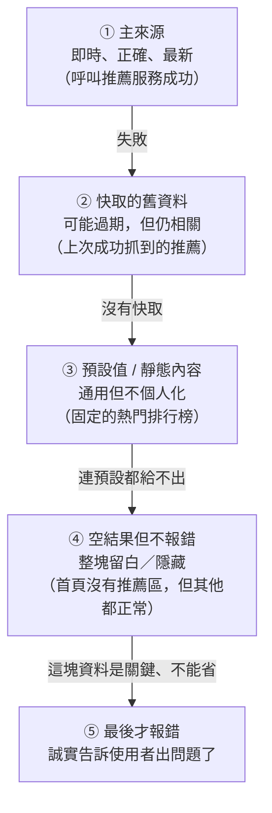
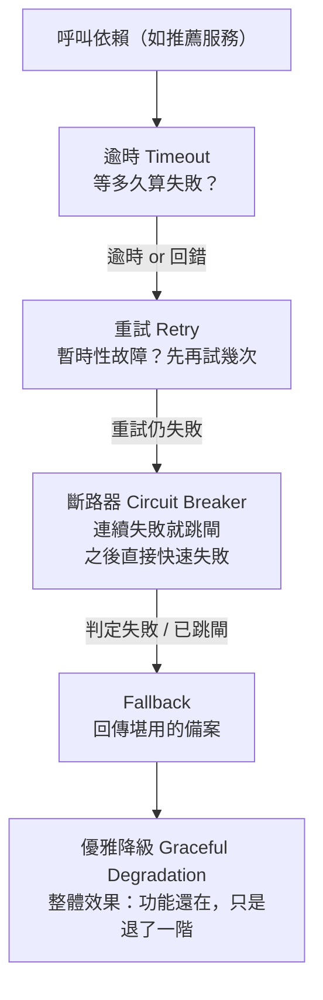

# [E-15-1] Fallback Pattern：當依賴壞掉時，給一個「堪用的備案」

> **目標**：理解 fallback（後備 / 備援）pattern 是什麼、什麼時候該用、它有哪些「備案層級」由好到差、以及該避開的雷（別把錯的關鍵資料當備案亂給）。

## 一個問題：推薦服務掛了，整個首頁要陪葬嗎？

想像你在做一個電商網站。首頁上有一塊「**個人化推薦**」——依你過去看過、買過的東西，猜你可能想買什麼。這塊功能背後是一個獨立的服務（recommendation service，推薦服務）。

某天這個推薦服務掛了：可能它自己的資料庫慢、可能它被部署搞掛、可能只是網路抖一下。這時候你的首頁該怎麼辦？

最糟的做法是：首頁去呼叫推薦服務、拿不到結果、就**整頁噴 500 錯誤**，使用者連商品都看不到、買不了東西。

```
使用者打開首頁
  → 首頁去要「個人化推薦」
    → 推薦服務掛了，沒回應
  → 首頁：「那我也不知道怎麼辦了」→ 回傳 500
  → 使用者看到一片空白／錯誤頁
```

這顯然很蠢——**推薦只是首頁上的一小塊，它壞掉不該拖垮「看商品、買東西」這些核心功能。** 一個依賴（dependency，你所倚賴的外部服務或資源）壞掉，不該讓整個功能跟著死。

那該怎麼辦？答案就是這章的主角：**給它一個備案**。

## 生活類比：刷卡機連不上銀行

你去便利商店買東西，要刷卡結帳。結果刷卡機連不上銀行的授權系統——它「無法即時確認你這張卡有沒有效」。

店員會怎麼做？在很多實務情境下，店員不會說「那你不能買了，滾吧」，而是改用**手寫簽單（或離線刷卡）**：把你的卡壓個單、請你簽名，交易先照樣完成，**事後再補送去銀行請款**。

這就是 fallback：

> **當「最理想的做法」（即時連線授權）行不通時，改用一個「退而求其次、但仍堪用」的備案（離線簽單），讓整件事還是能完成。**

備案通常比主方案「差一點」——離線簽單有極小的呆帳風險、推薦改成熱門排行榜不夠個人化——但**「差一點」遠勝「完全不能用」**。fallback 的精神就是這句話。

## 用 pseudo code 描述 fallback

fallback 的骨架非常簡單：**試主來源，失敗了就走備案**。

```
試著：
    向 推薦服務 拿個人化推薦
    如果成功 → 直接用這份結果

如果失敗（逾時 / 回錯 / 斷路器已跳閘）：
    改拿 備案（例如快取的「熱門商品排行榜」）
    標記這份資料是「備援來源、可能不是最新」
    回傳備案，讓首頁照樣顯示得出東西
```

注意「如果失敗」括號裡那三種情況——它們正是**觸發 fallback 的條件**，等一下會細講：

- **逾時（timeout）**：等太久還沒回應，當作失敗。
- **回錯**：對方明確回了錯誤（例如 500）。
- **斷路器已跳閘（circuit breaker open）**：先前連續失敗太多次，系統已經「跳閘」，這次根本不去呼叫、直接走備案。

## fallback 的「備案層級」：由好到差

fallback 不是只有「一個備案」——它是一串**由好到差排下來的選項**，能給好的就給好的，給不了才往下退一階。這串階梯長這樣：



這張圖表達：**能停在越上面的階梯越好，越往下代表退得越多。** 每一階適合的情況：

| 層級 | 是什麼 | 什麼情況適合 |
|---|---|---|
| ① 主來源 | 即時呼叫、拿到正確最新的結果 | 正常狀況，一律優先 |
| ② 快取的舊資料 | 上次成功時存下來的結果，可能過期 | 「舊資料也還有用」時最佳選擇（如推薦、排行榜、設定檔） |
| ③ 預設值 / 靜態內容 | 一份寫死的通用內容 | 沒快取、但「給個通用版」也可接受（如固定的熱門清單、預設頭像） |
| ④ 空結果但不報錯 | 這塊直接留白或隱藏，其他功能照常 | 這塊資料「有很好、沒有也不致命」（如推薦、廣告、相關文章） |
| ⑤ 報錯 | 誠實回傳錯誤 | 這塊是**關鍵資料**，寧可報錯也不能亂給（如金額、餘額、庫存） |

關鍵心法：**往下退幾階，取決於「這份資料錯了 / 沒有，會怎樣」。** 推薦錯了無傷大雅，可以一路退到「留白」；但如果是帳戶餘額，退到「給個舊的或猜一個」是災難——這種寧可停在 ⑤ 報錯。這個雷後面「常見錯誤」會再強調。

## 正式程式碼範例

把上面的概念寫成一段乾淨、可讀的 TypeScript。情境：**呼叫推薦服務，失敗就回快取的熱門清單**。

先看回傳型別的設計——這是這段程式碼最重要的細節之一：

```typescript
interface Product {
  id: string;
  name: string;
  price: number;
}

// 關鍵：回傳值要「標明資料是哪來的、可能多舊」，
// 呼叫端才知道自己拿到的是不是降級資料，UI 也能據此提示使用者。
interface RecommendationResult {
  products: Product[];
  source: "live" | "cache" | "default"; // 主來源／快取／預設，一眼看出降級到哪一階
  isStale: boolean;                      // 是否可能過期（快取與預設都算）
}
```

為什麼回傳值要帶 `source` 和 `isStale`？因為 fallback 最危險的不是「用了備案」，而是「**用了備案卻沒人知道**」。把來源標在回傳值上，呼叫端可以決定要不要在畫面顯示「推薦暫時以熱門商品替代」，監控也能統計「現在有多少比例的請求在吃降級資料」。

接著是主邏輯：

```typescript
async function getRecommendations(userId: string): Promise<RecommendationResult> {
  try {
    // ① 主來源：即時呼叫推薦服務（內部已設好逾時，見下方說明）
    const products = await recommendationService.fetch(userId);

    // 成功後「順手更新快取」，讓下次降級時有新鮮一點的備案可用
    await recommendationCache.save(userId, products);

    return { products, source: "live", isStale: false };
  } catch (error) {
    // 不可以吃掉 error——降級是事實，一定要記錄下來，否則「在降級都沒人知道」
    logger.warn("推薦服務呼叫失敗，改用備案", {
      userId,
      reason: error instanceof Error ? error.message : String(error),
    });

    // ② 快取的舊資料：上次成功時存下來的推薦
    const cached = await recommendationCache.get(userId);
    if (cached) {
      return { products: cached, source: "cache", isStale: true };
    }

    // ③ 預設值：連快取都沒有，就給一份通用的熱門排行榜
    const popular = await getPopularProductsFallback();
    return { products: popular, source: "default", isStale: true };
  }
}
```

幾個對應到規範的重點：

- **錯誤不吃掉**：`catch` 裡一定 `logger.warn` 記下來，並帶上原因與 `userId`。「悄悄降級」是 fallback 最常見的坑。
- **備案標明來源**：回傳的 `source` / `isStale` 讓呼叫端知道這份是降級資料、可能過期。
- **備案本身也可能失敗**：`getPopularProductsFallback()`（去拿熱門清單）本身也可能掛——所以它內部應該是「連資料庫都失敗，就回一份寫死在程式裡的靜態清單」，也就是「**fallback 的 fallback**」，絕不能讓備案自己拋錯又把整個函式帶垮。

至於「等多久算失敗」「該不該先重試」，不是在這段 `try/catch` 裡硬幹，而是交給**逾時、重試、斷路器**這些鄰居模式——這正是下一節要講的。

## fallback 和鄰居模式的關係

fallback 很少單獨出現。它跟**逾時、重試、斷路器、優雅降級**是一組互相搭配的韌性模式（resilience patterns，讓系統面對故障仍站得住的設計手法）——這也是「E-15 韌性模式」這個系列存在的理由。它們的分工：



一句話串起來：**逾時決定「何時算失敗」→ 重試給「暫時性故障」一次機會 → 斷路器擋住「持續性故障」→ fallback 在最後補上「堪用的備案」→ 對使用者呈現出來就是「優雅降級」。**

逐個講清楚它們跟 fallback 的關係：

| 模式 | 它負責什麼 | 跟 fallback 的關係 |
|---|---|---|
| **逾時（timeout）** | 決定「等多久沒回應就算失敗」 | 它是**觸發 fallback 的條件之一**——沒逾時，你會卡在那裡等到天荒地老，fallback 根本沒機會啟動 |
| **重試（retry）** | 短暫故障先重試幾次（配指數退避） | 排在 fallback **之前**——先給暫時性故障機會，重試幾次還是不行，才走 fallback |
| **斷路器（circuit breaker）** | 連續失敗就「跳閘」，一段時間內直接快速失敗、不再呼叫 | 斷路器跳閘時，請求**直接走 fallback**，不再拖累自己去敲一個壞掉的門 |
| **優雅降級（graceful degradation）** | 系統整體「保住核心、犧牲次要」的策略 | fallback 是**實現降級的具體手段**——降級是目標，fallback 是達成它的其中一種做法 |

這三個模式（逾時 / 重試 / 斷路器）在 SRE 課程講得很完整，這裡不重複——想看它們的細節與狀態機：

> 逾時、重試（指數退避、抖動）、斷路器三狀態的完整說明 → [sre-8-1：失敗一定會發生——重試、逾時、斷路器](../../lessons/sre/part-8/sre-8-1-designing-for-failure.md)

而「優雅降級」是比 fallback 更上位的策略概念（過載時關次要保核心），fallback 只是它的其中一種實現：

> 優雅降級、限流、負載卸除的整體策略 → [sre-8-2：優雅降級與保命機制](../../lessons/sre/part-8/sre-8-2-graceful-degradation.md)

## 常見錯誤（反模式）

fallback 好用，但用歪了會出大事。這三個是最常見的雷。

> **常見錯誤一：對「關鍵資料」也亂給備案**
>
> 有人為了「反正別噴錯就好」，把 fallback 套在**所有東西**上——包括帳戶餘額、訂單金額、庫存數量這種**關鍵資料**。
>
> ```typescript
> // 危險！餘額拿不到就回一個「舊的或猜的」，使用者會依據錯的數字做決定
> try {
>   return await getAccountBalance(userId);
> } catch {
>   return { balance: lastKnownBalance }; // 😱 顯示過期餘額，可能害使用者超支
> }
> ```
>
> 問題是：推薦錯了頂多推薦不準，但**餘額、金額、庫存錯了，會讓使用者（或系統）根據假資料做出錯誤決定**——這比報錯嚴重得多。
>
> **正確做法**：關鍵資料寧可停在備案層級的最後一階「⑤ 誠實報錯」，也不要亂給。fallback 只適合「錯了 / 舊了也不致命」的資料（推薦、排行榜、非關鍵設定、快取內容）。判斷準則就一句：**「這份資料給錯，會不會害人做出錯誤決定？」會，就別 fallback。**

> **常見錯誤二：悄悄降級，沒標來源、沒記 log**
>
> ```typescript
> // 壞：降級了，但外界完全看不出來
> try {
>   return await recommendationService.fetch(userId);
> } catch {
>   return getPopularProducts(); // 沒 log、回傳值也沒標記這是備案
> }
> ```
>
> 問題是：推薦服務**可能已經掛了好幾天**，但因為 fallback 每次都默默補上熱門清單，監控一片綠、沒人收到告警、也沒人去修。等到有人發現「怎麼推薦一直不準」才驚覺——原來壞很久了。這叫「**靜默失敗（silent failure）**」。
>
> **正確做法**：降級時一定 (1) 記 log（`logger.warn`，帶原因），(2) 在回傳值標明來源（前面範例的 `source` / `isStale`），(3) 最好還推一個指標讓監控能統計「降級比例」，比例一高就告警。**fallback 是用來「撐住體驗」，不是用來「掩蓋故障」。**

> **常見錯誤三：忘了「備案本身也會失敗」**
>
> fallback 的備案常常也是一個會出錯的東西——快取（如 Redis）可能也掛了、預設清單要查的資料庫也可能連不上。如果 `catch` 區塊裡的備案又拋出錯誤，而你沒接住，整個函式一樣爆炸，等於白做 fallback。
>
> **正確做法**：想清楚「**fallback 的 fallback**」。備案要由外而內越來越保險：快取 → 資料庫的預設清單 → **最後一層是寫死在程式碼裡、絕不會失敗的靜態內容**。讓最底層的備案「不依賴任何會壞的東西」，這條降級鏈才有真正的底。

## 小結

- **fallback（後備）pattern**：當依賴壞掉（逾時 / 回錯 / 斷路器跳閘）時，改回傳一個「退而求其次但堪用」的備案，讓功能不整個垮掉。核心信念是「**差一點，遠勝完全不能用**」。
- fallback 是一串**由好到差的備案層級**：主來源 → 快取舊資料 → 預設 / 靜態值 → 空結果不報錯 → 最後才報錯。退幾階取決於「這份資料錯了 / 沒有會怎樣」。
- 它跟**逾時、重試、斷路器**是一組：逾時決定何時算失敗、重試給暫時故障機會、斷路器擋持續故障，最後 fallback 補上備案；對使用者呈現出來就是**優雅降級**。
- 最該避開的雷：**別對關鍵資料（餘額、金額、庫存）亂給備案**；**別悄悄降級**（要記 log、標來源）；**別忘了備案自己也會失敗**（要有 fallback 的 fallback）。

> 想看降級的整體策略（限流、負載卸除、保核心捨次要）→ [sre-8-2：優雅降級與保命機制](../../lessons/sre/part-8/sre-8-2-graceful-degradation.md)
> 想看「為失敗而設計」的全貌與逾時 / 重試 / 斷路器細節 → [sre-8-1：失敗一定會發生](../../lessons/sre/part-8/sre-8-1-designing-for-failure.md)
> 本系列（E-15 韌性模式）後續章節會把「斷路器、重試、逾時」各自展開，從課外讀物的角度補上實作與更多的坑——敬請期待。
