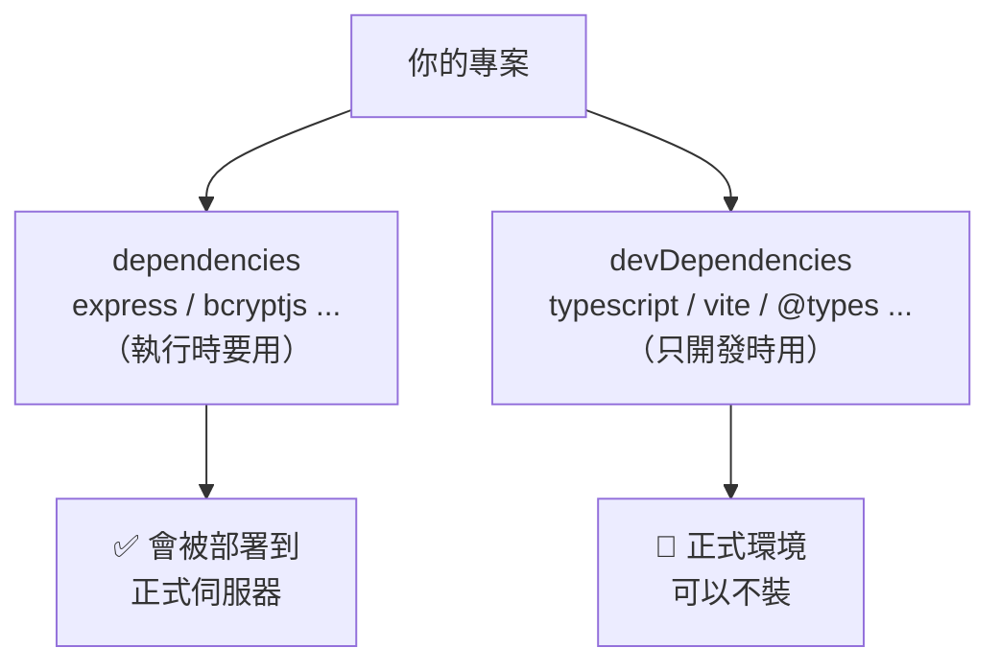

# [E-2-2] `dependencies` vs `devDependencies` 有什麼不同

> **這篇在說什麼**：解釋 `package.json` 裡那兩個長得很像的清單——`dependencies` 和 `devDependencies`——差在哪、為什麼要分開，以及一個套件該放哪一邊。

## 概念說明

打開任何一個專案的 `package.json`，你會看到兩份套件清單：

```json
{
  "dependencies": {
    "express": "^4.19.0"
  },
  "devDependencies": {
    "typescript": "^5.4.0"
  }
}
```

它們長得幾乎一樣，都是「這個專案用到的套件」。那為什麼要分成兩堆？

用開餐廳來想最清楚：

```
做一道菜，你會用到兩類東西：

一、會「進到菜裡、端給客人」的     → 食材（牛肉、青菜、醬料）
二、只在「廚房裡幫你做菜」的工具    → 鍋子、刀、磅秤、食譜

客人吃到的是食材，不是鍋子。
鍋子很重要，但它不會被端上桌。
```

對應到程式：

```
dependencies     = 食材：程式「實際執行時」需要的東西
                   （上線後，伺服器跑程式還是會用到它）

devDependencies  = 廚房工具：只在「開發階段」幫你做事的東西
                   （上線後就用不到了，使用者那邊根本不需要它）
```

`dev` 就是 development（開發）的縮寫。`devDependencies` 直譯就是「開發時才需要的依賴」。

---

## 深入一點

### 怎麼判斷一個套件該放哪邊？

問自己一個問題：**「程式上線、真正在伺服器上跑的時候，還需要它嗎？」**

```
需要 → dependencies（食材，會端上桌）
不需要，只是開發時用來輔助 → devDependencies（廚房工具）
```

用我們課程 POC 裡實際的套件來分類：

```
dependencies（執行時真的會用到）：
    express      → 後端伺服器框架，程式跑起來就靠它
    cors         → 處理跨來源請求，伺服器運作時要用
    bcryptjs     → 登入時要用它比對密碼
    jsonwebtoken → 簽發、驗證 token，每個請求都會用

devDependencies（只在開發時用）：
    typescript   → 把 .ts 編譯成 .js，編譯完上線跑的是 .js，就不需要它了
    tsx          → 開發時直接執行 .ts 的工具
    vite         → 開發伺服器與打包工具
    @types/...   → 型別定義，只服務 TypeScript，執行時完全用不到
```

有沒有看出規律？**和「型別、編譯、打包、開發伺服器」有關的，幾乎都是 devDependencies**；而程式真正運作時的邏輯依賴，才是 dependencies。



這張圖表達兩份清單的最終去向：`dependencies` 會跟著程式上線、在伺服器上運作；`devDependencies` 在開發階段功成身退，正式環境其實可以不裝它。

---

### 安裝時怎麼指定放哪一邊？

`npm install` 時用不同的旗標，npm 就會把套件寫進對的清單：

```
npm install express          ← 預設放進 dependencies
npm install -D typescript    ← -D（或 --save-dev）放進 devDependencies
```

那個 `-D` 是 `--save-dev` 的簡寫，意思是「存到 devDependencies」。所以你看到別人打 `npm install -D vite`，就知道他在說「vite 是開發工具，不是執行時依賴」。

---

### 分清楚這兩堆，到底有什麼實際好處？

你可能想：「反正都會裝，幹嘛分得這麼細？」分開有兩個實際的好處：

**好處一：正式環境可以裝得更精簡、更快**

部署到正式伺服器時，可以下這個指令：

```
npm install --omit=dev      ← 只裝 dependencies，跳過 devDependencies
```

伺服器不需要 TypeScript 編譯器、不需要打包工具（那些在你部署「之前」就已經做完了）。跳過它們，安裝更快、佔用空間更小、要維護的東西更少。

**好處二：清楚表達「每個套件的角色」**

光看一個套件在哪一堆，就知道它的定位。新接手專案的人看一眼 `package.json`，馬上分得出「哪些是核心邏輯依賴、哪些只是開發輔助」。這也是一種文件。

---

### 放錯邊會怎樣？

> **常見錯誤** — 把套件放錯清單：
>
> ```
> ❌ 把 typescript 放進 dependencies
>    → 正式環境白白多裝一個用不到的編譯器
>
> ❌ 把 express 放進 devDependencies
>    → 用 npm install --omit=dev 部署後，伺服器找不到 express，程式直接掛掉！
> ```
>
> 第二種特別致命：本機開發一切正常（因為本機兩堆都裝），一上線就壞，而且錯誤訊息是「找不到 express」，容易讓人摸不著頭緒。
>
> 正確做法：安裝時就想清楚「上線後還需不需要它」。執行時要用的（express、bcryptjs）用 `npm install`；只有開發/編譯時用的（typescript、vite、@types）用 `npm install -D`。

---

## 延伸閱讀

- npm 的其他基礎知識和 `package.json` 各欄位 → [課外讀物 E-2-1：npm 是什麼？package.json 解析](./E-2-1-npm-intro.md)
- 裝完套件後，`node_modules` 為什麼動不動就幾百個資料夾？ → [課外讀物 E-2-3：node_modules 為什麼那麼大？](./E-2-3-node-modules-size.md)
