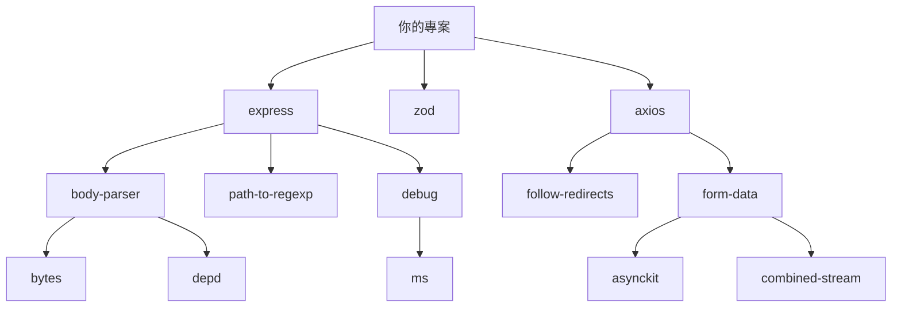
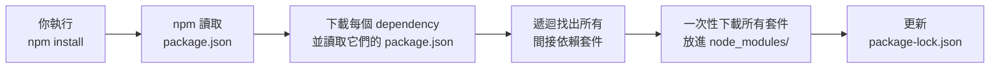

# [E-2-3] node_modules 為什麼那麼大？

> **這篇在說什麼**：解釋為什麼裝幾個套件之後，`node_modules` 突然有幾百個資料夾、幾百 MB，以及為什麼這不是 bug。

## 概念說明

你在 `package.json` 裡寫了三行 `dependencies`，跑了一次 `npm install`，然後你打開 Finder，發現 `node_modules` 資料夾裡有 **312 個子資料夾**。

你沒打錯字。你的 WiFi 也沒壞。

這是正常現象，而且有個合理的原因。

---

想像你叫了一份外送——你點的是一個漢堡。

但這個漢堡，麵包需要從麵包工廠進貨、起司需要從乳品廠進貨、生菜需要從農場來、番茄醬需要另一家廠商、包裝紙又是另一家……

外送員沒有辦法只把「漢堡」交給你，他必須把所有組成漢堡的材料一起帶過來。

npm 做的事就是這樣。

你要 `express`，express 要 `body-parser`，`body-parser` 要 `bytes`，`bytes` 要……這條依賴鏈可以很長。最後 npm 不只裝你要的那幾個套件，它把整棵**依賴樹（dependency tree）**上的每個節點都裝進來了。

---

## 深入一點

### 依賴樹長什麼樣子？

你的 package.json 只有三個依賴：

```
你的專案
├── express
├── zod
└── axios
```

但 npm 裝完之後，實際的結構更像這樣：



這張圖說明：你只裝了三個套件，但每個套件都有自己的依賴，依賴的依賴又有依賴，最後可能展開成幾十、幾百個套件。

一個「Hello World」等級的 Express 應用程式，裝完可能輕鬆破百個套件。這不是浪費，這是現代軟體「站在巨人肩膀上」的代價。

---

### 那一年，11 行程式碼讓整個網際網路都炸了

2016 年發生了一件改變整個 npm 生態系認知的事件，史稱 **left-pad 事件**。

有個叫 Azer Koçulu 的開發者，在 npm 上發布了幾十個小套件。其中最小的一個，叫 `left-pad`——它的全部功能就是「在字串左邊補空格」，總共 **11 行程式碼**。

```javascript
// left-pad 的完整實作（2016 年版）
module.exports = leftpad;
function leftpad(str, len, ch) {
  str = String(str);
  var i = -1;
  if (!ch && ch !== 0) ch = ' ';
  len = len - str.length;
  while (++i < len) {
    str = ch + str;
  }
  return str;
}
```

就是這樣。11 行。

某天，Azer 跟 npm, Inc. 發生了爭執（起因是他的另一個套件名稱被一家大公司要求更名），他一氣之下，把自己在 npm 上的**所有套件**都「unpublish」（下架）了。

包括 `left-pad`。

結果呢？

**Babel 壞了。React 壞了。數不清的 CI/CD 流程全部失敗。** 整個矽谷的工程師在那天早上起床，發現他們的程式都不能 build 了。因為 Babel 依賴 A，A 依賴 B，B 依賴 `left-pad`——一條鏈斷掉，整棵樹都倒了。

這件事說明了依賴樹有多脆弱：一個 11 行的套件，可以讓半個網際網路停擺。

npm Inc. 事後修改了政策：套件一旦發布超過一定時間，或者被其他套件依賴，就不能隨意 unpublish。但那個早晨，已經成為軟體史上的一個教訓。

> 順道一提：`left-pad` 的功能在 JavaScript 內建的 `String.prototype.padStart()` 就能做到。這個語言功能在 ES2017 加入，部分原因就是受到這個事件的影響。

---

### 為什麼 node_modules 不能 commit 到 Git？

這個問題答案很直觀，但值得說清楚：

**第一：太大了。**

一個中型專案的 `node_modules` 可能輕鬆超過 200 MB。Git 本來就不是設計來追蹤幾萬個二進位檔案的，這樣做會讓 repository 肥到難以使用。

**第二：不需要這樣做。**

所有套件都可以從 npm 重新下載。你只需要記錄「你要哪些套件」（`package.json`）和「確切裝哪個版本」（`package-lock.json`），把這兩個檔案 commit 就夠了。

任何人 clone 你的 repo，跑一次 `npm install`，就能還原完全一樣的 `node_modules`。

所以正確的 `.gitignore` 裡面，一定要有這一行：

```
node_modules/
```

如果你用 `npm create vite` 或 `npx create-react-app` 建立專案，它們都會自動幫你加好這一行。但如果是手動建立專案，記得自己加。

---

### 套件的真實安裝流程



這張圖說明：`npm install` 不只是「下載你列出的套件」，它是遞迴地展開整棵依賴樹，把所有涉及的套件都抓下來。

---

### 這個問題有解嗎？

生態系確實在努力改善這個狀況：

**pnpm（performant npm）**：不把套件複製到每個專案的 `node_modules`，而是在你電腦上建立一個全域的套件快取，各個專案透過**硬連結（hard link）**指向同一份檔案。這樣三個專案都用同一版 TypeScript，磁碟上只存一份。

**Bun**：一個全新的 JavaScript 執行環境兼套件管理工具，安裝速度比 npm 快幾倍到幾十倍（根據 benchmark 不同差距不同），也有類似 pnpm 的快取機制。

**Deno**：一個不同思路的 JavaScript 執行環境，直接用 URL import，根本沒有 `node_modules` 的概念。

這些工具都在嘗試解決同一個問題，但因為 npm 生態太成熟、太龐大，node_modules 的模式在短期內不會消失。

對初學者來說，這些都是「知道有這件事」就好，不需要現在就深入研究。先把 npm 用熟，之後再慢慢接觸其他工具。

---

## 延伸閱讀

- 搞懂 `dependencies` 和 `devDependencies` 的完整差別 → [課外讀物 E-2-2：dependencies 和 devDependencies 有什麼不同](./E-2-2-dependencies-vs-devdependencies.md)
- npm 的其他基礎知識和 package.json 欄位解析 → [課外讀物 E-2-1：npm 是什麼？package.json 完整解析](./E-2-1-npm-intro.md)
