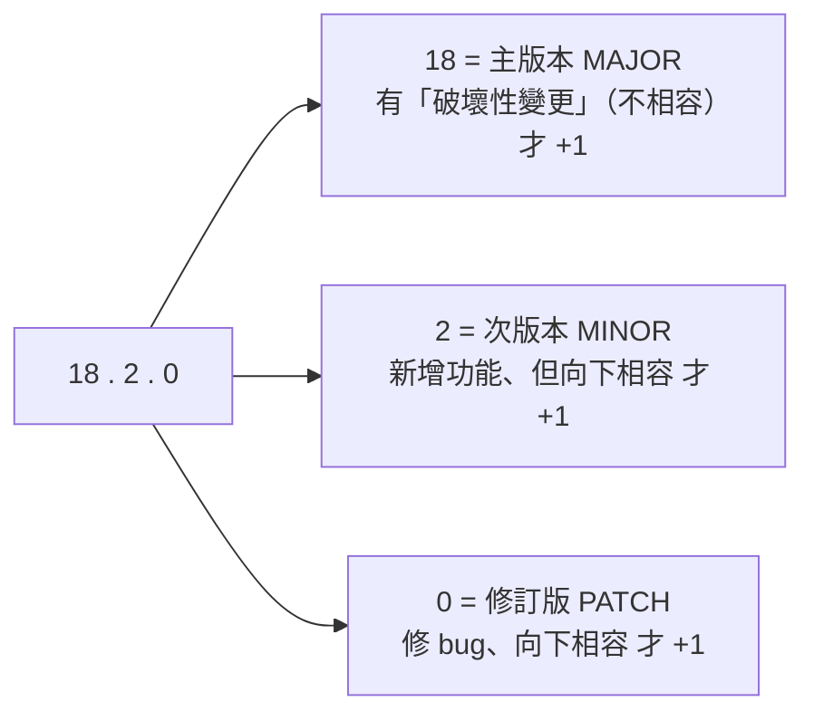

# [E-2-4] 版本號的意義：^1.2.3 代表什麼

> **目標**：看懂套件版本號的規則（語意化版本 SemVer），以及 `package.json` 裡 `^`、`~` 這些符號代表什麼。

## 版本號不是隨便編的

打開 `package.json`，你會看到一堆像 `"react": "^18.2.0"` 的東西。那個 `18.2.0` 和前面的 `^` 是什麼意思？這背後有一套規則叫**語意化版本（Semantic Versioning，SemVer）**。

## SemVer：三段數字的意義

版本號 `主版本.次版本.修訂版本`（`MAJOR.MINOR.PATCH`），例如 `18.2.0`：

| 段 | 什麼時候 +1 | 對你的影響 |
|----|-----------|-----------|
| **MAJOR（主）** | 有**破壞性變更**（舊用法會壞）| 升級要小心，可能要改你的程式 |
| **MINOR（次）** | 新增功能，但**向下相容** | 可放心升（舊功能照常）|
| **PATCH（修訂）** | 修 bug，**向下相容** | 可放心升 |

所以 `18.2.0` → `18.3.0` 是「加了新功能但相容」，可放心；但 `18.x.x` → `19.0.0` 是「破壞性變更」，升級要看遷移指南、可能要改程式。這套規則讓你「看版本號就知道升級風險」。

## ^ 和 ~：允許自動升級的範圍

`package.json` 裡的 `^`、`~` 符號，是告訴 npm「**安裝時，允許自動升到哪個範圍**」：

| 寫法 | 意思 | 允許範圍 |
|------|------|---------|
| `^1.2.3` | 允許「**不改主版本**」的更新 | `1.2.3` ~ `1.x.x`（< 2.0.0）|
| `~1.2.3` | 允許「**只改修訂版**」的更新 | `1.2.3` ~ `1.2.x`（< 1.3.0）|
| `1.2.3` | **精確鎖死**這個版本 | 只有 `1.2.3` |

- **`^`（最常見）**：允許升次版本和修訂版（新功能 + 修 bug），但不升主版本（不要破壞性變更）。這是 npm 的預設——「自動拿到相容的更新，但不要破壞性的」。
- **`~`**：更保守，只允許修訂版（只收 bug 修復）。
- **精確版本**：完全鎖死，連 bug 修復都不自動拿。

## package-lock.json：鎖定「實際裝的」版本

`^1.2.3` 是個「範圍」——那「實際裝了哪個版本」呢？這由 **`package-lock.json`** 記錄。它鎖定「這次安裝『實際』裝了的精確版本」，確保：

> **團隊每個人、每台機器，`npm install` 裝出來的版本「完全一樣」。**

沒有 lock 檔，A 同事可能裝到 `1.2.5`、B 裝到 `1.2.8`（都符合 `^1.2.3` 範圍），導致「在我電腦上可以跑」的問題。lock 檔釘死版本，保證一致——所以 **lock 檔一定要進版本控制**（commit 進 git）。

## 小結

- 版本號用 **SemVer**：`MAJOR.MINOR.PATCH`——主版本（破壞性）、次版本（新功能相容）、修訂版（修 bug）。
- `^`（升次/修訂、不升主，最常見）、`~`（只升修訂）、精確版本（鎖死）。
- **package-lock.json** 鎖定「實際裝的精確版本」，保證團隊一致——要進版控。

> npm 與 package.json → [課外讀物 E-2-1：npm 是什麼](./E-2-1-npm-intro.md)
