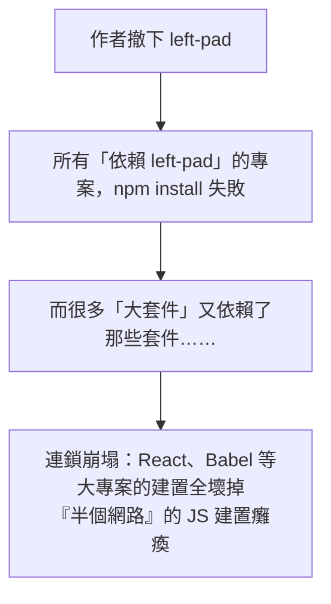

# [E-2-5] 趣味：左墊事件——11 行程式碼如何癱瘓半個網路

> **目標**：透過著名的「left-pad 事件」，輕鬆理解套件生態系的「依賴」有多脆弱、以及它帶來的省思。

## 一個 11 行的小套件

2016 年，一個叫 **left-pad** 的 npm 套件出了大事。這個套件做的事**極其簡單**——它就是「**在字串左邊補空格/字元**」，整個套件只有大約 **11 行程式碼**。例如把 `"5"` 補成 `"  5"`。

簡單到你可能覺得「這也值得做成套件？自己寫不就好了？」——但當時很多專案（包括一些大專案）為了省事，都「依賴」了它。

## 災難發生

那年，left-pad 的作者因為和 npm 的一個商標糾紛鬧得不愉快，一氣之下，把自己**所有的 npm 套件全部「撤下（unpublish）」**——包括 left-pad。

結果呢？

因為**依賴是會「連鎖」的**——你的專案依賴 A，A 依賴 B，B 依賴 left-pad……。left-pad 一消失，整條依賴鏈全斷。一個 11 行的小套件消失，竟然讓 **React、Babel 等無數大專案無法建置**，全球的 JS 開發者哀鴻遍野。npm 最後緊急介入、把 left-pad 復原，才平息災難。

## 這件事教了我們什麼

left-pad 事件成了軟體工程的經典案例，帶來幾個深刻省思：

**① 依賴是把雙面刃**

套件生態（npm）讓你「站在前人肩膀上」、不用重造輪子——這很棒。但你也**把命運交到了「別人的套件」手上**。它消失、它有 bug、它被植入惡意程式，都會影響你（呼應 infra/aws 的供應鏈安全）。

**② 「小到不該是套件」的東西**

「左補空格」這種 11 行就能自己寫的功能，真的值得「依賴一個外部套件」嗎？這引發了「**依賴該多細**」的討論——過度依賴瑣碎的小套件，讓你的依賴樹變得龐大又脆弱（呼應 E-2-3 node_modules 為什麼那麼大）。

**③ 鎖定版本、不可變的重要**

這件事後，npm 改了規則——**已發布的套件不能隨便 unpublish**（尤其被廣泛使用的）。也凸顯了 **lock 檔（E-2-4）** 的重要——鎖死版本，至少別因為「某個版本被改動」而突然壞掉。

**④ 連鎖故障無所不在**

一個微小的東西消失，透過「依賴鏈」放大成大災難——這跟你在 SRE Part 8-1 學的「連鎖故障」、cache 雪崩，是同一種「小問題被放大」的現象。系統的脆弱，常藏在「你以為理所當然」的依賴裡。

## 小結

- left-pad 是個 11 行的 npm 小套件（左補字串）。
- 2016 年作者把它撤下 → 因為依賴連鎖，React/Babel 等無數大專案建置全壞，「半個網路」癱瘓。
- 省思：依賴是雙面刃（方便但把命運交給別人）、別過度依賴瑣碎小套件、鎖定版本很重要、連鎖故障無所不在。

> node_modules 為什麼那麼大（依賴樹）→ [課外讀物 E-2-3](./E-2-3-node-modules-size.md)；連鎖故障 → 參見 **sre 課程** Part 8-1
