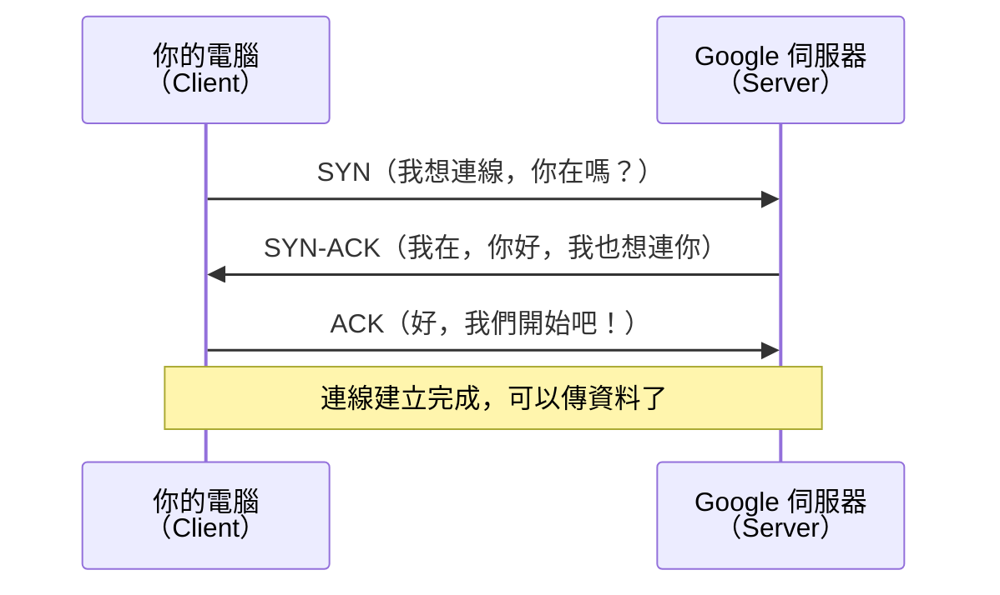
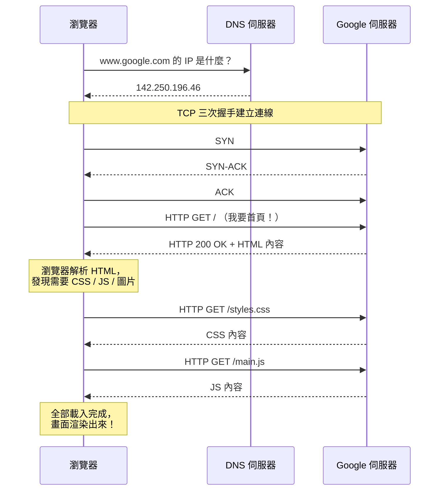

# [E-3-1] 網際網路是怎麼運作的？

> **你會了解**：從你在鍵盤上打出 `www.google.com` 並按下 Enter，到 Google 首頁畫面出現在你眼前——這 0.1 秒之內，網路世界裡究竟發生了什麼事。

---

## 背景 / 故事

你每天都在用 Google。打開瀏覽器，輸入網址，按 Enter，畫面就出現了。

快到你根本沒有時間思考。

但如果你停下來想一想——你的電腦在台北，Google 的伺服器在美國某個資料中心。你輸入的是一串文字（`www.google.com`），但電腦根本不懂「google」是什麼意思。畫面上的文字、圖片、樣式，是怎麼從地球的另一端跑到你的螢幕上的？

這一篇，我們就把這個「0.1 秒的奇蹟」拆開來看。

---

## 核心概念

### 第一關：DNS — 網址翻譯機

你有沒有想過，為什麼你可以打「google.com」而不是一串數字？

**因為網路世界的真正地址是 IP 位址**，長這樣：`142.250.196.46`。

但人類記不住一堆數字。所以我們發明了 DNS（Domain Name System，網域名稱系統）——它的工作就是把「人類看得懂的名字」翻譯成「電腦看得懂的數字」。

> 把 DNS 想成你手機裡的通訊錄。你存的是「媽媽」，但實際打出去的是 `0912-345-678`。你不需要記號碼，手機幫你查。DNS 的角色就是這本通訊錄。

**DNS 解析的過程（簡化版）**

當你輸入 `www.google.com`，你的電腦不是直接問 Google：

```
第一步：問自己的快取（上次查過嗎？）
         ↓ 沒有
第二步：問家裡的路由器（它有記嗎？）
         ↓ 沒有
第三步：問 ISP（網路服務供應商，例如中華電信）的 DNS 伺服器
         ↓ 還是沒有
第四步：問根域名伺服器（Root DNS）
         → 根 DNS 說：「.com 的事去問 .com 的 DNS」
         → .com DNS 說：「google.com 去問 Google 自己的 DNS」
         → Google 的 DNS 說：「142.250.196.46，拿去！」
第五步：結果層層回傳，快取起來備用
```

整個過程通常在幾毫秒內完成，快到你完全感覺不到。

---

### 第二關：IP 位址 — 網路世界的門牌號碼

拿到 IP 位址之後，你的電腦才知道「資料要送到哪裡去」。

IP 位址有兩種版本：
- **IPv4**：`142.250.196.46`，四組數字，每組 0–255。總共約 43 億個地址——已經快用完了。
- **IPv6**：`2404:6800:4012:3::200e`，更長、更複雜，幾乎永遠用不完。

你還會聽到兩種 IP 的分類：
- **公網 IP**：在整個網際網路上獨一無二的地址，Google 的伺服器有公網 IP。
- **私有 IP**：只在你家區域網路（Wi-Fi）裡有效，例如 `192.168.1.xxx`。你的電腦連到 Wi-Fi 後拿到的是私有 IP，由你家的路由器負責幫你「轉達」到外面的世界。

---

### 第三關：TCP — 可靠的快遞員

知道地址之後，接下來要「建立連線」，才能開始傳資料。

這裡用的是 TCP（Transmission Control Protocol，傳輸控制協定）。

> 把 TCP 想成「掛號信」。你寄出去，對方要簽收確認。如果信件遺失，系統會重寄。每一封信都有編號，收到後按順序排好。
>
> 相對地，UDP（另一個傳輸協定）是「普通信」——寄出去就不管了，速度更快但可能遺失。影音直播就用 UDP，丟幾個封包沒關係，但要快。

**三次握手（Three-way Handshake）**

在真正傳資料之前，TCP 需要先「確認雙方都準備好了」。這個過程叫三次握手：



這張圖說明了：在任何資料被傳送之前，雙方要先用三個訊息確認彼此都活著、都準備好接收。

- **SYN**（Synchronize）：我想和你建立連線
- **SYN-ACK**（Synchronize-Acknowledge）：好，我收到了，我也準備好了
- **ACK**（Acknowledge）：收到，開始！

---

### 第四關：HTTP — 前後端溝通的共同語言

連線建立後，瀏覽器和伺服器要用同一種語言說話，這個語言叫 **HTTP（HyperText Transfer Protocol，超文字傳輸協定）**。

HTTP 的對話模式很簡單：

1. **瀏覽器發出 Request（請求）**，說：「我要這個頁面！」
2. **伺服器回傳 Response（回應）**，說：「好，給你 HTML！」

一個 HTTP Request 包含：
- **Method（方法）**：你想做什麼（GET 取得資料、POST 送出資料…）
- **URL**：你要的資源在哪裡
- **Headers**：一些附加資訊（你是誰、你接受什麼格式…）
- **Body**：你帶去的資料（通常 GET 沒有 body）

一個 HTTP Response 包含：
- **Status Code（狀態碼）**：請求成功了嗎（200 成功、404 找不到…）
- **Headers**：伺服器的附加資訊
- **Body**：伺服器回傳的資料（HTML、JSON…）

**HTTPS = HTTP + 加密**

你一定看過網址前面有個鎖頭，代表這個連線用的是 HTTPS。

HTTPS 是在 HTTP 的基礎上加了 **TLS（Transport Layer Security）加密層**。所有傳輸的資料都被加密，中間的人就算攔截到封包，看到的也是亂碼。現代網站幾乎全部用 HTTPS，HTTP 已經快成古董了。

---

### 完整旅程：從 Enter 到畫面出現

把以上四關串在一起，完整的旅程長這樣：



這張圖呈現了從 DNS 查詢、TCP 握手、HTTP 請求到最終渲染的完整過程。實際上還會有更多資源請求同時發生，但基本邏輯就是這樣。

---

## 小結

你每次打開一個網頁，瀏覽器在背後悄悄做了這幾件事：
1. 問 DNS：「這個網址的 IP 是多少？」
2. 用 TCP 三次握手和伺服器建立可靠的連線
3. 用 HTTP 發出請求，伺服器回傳資料
4. 瀏覽器把 HTML、CSS、JS 組合起來，渲染成你看到的畫面

這整個流程，通常在幾百毫秒之內就完成了。

---

## 延伸閱讀

> 想更深入了解 HTTP 協定的細節，包含各種 Methods、狀態碼的意思、Headers 的用途 → [課外讀物 E-3-3：HTTP 協定詳解](./E-3-3-http-protocol.md)
