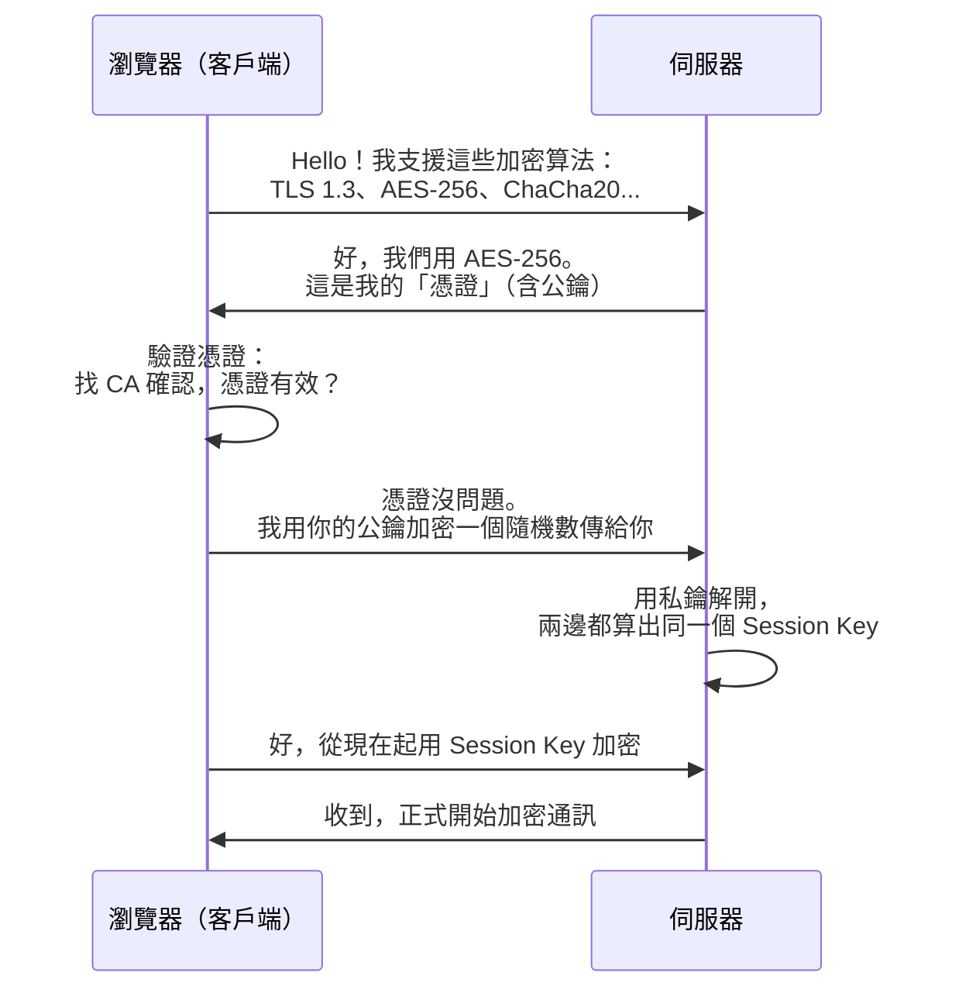
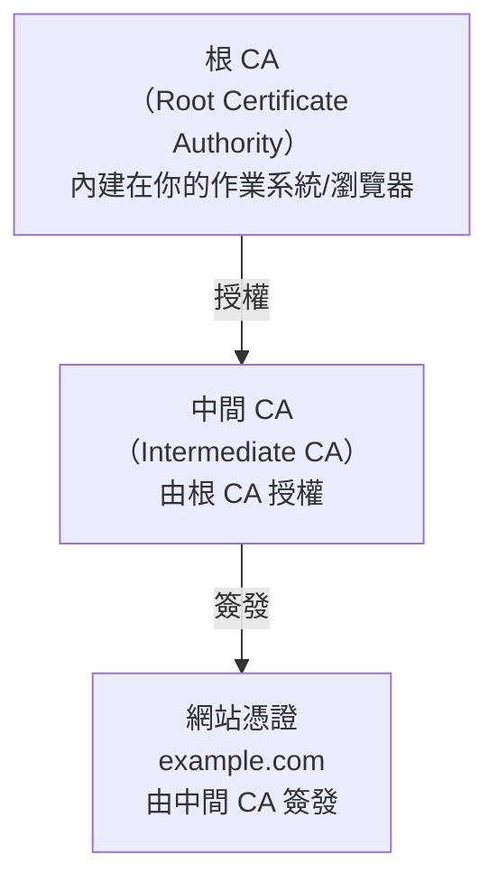

# [E-3-2] HTTPS 與 TLS：為什麼網址前面要有那把鎖

> **你會了解**：HTTPS 加密的運作原理，TLS 握手是什麼，以及憑證怎麼證明你連到的是真正的網站。

---

## 在咖啡廳刷卡買東西，為什麼沒被盜刷？

你有沒有在咖啡廳連公共 Wi-Fi，然後順手網購或登入 Gmail？

如果你有，你大概知道「這樣好像不太安全」——但實際上，大多數時候什麼事都沒發生。這是為什麼？

答案是：因為你連的網站用了 **HTTPS**。

同一個咖啡廳的人，即使他們架了一台假的路由器攔截你的封包，看到的也只是一堆亂碼。這就是加密的威力。

這篇就來說清楚：這把鎖是怎麼運作的？

---

## 明信片 vs 密封信：HTTP 和 HTTPS 的差別

先從最直觀的比喻開始。

**HTTP（沒有加密）**，就像寄明信片：

```
你的密碼：hunter2
信用卡號：4111-1111-1111-1111
```

這些內容直接暴露在網路封包裡，任何坐在傳輸路徑中間的人——路由器、ISP、甚至同一個 Wi-Fi 上的陌生人——都能看到。

**HTTPS（有加密）**，則像寄密封信：

```
%$#@!*&^%$#@!*中間的人看到的是這個&^%$#@!
```

就算有人攔截了封包，拿到的也是無法解讀的密文。只有你和伺服器兩端才能解讀實際內容。

HTTP 和 HTTPS 最大的差別就在這裡：HTTP 是**明文傳輸**，HTTPS 是**加密傳輸**。

而讓 HTTPS 能加密的技術，叫做 **TLS**。

---

## TLS 是什麼？它負責三件事

TLS 的全名是 **Transport Layer Security**（傳輸層安全協定）。

你可能聽過 **SSL**（Secure Sockets Layer）——那是 TLS 的前身，現在已經不用了，但很多人還是習慣說「SSL 憑證」。正確來說，現在跑的是 **TLS 1.3**（2018 年起的主流版本）。

TLS 一次解決三個問題：

| 問題 | TLS 提供的保障 |
|------|--------------|
| 資料被人偷看 | **加密（Encryption）**：中間人看到的是亂碼 |
| 連到假網站 | **身份驗證（Authentication）**：憑證證明對方是真的 |
| 資料被人竄改 | **完整性（Integrity）**：有任何修改馬上被發現 |

這三件事缺一不可。光加密但沒有身份驗證，你可能加密地把密碼傳給一個假冒的銀行網站。

---

## TLS 握手：兩個陌生人怎麼建立秘密頻道

這是整個 HTTPS 最有趣的部分。

想像你要跟一個素未謀面的人在電話裡說悄悄話，但你們從來沒見過面，也沒辦法事先交換密碼——你們要怎麼做到「只有彼此聽得懂」？

TLS 握手就是在解決這個問題。



這張圖說的是：雙方如何在公開的網路上，協商出一個「只有彼此知道」的 Session Key，之後的所有通訊都用這把鑰匙加密。

整個握手過程通常在幾十毫秒內完成，你感覺不到。

有幾個關鍵概念值得多說一下：

**公鑰加密（非對稱加密）**：憑證裡有一把「公鑰」，任何人都可以用它加密；但只有伺服器手上的「私鑰」能解開。就像你可以把掛鎖（公鑰）分發給所有人，但只有你有鑰匙（私鑰）。

**Session Key（對稱加密）**：握手之後協商出來的臨時密鑰，用來加密後續所有內容。對稱加密（雙方用同一把 key）比非對稱加密快很多，所以握手完成後就切換到對稱加密。

---

## 憑證是什麼：網路世界的護照

握手過程中，伺服器會出示一份「憑證」。但瀏覽器怎麼確認這份憑證不是偽造的？

現實世界裡，你的護照是由政府簽發的，所以它值得信任。

網路世界也有類似的機制。憑證是由 **CA（Certificate Authority，憑證授權機構）** 簽發的。



這張圖說的是：信任是一層一層往下傳的——你信任根 CA，根 CA 信任中間 CA，中間 CA 簽發了你要連的網站憑證。

全球主要的 CA 包括 DigiCert、Comodo、GlobalSign，以及後來改變遊戲規則的 **Let's Encrypt**。

**瀏覽器的驗證流程大概是這樣的：**

```
拿到 example.com 的憑證
→ 這張憑證是誰簽的？（DigiCert）
→ DigiCert 是誰簽的？（DigiCert 根 CA）
→ 根 CA 在我信任清單裡嗎？（有）
→ 憑證還沒過期嗎？（還沒）
→ 憑證上的域名是 example.com，跟我要連的一樣嗎？（一樣）
→ 通過，顯示那把綠色的鎖
```

如果任何一個環節不通過——憑證過期、域名不符、CA 不在信任清單——瀏覽器就會顯示那個嚇人的紅色警告頁面。這不是 bug，這是安全機制在保護你。

---

## Let's Encrypt：免費憑證讓 HTTPS 普及了

在 2015 年以前，要讓網站支援 HTTPS，你得去付費購買憑證，一張要幾百到幾千塊台幣，而且每年要續費。

**Let's Encrypt** 在 2015 年推出，提供**完全免費、自動更新**的 TLS 憑證。

這件事改變了整個網路的生態。HTTPS 的採用率從 2015 年的不到 40%，到 2024 年已經超過 85%。

現在用任何一個現代的雲端主機或部署平台（Vercel、Netlify、Cloudflare……），HTTPS 幾乎是預設開啟的，你根本不需要手動處理憑證——背後都是 Let's Encrypt 在運作。

---

## 小結

- HTTP 是明文傳輸，HTTPS 在外面包了一層 TLS 加密
- TLS 負責三件事：加密、身份驗證、完整性保護
- TLS 握手讓雙方在公開網路上協商出只有彼此知道的 Session Key
- 憑證由 CA 簽發，形成一條信任鏈，確保你連到的是真正的網站
- Let's Encrypt 讓免費憑證成為可能，推動 HTTPS 普及

下次看到瀏覽器網址列那把鎖，你就知道背後發生了什麼事了。

---

## 延伸閱讀

> 想了解 HTTP 協定的完整內容 → [課外讀物 E-3-3：HTTP 協定詳解](./E-3-3-http-protocol.md)
