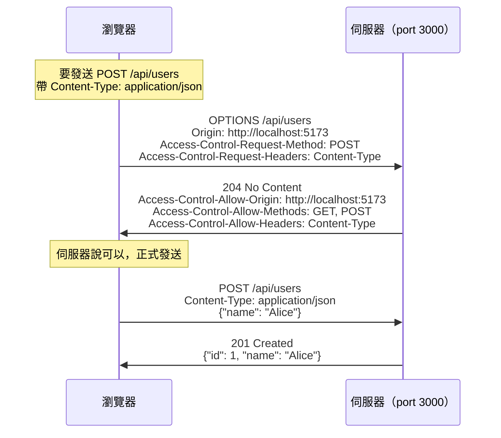

# [E-3-4] CORS：為什麼前後端分開跑就報錯？

> **你會了解**：Same-Origin Policy 是什麼，CORS 為什麼存在，以及怎麼解決那個讓人崩潰的紅色錯誤。

---

## 一個幾乎每個前端工程師都踩過的坑

你用 Vite 把前端跑起來了，port 5173。

後端 Express 也跑起來了，port 3000。

然後你寫了一個 `fetch("http://localhost:3000/api/users")`，信心滿滿地打開瀏覽器——

```
Access to fetch at 'http://localhost:3000/api/users' from origin
'http://localhost:5173' has been blocked by CORS policy:
No 'Access-Control-Allow-Origin' header is present on
the requested resource.
```

紅色錯誤。API 沒有回應。什麼資料都沒有。

這個錯誤幾乎是每個開始寫前後端分離的人都會遇到的第一道牆。這篇就來說清楚：它到底是怎麼一回事？

---

## 同源政策：瀏覽器內建的保安

在說 CORS 之前，要先理解它存在的原因——**Same-Origin Policy（同源政策）**。

「同源」的意思是：**協定 + 域名 + 端口** 三個都完全一樣。

```
http://localhost:5173   ← 前端
http://localhost:3000   ← 後端
```

協定一樣（都是 http），域名一樣（都是 localhost），但**端口不同**（5173 vs 3000）。

端口不同 → 不同源 → 瀏覽器擋下來。

| 比較對象 | 結果 |
|---------|------|
| `http://example.com` vs `https://example.com` | 不同源（協定不同） |
| `http://example.com` vs `http://api.example.com` | 不同源（子域名不同） |
| `http://example.com:80` vs `http://example.com:8080` | 不同源（端口不同） |
| `http://example.com/page1` vs `http://example.com/page2` | **同源**（只有路徑不同） |

**但為什麼瀏覽器要這樣限制？**

想像一個場景：你登入了網路銀行（`bank.com`），然後你順便開了另一個分頁逛了一個惡意網站（`evil.com`）。

如果沒有同源政策，`evil.com` 的 JavaScript 可以偷偷發送請求到 `bank.com/api/transfer`，而且因為你的瀏覽器裡有 `bank.com` 的登入 cookie，這個請求還會帶著你的身份。你的錢就這樣被轉走了。

同源政策就是為了防這件事的。**只有來自相同源的 JavaScript，才能讀取另一個源的回應。**

用個比喻：同源政策就像公寓的門禁——你不能直接走進別人家，但你可以按門鈴，等對方決定要不要開門。而 **CORS 就是那個對講機**，讓對方決定「這個訪客我認識，可以讓他進來」。

---

## CORS：讓伺服器自己決定開放給誰

**CORS（Cross-Origin Resource Sharing，跨來源資源共享）** 是一套由伺服器主動宣告「我允許哪些源存取我」的機制。

關鍵在這個 HTTP response header：

```
Access-Control-Allow-Origin: http://localhost:5173
```

當瀏覽器看到這個 header，它知道：「好，伺服器說這個源可以，我放行。」

如果這個 header 不存在，或者值不符合，瀏覽器就把回應擋下來，不讓你的 JavaScript 讀到。

注意：**伺服器實際上是有回應的**——只是瀏覽器把那個回應藏起來了。這就是為什麼你在瀏覽器的 Network tab 有時還是看得到那個請求，但 JavaScript 拿不到資料。

---

## Preflight Request：正式開打前的偵察兵

有時候瀏覽器在送出真正的請求之前，會先悄悄送一個「問路」的請求，叫做 **Preflight Request（預檢請求）**。

它用的 HTTP 方法是 `OPTIONS`，意思是：「欸，我接下來想送一個 POST 請求，帶著 JSON 資料，你允許嗎？」



這張圖說的是：瀏覽器在送真正的 POST 之前，先用 OPTIONS 確認伺服器是否同意，確認後才發正式請求。

**什麼時候會觸發 Preflight？**

不是每個請求都需要 Preflight。以下幾種情況才會觸發：

- 使用了 `PUT`、`DELETE`、`PATCH` 等方法（GET、POST 有時不會觸發）
- 加了自訂的請求 header（例如 `Authorization`）
- `Content-Type` 是 `application/json`（不是 `text/plain` 或 `multipart/form-data`）

這也是為什麼你有時候發一個帶 JSON 的 POST，卻看到主控台出現兩個請求——一個 OPTIONS，一個才是你的 POST。

---

## 實際解法：在 Express 加上 CORS

最快的解法是用 `cors` 這個 npm 套件：

```typescript
import express from "express"
import cors from "cors"

const app = express()

// 只允許來自前端的請求
app.use(cors({ origin: "http://localhost:5173" }))

app.use(express.json())

app.get("/api/users", (req, res) => {
  res.json([{ id: 1, name: "Alice" }])
})
```

這樣伺服器就會在每個回應加上正確的 `Access-Control-Allow-Origin` header，瀏覽器看到之後就會放行。

**為什麼不要用 `origin: "*"`？**

你可能看過這樣的設定：

```typescript
// 不要在生產環境這樣做
app.use(cors({ origin: "*" }))
```

`"*"` 表示允許所有源存取，開發環境暫時這樣寫是沒關係的，但**上線後千萬不要**，原因有兩個：

第一，任何網站都能存取你的 API，包括惡意網站。

第二，如果你的 API 需要帶 credentials（例如 cookie 或 `Authorization` header），帶了 credentials 的請求根本不能用 `"*"`，瀏覽器會再報另一個錯誤。必須明確指定 origin，同時加上 `credentials: true`：

```typescript
app.use(cors({
  origin: "http://localhost:5173",
  credentials: true,          // 允許帶 cookie
}))
```

---

## 常見錯誤訊息對照表

遇到 CORS 錯誤時，錯誤訊息通常說得很清楚，只是要知道怎麼讀：

**錯誤一：**
```
has been blocked by CORS policy:
No 'Access-Control-Allow-Origin' header is present on the requested resource.
```
意思：伺服器沒有設定 CORS，根本沒有回傳 `Access-Control-Allow-Origin`。

解法：在伺服器加上 cors middleware。

---

**錯誤二：**
```
CORS policy: The value of the 'Access-Control-Allow-Origin' header
in the response must not be the wildcard '*' when the request's
credentials mode is 'include'.
```
意思：你的請求帶了 credentials（cookie 或 Authorization），但伺服器設了 `origin: "*"`，這個組合不被允許。

解法：把 `origin` 改成具體的網址，並加上 `credentials: true`。

---

**錯誤三：**
```
CORS policy: Response to preflight request doesn't pass
access control check: No 'Access-Control-Allow-Origin' header...
```
意思：Preflight（OPTIONS 請求）被擋下來了，伺服器沒有正確回應 OPTIONS。

解法：確保 cors middleware 在所有其他路由之前設定，OPTIONS 請求才能被正確處理。

---

## 小結

- 瀏覽器的 Same-Origin Policy 阻止 JavaScript 讀取不同源的回應，目的是防止惡意網站偷資料
- 「同源」的定義是：協定、域名、端口三個都一樣
- CORS 讓伺服器主動宣告允許哪些源，透過 `Access-Control-Allow-Origin` header 告訴瀏覽器
- 部分請求（帶 JSON、自訂 header 等）會先觸發 OPTIONS 預檢請求，確認伺服器同意後才送真正的請求
- 解法：在 Express 加上 cors middleware，指定具體的 origin，不要圖方便用 `"*"`

下次看到那個紅色錯誤，至少你知道要去伺服器端加 header，而不是在前端東改西改。

---

## 延伸閱讀

> 想了解 HTTP 協定的完整內容 → [課外讀物 E-3-3：HTTP 協定詳解](./E-3-3-http-protocol.md)
