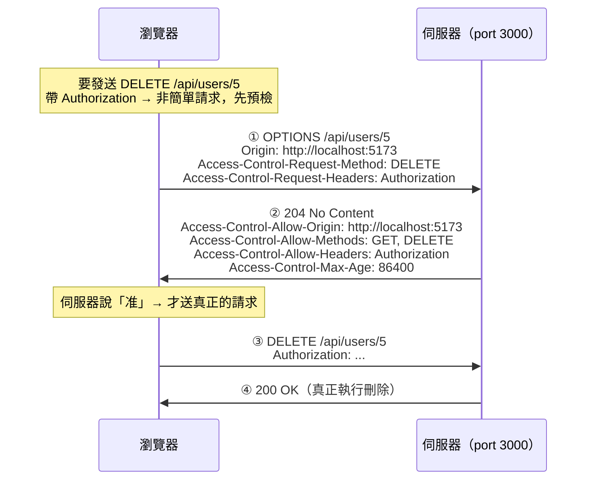

# [E-3-4] CORS：為什麼前後端分開跑就報錯？

> **你會了解**：Same-Origin Policy 是什麼，CORS 為什麼存在，以及怎麼解決那個讓人崩潰的紅色錯誤。

---

## 一個幾乎每個前端工程師都踩過的坑

你用 Vite 把前端跑起來了，port 5173。

後端 Express 也跑起來了，port 3000。

然後你寫了一個 `fetch("http://localhost:3000/api/users")`，信心滿滿地打開瀏覽器——

```
Access to fetch at 'http://localhost:3000/api/users' from origin
'http://localhost:5173' has been blocked by CORS policy:
No 'Access-Control-Allow-Origin' header is present on
the requested resource.
```

紅色錯誤。API 沒有回應。什麼資料都沒有。

這個錯誤幾乎是每個開始寫前後端分離的人都會遇到的第一道牆。這篇就來說清楚：它到底是怎麼一回事？

---

## 同源政策：瀏覽器內建的保安

在說 CORS 之前，要先理解它存在的原因——**Same-Origin Policy（同源政策）**。

「同源」的意思是：**協定 + 域名 + 端口** 三個都完全一樣。

```
http://localhost:5173   ← 前端
http://localhost:3000   ← 後端
```

協定一樣（都是 http），域名一樣（都是 localhost），但**端口不同**（5173 vs 3000）。

端口不同 → 不同源 → 瀏覽器擋下來。

| 比較對象 | 結果 |
|---------|------|
| `http://example.com` vs `https://example.com` | 不同源（協定不同） |
| `http://example.com` vs `http://api.example.com` | 不同源（子域名不同） |
| `http://example.com:80` vs `http://example.com:8080` | 不同源（端口不同） |
| `http://example.com/page1` vs `http://example.com/page2` | **同源**（只有路徑不同） |

**但為什麼瀏覽器要這樣限制？**

想像一個場景：你登入了網路銀行（`bank.com`），然後你順便開了另一個分頁逛了一個惡意網站（`evil.com`）。

如果沒有同源政策，`evil.com` 的 JavaScript 可以偷偷發送請求到 `bank.com/api/transfer`，而且因為你的瀏覽器裡有 `bank.com` 的登入 cookie，這個請求還會帶著你的身份。你的錢就這樣被轉走了。

同源政策就是為了防這件事的。**只有來自相同源的 JavaScript，才能讀取另一個源的回應。**

用個比喻：同源政策就像公寓的門禁——你不能直接走進別人家，但你可以按門鈴，等對方決定要不要開門。而 **CORS 就是那個對講機**，讓對方決定「這個訪客我認識，可以讓他進來」。

---

## CORS：讓伺服器自己決定開放給誰

**CORS（Cross-Origin Resource Sharing，跨來源資源共享）** 是一套由伺服器主動宣告「我允許哪些源存取我」的機制。

關鍵在這個 HTTP response header：

```
Access-Control-Allow-Origin: http://localhost:5173
```

當瀏覽器看到這個 header，它知道：「好，伺服器說這個源可以，我放行。」

如果這個 header 不存在，或者值不符合，瀏覽器就把回應擋下來，不讓你的 JavaScript 讀到。

注意：**伺服器實際上是有回應的**——只是瀏覽器把那個回應藏起來了。這就是為什麼你在瀏覽器的 Network tab 有時還是看得到那個請求，但 JavaScript 拿不到資料。

---

## Preflight Request：正式開打前的偵察兵

有時候瀏覽器在送出真正的請求之前，會先悄悄送一個「問路」的請求，叫做 **Preflight Request（預檢請求）**。它用的 HTTP 方法是 `OPTIONS`，意思是：「欸，我接下來想送一個帶 JSON 的請求，你允許嗎？」

但這裡有個關鍵問題很多人跳過，結果就是「看過卻沒真的懂」——

### 為什麼要先問？因為有些請求「先斬後奏」就來不及了

回想上面同源政策的核心：**CORS 保護的是「伺服器」不被非預期的跨站請求傷害。**

現在想像沒有預檢的世界：

```
你登入了 bank.com，瀏覽器存了你的 cookie
       ↓
你不小心逛到惡意網站 evil.com
       ↓
evil.com 的 JavaScript 偷偷送出：
   DELETE https://bank.com/account  （瀏覽器會自動帶上你的 cookie！）
```

如果瀏覽器毫無防備就直接把這個 `DELETE` 送出去，**等伺服器收到時，破壞已經造成了**——就算伺服器接著回「不准跨來源」，帳戶可能早就被刪掉了。像 `DELETE`、`PUT` 這種**有副作用**（會改變伺服器狀態）的請求，「先送了再說」根本來不及。

所以瀏覽器的策略是：**對「可能有副作用」的請求，先派一個偵察兵（OPTIONS）去問過，伺服器點頭才送真正的那一發。** 這就是 preflight 的真正目的。

> **關鍵記憶點**：preflight 不是為了「確認能不能讀到回應」（那是一般 CORS header 在做的事），而是為了**在造成傷害前先攔住有副作用的請求**。

### 簡單請求 vs 非簡單請求：判斷會不會觸發

瀏覽器把跨來源請求分成兩類。**簡單請求（simple request）**不會觸發 preflight，直接送；只要**跳脫**簡單請求的條件，就得先預檢。

一個請求要算「簡單請求」，必須**同時**滿足：

- 方法是 `GET`、`HEAD`、`POST` 其中之一
- 沒有加自訂 header（只用了 `Accept`、`Content-Type` 等少數安全 header）
- `Content-Type` 只能是 `application/x-www-form-urlencoded`、`multipart/form-data`、`text/plain`

**只要違反任一條，就會先 preflight。** 最常見的觸發情境：

| 你做了什麼 | 為什麼觸發 |
|---|---|
| 用 `PUT` / `DELETE` / `PATCH` | 非簡單方法，通常有副作用 |
| 送 JSON（`Content-Type: application/json`） | JSON 不在簡單清單裡——實務上**最常見**的觸發原因 |
| 帶自訂 header（如 `Authorization`、`X-Api-Token`） | 自訂 header 需要先報備 |

> 💡 這就是為什麼你發一個帶 JSON 的 POST，Network 面板卻跑出**兩個**請求——多出來那個 `OPTIONS` 就是 preflight，不是你寫錯。

### 一次 preflight 的完整來回


```mermaid
sequenceDiagram
    participant B as 瀏覽器
    participant S as 伺服器（port 3000）

    Note over B: 要發送 DELETE /api/users/5<br/>帶 Authorization → 非簡單請求，先預檢

    B->>S: ① OPTIONS /api/users/5<br/>Origin: http://localhost:5173<br/>Access-Control-Request-Method: DELETE<br/>Access-Control-Request-Headers: Authorization
    S->>B: ② 204 No Content<br/>Access-Control-Allow-Origin: http://localhost:5173<br/>Access-Control-Allow-Methods: GET, DELETE<br/>Access-Control-Allow-Headers: Authorization<br/>Access-Control-Max-Age: 86400

    Note over B: 伺服器說「准」→ 才送真正的請求

    B->>S: ③ DELETE /api/users/5<br/>Authorization: ...
    S->>B: ④ 200 OK（真正執行刪除）
```

這張圖的重點：**真正有副作用的 ③ 只有在 ② 回覆「允許」後才送出。** 如果 ② 沒有回對的 `Access-Control-Allow-*` header，瀏覽器會**直接擋下 ③**，你的 `fetch` 就爆 CORS error——而且此時真正的請求**根本沒送到伺服器**，什麼都沒發生。

### 三個實務上一定要知道的細節

1. **preflight 是瀏覽器自動做的，你控制不了。** 你只寫了 `fetch(url, { method: "DELETE" })`，那個 `OPTIONS` 是瀏覽器背著你偷偷發的，程式碼裡看不到。

2. **`Access-Control-Max-Age` 可以快取預檢結果。** 上圖的 `86400`（秒 = 一天）代表：接下來一天內，對同樣的請求瀏覽器就不用再 preflight，直接送真正的請求。沒有它的話，每個 JSON 請求都要跑兩趟，很浪費。

3. **preflight 只發生在瀏覽器。** 用 Postman、curl、或後端對後端呼叫**都不會有 preflight**——因為 CORS 是瀏覽器強加的規則，其他 client 不理這套。所以「**Postman 打得通、瀏覽器卻 CORS error**」幾乎都是 preflight/CORS header 沒設好，不是你的 API 壞了。

---

## 實際解法：在 Express 加上 CORS

最快的解法是用 `cors` 這個 npm 套件：

```typescript
import express from "express"
import cors from "cors"

const app = express()

// 只允許來自前端的請求
app.use(cors({ origin: "http://localhost:5173" }))

app.use(express.json())

app.get("/api/users", (req, res) => {
  res.json([{ id: 1, name: "Alice" }])
})
```

這樣伺服器就會在每個回應加上正確的 `Access-Control-Allow-Origin` header，瀏覽器看到之後就會放行。

**為什麼不要用 `origin: "*"`？**

你可能看過這樣的設定：

```typescript
// 不要在生產環境這樣做
app.use(cors({ origin: "*" }))
```

`"*"` 表示允許所有源存取，開發環境暫時這樣寫是沒關係的，但**上線後千萬不要**，原因有兩個：

第一，任何網站都能存取你的 API，包括惡意網站。

第二，如果你的 API 需要帶 credentials（例如 cookie 或 `Authorization` header），帶了 credentials 的請求根本不能用 `"*"`，瀏覽器會再報另一個錯誤。必須明確指定 origin，同時加上 `credentials: true`：

```typescript
app.use(cors({
  origin: "http://localhost:5173",
  credentials: true,          // 允許帶 cookie
}))
```

---

## 常見錯誤訊息對照表

遇到 CORS 錯誤時，錯誤訊息通常說得很清楚，只是要知道怎麼讀：

**錯誤一：**
```
has been blocked by CORS policy:
No 'Access-Control-Allow-Origin' header is present on the requested resource.
```
意思：伺服器沒有設定 CORS，根本沒有回傳 `Access-Control-Allow-Origin`。

解法：在伺服器加上 cors middleware。

---

**錯誤二：**
```
CORS policy: The value of the 'Access-Control-Allow-Origin' header
in the response must not be the wildcard '*' when the request's
credentials mode is 'include'.
```
意思：你的請求帶了 credentials（cookie 或 Authorization），但伺服器設了 `origin: "*"`，這個組合不被允許。

解法：把 `origin` 改成具體的網址，並加上 `credentials: true`。

---

**錯誤三：**
```
CORS policy: Response to preflight request doesn't pass
access control check: No 'Access-Control-Allow-Origin' header...
```
意思：Preflight（OPTIONS 請求）被擋下來了，伺服器沒有正確回應 OPTIONS。

解法：確保 cors middleware 在所有其他路由之前設定，OPTIONS 請求才能被正確處理。

---

## 小結

- 瀏覽器的 Same-Origin Policy 阻止 JavaScript 讀取不同源的回應，目的是防止惡意網站偷資料
- 「同源」的定義是：協定、域名、端口三個都一樣
- CORS 讓伺服器主動宣告允許哪些源，透過 `Access-Control-Allow-Origin` header 告訴瀏覽器
- 帶副作用的請求（用 `PUT`/`DELETE`、帶 JSON、帶自訂 header 等「非簡單請求」）會先觸發 OPTIONS 預檢，**目的是在造成傷害前先問過伺服器**，同意後才送真正的請求；預檢失敗時真正的請求根本不會送出
- 預檢只發生在瀏覽器——Postman／curl 不會有，所以「Postman 通、瀏覽器不通」通常就是 CORS 沒設好
- 解法：在 Express 加上 cors middleware，指定具體的 origin，不要圖方便用 `"*"`

下次看到那個紅色錯誤，至少你知道要去伺服器端加 header，而不是在前端東改西改。

---

## 延伸閱讀

> 想了解 HTTP 協定的完整內容 → [課外讀物 E-3-3：HTTP 協定詳解](./E-3-3-http-protocol.md)
