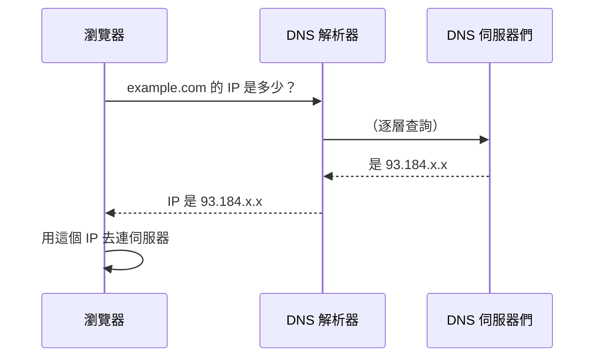

# [E-3-5] DNS：網址背後的電話簿

> **目標**：理解 DNS 怎麼把「好記的網址」翻譯成「機器用的 IP 位址」，這是你每次上網都用到、卻看不見的系統。

## 一個你每天用、卻沒察覺的系統

你在瀏覽器打 `google.com`，幾秒後看到網頁。但機器之間其實**不認得「google.com」這種名字**——它們只認 **IP 位址**（像 `142.250.x.x` 這種數字，infra Part 3-1）。

那「google.com」怎麼變成 IP 的？靠 **DNS（Domain Name System，網域名稱系統）**。

> **DNS 是網路世界的「電話簿」——你給它一個好記的名字（網址），它回你對應的 IP 位址（機器的地址）。**

用類比：你不會背朋友的電話號碼，而是存「媽媽」「公司」在通訊錄，要打時查名字得號碼。DNS 就是網路的通訊錄——把「google.com」查成 IP。

## DNS 查詢的流程

當你打開 `example.com`，背後發生一連串「查號」：



實際上 DNS 是「**階層式、分散式**」的（這本身就是個分散式系統，呼應 E-13）：

1. 先問「**根 DNS**」：`.com` 的伺服器在哪？
2. 再問 `.com` 的伺服器：`example.com` 的伺服器在哪？
3. 再問 `example.com` 的伺服器：它的 IP 是多少？

聽起來很多步，但因為**到處都有快取**（呼應快取課程），實際上通常瞬間完成。

## DNS 也充滿快取

DNS 查詢慢（要逐層問），所以**每一層都快取**（cache-2-1 全景的精神）：

- 你的瀏覽器快取。
- 你的作業系統快取。
- 你的 DNS 解析器（通常是 ISP 或 8.8.8.8 之類）快取。

所以同一個網址，第一次查可能慢一點，之後都從快取瞬間拿到 IP。這些快取有「**TTL（存活時間）**」（cache-1-2）——這也是為什麼「改了 DNS 設定（例如換伺服器 IP）後，要等一段時間（TTL）才全球生效」的原因。

## 常見的 DNS 記錄類型

DNS 不只存「名字 → IP」，還有幾種記錄（你在 aws Part 6-6 Route 53 碰過）：

| 記錄 | 作用 |
|------|------|
| **A** | 網址 → IPv4 位址 |
| **AAAA** | 網址 → IPv6 位址 |
| **CNAME** | 網址 → 另一個網址（別名）|
| **MX** | 信件要送到哪個郵件伺服器 |

例如 `www.example.com` 用 CNAME 指向 `example.com`、`example.com` 用 A 記錄指向實際 IP。

## DNS 在整個請求中的位置

回到「打開網頁」的全景（呼應 E-3-1、infra Part 3-1）：

```
你打 https://example.com
  → ① DNS：把 example.com 查成 IP（這篇）
  → ② 連到那個 IP（走網路，E-3-1）
  → ③ HTTPS 加密握手（E-3-2）
  → ④ 發 HTTP 請求、拿回網頁（E-3-3）
```

DNS 是這趟旅程的**第一步**——沒有它，你得背一堆 IP 數字才能上網。它是讓網際網路「好用」的隱形功臣。

## 小結

- DNS = 網路的「電話簿」，把好記的網址翻譯成機器用的 IP 位址。
- 它是階層式、分散式的（根 → .com → 網域），但靠快取通常瞬間完成。
- DNS 到處快取、有 TTL——所以改 DNS 設定要等一段時間才生效。
- 記錄類型：A（IPv4）、CNAME（別名）、MX（信件）等。
- 它是「打開網頁」旅程的第一步。

> 網際網路怎麼運作 → [課外讀物 E-3-1](./E-3-1-how-internet-works.md)；雲端 DNS（Route 53）→ 參見 **aws 課程** Part 6-6；DNS 快取 → 快取課程
