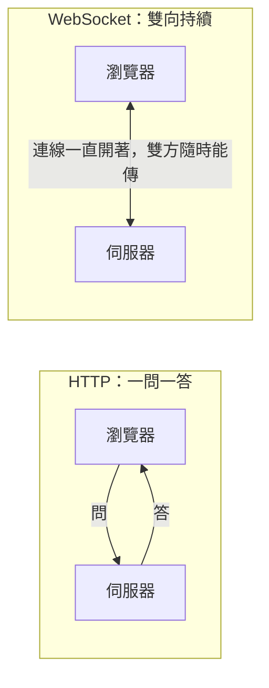

# [E-3-6] WebSocket：當 HTTP 的一問一答不夠用

> **目標**：理解 HTTP「一問一答」的限制，以及 WebSocket 怎麼建立「雙向、即時」的連線，適合聊天、通知這類即時應用。

## HTTP 的限制：你問才有答

HTTP（E-3-3）的模式是「**請求-回應（一問一答）**」——**瀏覽器問，伺服器才答**。伺服器**不能主動**「推」東西給瀏覽器。

這對「看網頁」很好，但對「即時」應用有問題。想像一個聊天室：

> 別人傳訊息給你，伺服器知道了——但它**沒辦法主動推給你**。你的瀏覽器得「**一直去問**」伺服器「有新訊息嗎？有新訊息嗎？」（這叫**輪詢 polling**）——很笨、很浪費、也不夠即時。

## 解法：WebSocket——一條「持續開著的雙向通道」

**WebSocket** 解決這個——它在瀏覽器和伺服器之間，建立一條「**持續開著、雙向**」的連線：



- **持續連線**：建立一次後，連線**一直開著**（不像 HTTP 每次請求都要重新建立）。
- **雙向**：建立後，**伺服器也能「主動推」東西給瀏覽器**，不用瀏覽器問。

用類比：

- **HTTP** 像「**寄信**」——你寄一封、對方回一封，一來一往。
- **WebSocket** 像「**打電話**」——接通後，雙方隨時能說話，不用每句話都重新撥號。

## 怎麼建立 WebSocket

WebSocket 其實「**從 HTTP 升級而來**」——它先用一個 HTTP 請求「握手」，然後「升級」成 WebSocket 連線：

```
瀏覽器：（HTTP 請求）我想升級成 WebSocket
伺服器：（回應）好，升級！
→ 之後這條連線就變成雙向的 WebSocket，雙方隨時能傳訊息
```

連線建立後，雙方就能即時、雙向地傳訊息，直到有一方關閉。

## 適合什麼場景

WebSocket 適合「**需要即時、雙向**」的應用：

| 場景 | 為什麼要 WebSocket |
|------|------------------|
| **聊天室** | 別人傳訊息，要「即時」推給你 |
| **即時通知** | 有新通知，伺服器主動推 |
| **協作編輯**（如 Google Docs）| 別人的編輯要即時同步給你 |
| **即時遊戲** | 雙方狀態要即時互傳 |
| **股票/即時數據** | 數據變動即時推送 |

這些用 HTTP 輪詢都很笨拙，用 WebSocket 才優雅。

## 什麼時候「不」需要 WebSocket

別過度使用——大部分網站功能用普通 HTTP 就好。只有「**真的需要伺服器主動推、或高頻雙向**」時才用 WebSocket。它維持「持續連線」是有成本的（伺服器要同時撐住大量開著的連線）。

> 補充：還有些「介於中間」的技術——例如 **SSE（Server-Sent Events）** 是「伺服器單向推給瀏覽器」（比 WebSocket 簡單，適合只需要「推通知」、不需要雙向的場景）。技術選型看需求。

## 小結

- HTTP 是「一問一答」，伺服器不能主動推（像寄信）。
- **WebSocket** 建立「持續、雙向」的連線，伺服器能主動推（像打電話）。
- 它從 HTTP「握手升級」而來。
- 適合：聊天、即時通知、協作編輯、即時遊戲、即時數據。
- 別過度用——一般功能用 HTTP 就好；只推單向用 SSE 也行。

> HTTP 協定 → [課外讀物 E-3-3：HTTP 協定詳解](./E-3-3-http-protocol.md)
