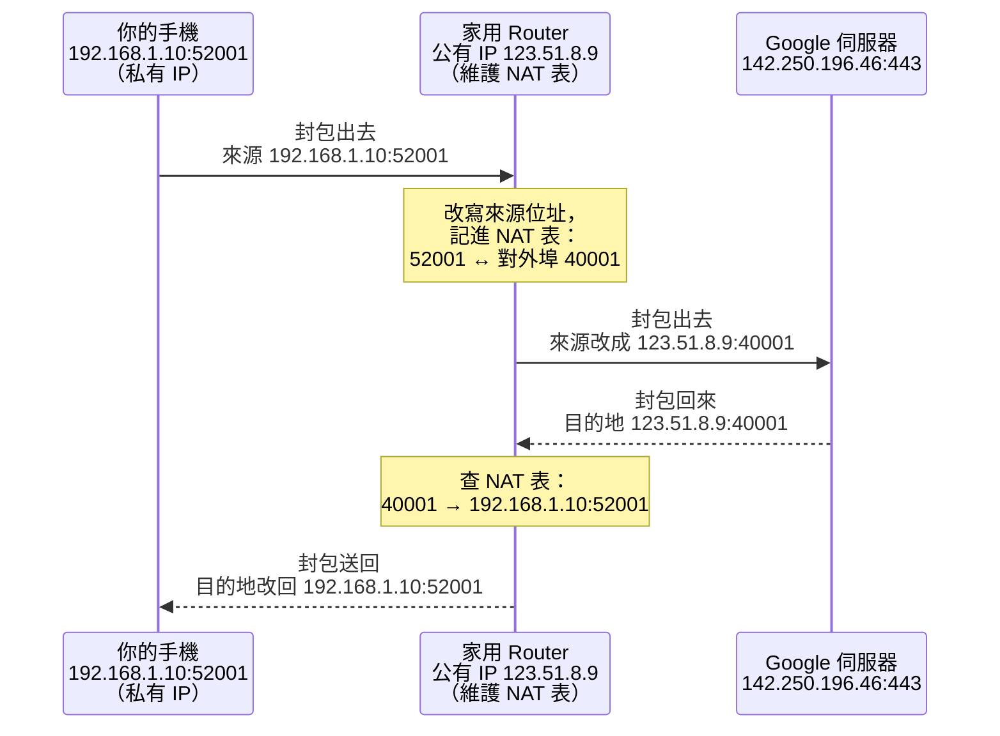

# [E-3-8] NAT：一個對外 IP，全家一起上網的魔法

> **目標**：搞懂為什麼你家十幾台裝置（手機、電腦、電視、掃地機器人）明明都在上網，對外卻只用「一個」IP 位址。這背後靠的是 NAT——一個你天天在用、卻從沒察覺的轉換機制。

## 一個奇怪的問題

先問你一個看似無聊、其實很有意思的問題：

你家有幾台會上網的裝置？手機、筆電、桌機、平板、電視、遊戲主機……隨便數一數大概十台跑不掉。它們同時滑 IG、看 YouTube、下載遊戲，全部都通。

那你有沒有想過——**外面的網際網路，是怎麼分辨「這個封包要送回你家的哪一台裝置」的？**

更奇怪的是：如果你去查一下「我的 IP 是多少」（Google 搜尋「what is my ip」就會告訴你），你會發現**全家所有裝置查出來的公有 IP 都一模一樣**。明明是不同裝置，對外卻長同一張臉。

這不是巧合，這就是 NAT 在工作。

---

## 為什麼需要 NAT？IPv4 不夠用了

要理解 NAT，得先回到一個很現實的問題：**IPv4 位址不夠用了。**

在 [E-3-1](./E-3-1-how-internet-works.md) 我們提過，網路世界真正的地址是 **IP 位址**（Internet Protocol Address，網際網路協定位址），像 `142.250.196.46` 這種數字。而最主流的 **IPv4（Internet Protocol version 4，第四版網際網路協定）** 總共只有大約 **43 億個**位址。

43 億聽起來很多，但地球上的人比這還多，而且每個人身上不只一台裝置。位址早就分光了。

那怎麼辦？總不能叫大家別上網。工程師想出的解法很聰明：

> **既然對外的公有 IP 這麼稀有，那就讓一整個家庭／公司「共用一個」對外 IP，內部再自己想辦法分裝置。**

這個「內部自己想辦法」的機制，就是 NAT（Network Address Translation，網路位址轉換）。

---

## 私有 IP vs 公有 IP：兩種門牌

要共用一個對外 IP，得先把 IP 位址分成兩種角色。

**公有 IP（Public IP）**：在整個網際網路上**獨一無二**的地址，像你家在真實世界的完整地址（「台北市信義區松高路 1 號」），全世界寄信都找得到。Google 的伺服器、你家路由器對外那一面，用的都是公有 IP。它很稀有，通常是你的 ISP（Internet Service Provider，網路服務供應商，例如中華電信）分配給你家一個。

**私有 IP（Private IP）**：只在你家區域網路（Local Area Network，區域網路，就是你家 Wi-Fi 這一圈）裡有效的地址。它像公司內部的「分機號碼」或大樓裡的「三樓之二」——出了這棟大樓就沒意義，隔壁棟也可以有一模一樣的「三樓之二」。

私有 IP 有幾個固定的號段，是全世界公認「保留給內網用、不會出現在公開網際網路上」的：

| 私有 IP 範圍 | 常見場景 |
|---|---|
| `192.168.0.0` ~ `192.168.255.255` | 家用 Wi-Fi 最常見（你手機大概是 `192.168.1.x`）|
| `10.0.0.0` ~ `10.255.255.255` | 公司、大型內網 |
| `172.16.0.0` ~ `172.31.255.255` | 中型網路、Docker 之類 |

> 換句話說：你家每台裝置都有一個「私有 IP」（分機號），但全家對外只有一個「公有 IP」（總機號碼）。外面的世界只看得到總機號碼。

這就帶出核心問題：**外面回來的封包只知道總機號碼，怎麼知道要轉給哪支分機？** 這正是 NAT 要解決的。

---

## 用生活類比先講：公司總機與旅館櫃檯

在看技術細節之前，先用兩個你一定懂的類比。

**類比一：公司總機分機**

想像一間公司只對外公布一支電話（`02-1234-5678`），但公司內部有一百支分機。

- 小明（分機 101）打電話出去找客戶，總機幫他接通，並在小本子上記一筆：「這通對外通話，是 101 撥的」。
- 客戶要回撥時，只會撥公司的總機號碼。總機接起來，**查一下小本子**：「喔，這通是回給 101 的」，於是轉接給小明。

客戶從頭到尾**只知道總機號碼**，完全不知道有「分機 101」這個東西。分機是公司內部的秘密。

**類比二：旅館櫃檯代收信**

你住旅館時，寄信可以寫旅館地址當回信地址。信寄回旅館後，櫃檯**查住房登記**，知道「這封是給 512 房的客人」，再送到你房間。外面的郵差只認得旅館地址，房號是旅館內部的事。

NAT 做的就是這件事：**router（路由器，你家 Wi-Fi 那台機器）就是總機／櫃檯**，它維護一張對應表，負責把「內部裝置＋內部埠號」對應到「對外連線」，出去改地址、回來查表送回正確的裝置。

---

## NAT 到底怎麼運作？那張「對應表」

現在來看真正的機制。你家的 router 裡維護著一張表，通常叫 **NAT 表（NAT table）** 或轉換表。

這裡要先補一個名詞：**埠號（Port）**。IP 位址是「哪一台機器」，埠號則是「這台機器上的哪一個連線視窗」。同一台手機可以一邊開 YouTube、一邊滑 IG，就是靠不同的埠號區分不同連線（就像同一棟大樓有很多信箱，各收各的）。NAT 就是靠 **IP + 埠號的組合** 來精準辨識每一條連線。

當你手機（私有 IP `192.168.1.10`）要連 Google 伺服器（`142.250.196.46`）時，封包經過 router，發生這樣的轉換：

**封包「出去」的時候**——router 把封包的「來源位址」從私有 IP 改寫成自己的公有 IP，並在 NAT 表記一筆：

| 內部裝置（私有 IP:埠號） | 改寫成（公有 IP:埠號） | 對方 |
|---|---|---|
| `192.168.1.10:52001` | `123.51.8.9:40001` | `142.250.196.46:443`（Google）|
| `192.168.1.20:49500` | `123.51.8.9:40002` | `142.250.196.46:443`（Google）|

**封包「回來」的時候**——Google 回傳的封包，目的地是 `123.51.8.9:40001`（公有 IP）。router 收到後**查 NAT 表**，發現 `40001` 這個埠號對應到 `192.168.1.10:52001`，於是把目的地改回你手機的私有 IP，送回你手機。

注意上面表格的重點：手機和筆電**同時**連同一個 Google 伺服器，router 用**不同的對外埠號**（`40001` vs `40002`）把它們區分開來——這樣即使回來的封包長得很像，router 也不會搞錯要送給誰。這種「用埠號區分多台裝置」的做法，正式名稱叫 **PAT（Port Address Translation，埠位址轉換）**，也常被叫做 **NAPT** 或口語的「NAT 過載」。它是家用路由器實際在用的 NAT 型態。

用一張圖把整個來回看清楚：

這張圖說明了 NAT 的核心：**出去時把私有來源位址「改寫」成公有位址並登記，回來時「查表還原」成正確的內部裝置**。內外之間的翻譯，全靠 router 那張表。

---

## 一個很重要的副作用：外面連不進來

理解了 NAT，你就能解釋一個很多人納悶的現象：

> **為什麼你家的電腦可以連外面的網站，但外面的人沒辦法主動連進你家的電腦？**

答案就藏在剛剛那張 NAT 表裡。NAT 表的每一筆，都是**你的裝置「先主動連出去」才建立的**。有了這筆記錄，回來的封包才查得到路。

但如果是外面某台陌生機器**主動**發封包到你家的公有 IP，router 收到後查表——**查無此筆**，它根本不知道要轉給內部哪一台，於是就把封包丟掉了。

這其實順便帶來了一層**天然的防火牆效果**：外部無法隨便連進你的內網裝置，因為 NAT 預設「沒登記過的連線一律不放行」。這也是為什麼你家的智慧電視、印表機直接暴露在網路上卻相對安全的原因之一。

---

## 那如果我「想」讓外面連進來呢？Port Forwarding

有時候你確實需要讓外面連進來。例如你在家架了一台遊戲伺服器、或想從公司遠端連回家裡的電腦。這時候就要用 **Port Forwarding（埠轉發，也叫連接埠轉發）**。

Port forwarding 等於是你**手動在 NAT 表裡預先寫死一筆規則**，告訴 router：

> 「以後任何打到我公有 IP 的 `25565` 埠的封包，不用查有沒有人先連出去，直接轉給內網的 `192.168.1.50:25565`（我的遊戲主機）。」

回到總機的類比：這就像事先交代總機小姐「只要有人問 25565 分機，一律轉給我，不用問了」。等於在你的天然防火牆上，**為特定服務開了一扇指定的門**。

（也因為是「開了一扇門」，設定 port forwarding 要小心——你等於把某台內網裝置直接暴露給整個網際網路，安全性要自己顧好。）

---

## NAT 對 P2P 連線的影響（點到為止）

最後提一個你未來可能會遇到的坑。

有些應用需要兩台使用者的裝置**直接互連**，不透過中間伺服器轉——這叫 **P2P（Peer-to-Peer，點對點）**，常見於視訊通話、線上遊戲對戰、檔案直傳。

問題來了：如果雙方**都躲在各自的 NAT 後面**，那就變成「兩支分機想直接通話，但雙方都只看得到對方的總機號碼，也都無法主動被連進去」。兩邊互相連不到對方，卡住了。

工程師為此發明了一堆繞路技巧，你之後可能會聽到這些名詞：

- **STUN**：幫裝置問出「我在 NAT 後面，對外到底長什麼樣子」。
- **打洞（NAT hole punching）**：兩邊同時往對方送封包，趁機在各自 NAT 表上「騙出」一筆對應記錄，硬是打通。
- **TURN**：真的打不通時，就找一台中繼伺服器幫忙轉，雖然慢一點但至少通。

這些細節這裡不展開，你只要記得：**NAT 讓「主動連進來」變困難，所以 P2P 應用得花額外力氣繞過它。** 這是 NAT 帶來便利的同時，付出的一點代價。

---

## 小結

- **IPv4 位址不夠用**（只有約 43 億個），所以發明 NAT，讓一整個家庭／公司共用一個對外的公有 IP。
- **私有 IP**（`192.168.x.x`、`10.x.x.x`、`172.16~31.x.x`）只在內網有效，像分機號；**公有 IP** 在整個網際網路獨一無二，像總機號。
- **NAT 的核心是一張對應表**：router 出去時把私有來源位址改寫成公有位址並登記，回來時查表還原成正確的內部裝置——靠 IP + 埠號區分不同連線（家用路由器用的其實是 PAT）。
- **副作用**：內網能主動連外、外面卻無法主動連進來（天然防火牆）；要開放時用 **Port Forwarding** 手動在 NAT 表寫死一筆規則。
- **P2P** 應用會被 NAT 擋住，得靠 STUN／打洞／TURN 等技巧繞過。

NAT 是網際網路「續命」的大功臣——它用一個聰明的翻譯機制，讓早該用完的 IPv4 位址撐到了今天。

---

> 網路世界的地址與 IP 是怎麼回事 → [課外讀物 E-3-1：網際網路是怎麼運作的？](./E-3-1-how-internet-works.md)
> 名字怎麼翻譯成 IP → [課外讀物 E-3-5：DNS：網址背後的電話簿](./E-3-5-dns.md)
