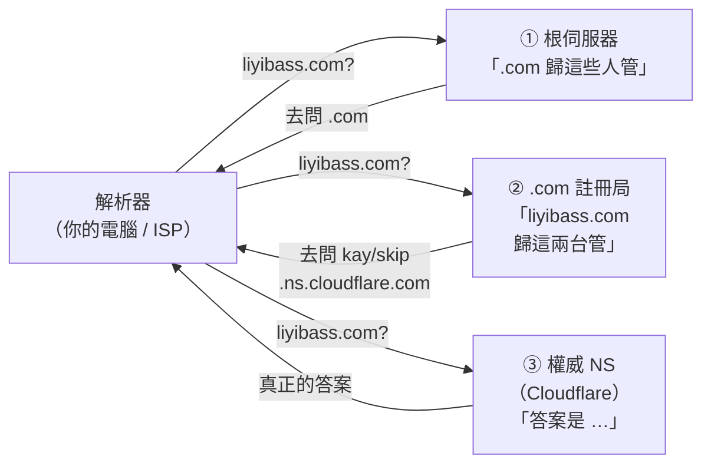
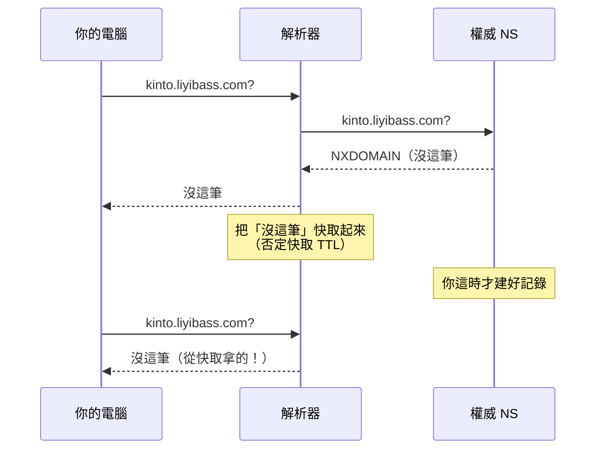

# [E-3-9] 網域搬家：DNS 委派鏈到底改了哪一行

> **這篇在說什麼**：把一個網域的 DNS 從 AWS Route 53 搬到 Cloudflare，實際上只改了一行設定——但那一行在哪裡、為什麼改別的地方沒用、怎麼確認它生效了，這三件事沒人會主動告訴你。

## 一個很容易改錯地方的操作

先講一個真實會發生的情境。

你在 AWS Route 53 裡看到你的網域，點進去，看到一張 **Hosted zone**，裡面清清楚楚列著 NS 記錄：

```
liyibass.com.  NS  ns-1135.awsdns-13.org.
liyibass.com.  NS  ns-1658.awsdns-15.co.uk.
...
```

你想搬去 Cloudflare，於是把這幾筆改成 Cloudflare 給你的位址、存檔、等了半天——**什麼都沒發生**。

問題不在你手速太慢，而在**你改的那份 NS 記錄根本沒人看**。

要理解為什麼，得先知道 DNS 不是一張大表。

> 還沒讀過 DNS 基本概念的話，先看 → [課外讀物 E-3-5：DNS：網址背後的電話簿](./E-3-5-dns.md)。這篇是它的續集，講「當你要動這套系統時」會遇到什麼。

## DNS 不是一張大表，是一條委派鏈

沒有任何一台機器存著「全世界所有網域的答案」。DNS 是一條**逐層把問題丟給下一個人**的鏈子：



這張圖表達的是：每一層都只回答「**下一步該去問誰**」，只有最後一層才給真正的答案。

**Name server 就是第 ③ 步那台「真的存著記錄、負責回答」的機器。**

而網域搬家，改的是**第 ② 步**——告訴 `.com` 註冊局：「以後別人問我的網域，請叫他們去問 Cloudflare。」

用一句話總結整篇文章：

> **搬家不是搬資料，是換一個「負責回答的櫃檯」。**

這也立刻推出一個很重要的推論：**記錄不會自己跟著搬過去**。新櫃檯手上必須先有同一份資料，不然就是換了櫃檯、但那裡什麼都查不到。

## AWS 上最容易搞混的兩個東西

Route 53 裡有兩個名字很像、性質完全不同的東西：

| | Registered domains | Hosted zone |
|---|---|---|
| 是什麼 | 網域的**所有權**（你花錢註冊的那個） | 一個**放 DNS 記錄的容器**（A、CNAME、TXT…） |
| NS 設定的意義 | ⭐ **委派**：寫進 `.com` 註冊局，決定流量去哪 | 自述：「我覺得是我負責」 |
| 刪掉會怎樣 | ⚠️ 網域沒了 | 只是少一份記錄，**不影響所有權** |
| 收費 | 網域年費 | **按月計費**（約 $0.50／月，實際費率自己確認） |

開頭那個「改了沒反應」的情境，就是改到了右邊那欄。

**要改的位置**：Route 53 → **Registered domains**（不是 Hosted zones）→ 點網域 → 右上角 **`Actions ▼`** → **`Edit name servers`**。

> ⚠️ 同一個下拉選單裡還有 `Transfer out`（把網域轉出 AWS）跟 `Delete domain`，不要點錯。

## NS 記錄會出現在兩個地方

這是上面那張表的根源，值得單獨拉出來講。**同一份 NS 記錄，在兩個地方各存一份**：

| 位置 | 誰放的 | 作用 | 有效嗎 |
|---|---|---|---|
| `.com` 註冊局（上層） | 你在 Registered domains 改 NS 時寫進去的 | **委派**：告訴全世界「去問這兩台」 | ⭐ **這份說了算** |
| zone 自己裡面 | DNS 供應商自動放的 | **自述**：「沒錯，就是我負責」 | 只是自我聲明 |

比喻：上層那份是**戶政事務所的遷入登記**，zone 裡那份是**你家門口自己貼的門牌**。你把門牌換掉，郵差還是照戶政資料送信。

## SOA：這個 zone 的身分證

刪 hosted zone 的時候你會發現：**NS 跟 SOA 這兩筆刪不掉**。因為它們不是你放進去的「內容」，而是**這個 zone 本身的結構**——沒有這兩筆，那就不是一個 zone 了。

SOA 是 **Start of Authority（權威起點）**，一個 zone 只有一筆。把實際抓到的兩筆拆開對照：

```
Cloudflare:
kay.ns.cloudflare.com.  dns.cloudflare.com.  2413408786  10000  2400  604800  1800

AWS（搬家前）:
ns-1135.awsdns-13.org.  awsdns-hostmaster.amazon.com.  1  7200  900  1209600  86400

└─ 主要 NS ──────────┘  └─ 管理者信箱 ──────────────┘  └序號┘ └刷新┘ └重試┘ └過期─┘ └否定快取┘
```

| 欄位 | Cloudflare | AWS | 意思 |
|---|---|---|---|
| 主要 NS | `kay.ns.cloudflare.com.` | `ns-1135.awsdns-13.org.` | 這個 zone 的主節點 |
| 管理者信箱 | `dns.cloudflare.com.` | `awsdns-hostmaster.amazon.com.` | ⚠️ **第一個 `.` 其實是 `@`** |
| 序號 | 2413408786 | **1** | 改一次記錄加一次 |
| 刷新 | 10000 | 7200 | 從節點多久跟主節點同步 |
| 重試 | 2400 | 900 | 同步失敗多久重試 |
| 過期 | 604800 | 1209600 | 多久同步不到就放棄回答 |
| **否定快取** | **1800** | **86400** | ⭐ 見下一節 |

兩個小細節值得停一下：

**管理者信箱那個 `.`**：DNS 的記錄格式裡不能出現 `@`，所以約定俗成用第一個 `.` 代替。`awsdns-hostmaster.amazon.com.` 讀作 `awsdns-hostmaster@amazon.com`。

**AWS 那筆的序號是 `1`**：序號每改一次記錄就會 +1。是 1 代表這個 zone **從建立到現在一次都沒被改過**——這種細節在排查「到底是誰動了設定」時很有用。

## ⭐ 否定快取：「只有我連不到」的元兇

SOA 最後一欄叫 minimum TTL，但它現在的實際用途是**否定快取（negative caching）**：

> **「查無此記錄」這個答案，要被快取多久。**

差距很大：

- AWS：`86400` 秒 = **一整天**
- Cloudflare：`1800` 秒 = **30 分鐘**

這在實務上會咬人。假設你要建 `kinto.liyibass.com`，但你手癢，**在建好之前先去瀏覽器打了一次**：



這張圖表達的是：**你查得太早，就把「不存在」這個答案存進了快取**。之後就算記錄建好了，你這台還是看不到——而別人是好的。

「只有我連不到」是最難查的一種問題，因為你會一直去懷疑伺服器設定，但問題根本不在那裡。

**避免**：記錄還沒建好之前，忍住不要查。

**已經踩到了**（macOS）：

```bash
sudo dscacheutil -flushcache
sudo killall -HUP mDNSResponder
```

## 搬家前：確認新櫃檯手上有同一份資料

Cloudflare 加入網域時會**自動掃描**你現有的記錄，抄一份過去。但它是「盡量」抓——

> ⚠️ **沒被抄到的記錄，NS 一切換就解析不到了。**

那個確認畫面不是形式，是你唯一一次核對的機會。核對方法是**對著舊的權威 NS 逐項查**：

```bash
for t in NS A MX TXT CNAME CAA SRV; do
  printf "%-6s %s\n" "$t" "$(dig +short $t liyibass.com | tr '\n' ' ')"
done
```

實際結果：

```
NS     ns-1135.awsdns-13.org. ns-1658.awsdns-15.co.uk. ns-41.awsdns-05.com. ns-529.awsdns-02.net.
A      （無）
MX     （無）
TXT    "google-site-verification=ZWkvyXgh…"
CNAME  （無）
CAA    （無）
SRV    （無）
```

這個網域除了一筆 Google 驗證用的 TXT，什麼都沒有——沒網站、沒信箱。所以掃描只抓到那一筆是**對的、沒有漏**，這次搬家風險趨近於零。

如果你的網域有在用（尤其有 **MX**），這一步就是生死線：漏抄 MX ＝ 信箱直接停擺。

### ⚠️ `dig` 有一個死角：子網域列舉不出來

你可以猜：

```bash
for h in www mail blog api dev staging _dmarc autodiscover; do
  r=$(dig +short "$h.liyibass.com" | tr '\n' ' ')
  [ -n "$r" ] && printf "%-14s %s\n" "$h" "$r"
done
```

但**猜不完**。DNS 協定本身不提供「列出這個網域底下所有名字」的功能（這是刻意的，不然等於免費送出攻擊面清單）。

所以權威的核對還是要**打開 hosted zone 的記錄清單用眼睛比對數量**。`dig` 只能驗證「我知道存在的那些有沒有抄到」，不能驗證「有沒有我不知道的」。

### 切換後：驗證新櫃檯真的答得出來

切換後，**同時問新舊兩邊**，兩邊都答得出來才安心：

```bash
dig +short TXT liyibass.com @kay.ns.cloudflare.com      # 新的
dig +short TXT liyibass.com @ns-1135.awsdns-13.org      # 舊的
```

兩邊都回 `"google-site-verification=ZWkvyXgh…"` ＝ 抄過去了，舊的可以退休。

## ⚠️ DNSSEC 開著的話，不能直接換

**這是搬家最容易炸掉的地雷。**

DNSSEC 會用簽章證明「這個答案沒被竄改」。而簽章的信任鏈是掛在**上層註冊局**的——你一換 NS，新供應商的答案帶著不同的（或沒有）簽章，**驗證失敗的網域會被解析器直接判定為不可信，整個網域解析不出來**。

而且這種失敗特別惡劣：不是「查不到」，是「查到了但拒絕接受」，錯誤訊息通常只有 `SERVFAIL`，很難聯想到 DNSSEC。

**動手前先確認**（AWS：Registered domains 的 Details 卡片裡有 `DNSSEC status`）：

- `Not configured` → 安全，可以直接換
- 已啟用 → **先關掉 DNSSEC，等它生效（可能要幾天），再換 NS**

## 怎麼確認生效：直接問註冊局，繞過所有快取

最直覺的做法是：

```bash
dig +short NS liyibass.com
```

但這條會經過你的解析器，**看到的可能是舊快取**。想知道「上游到底改了沒」，直接問 `.com` 註冊局：

```bash
dig +norec @a.gtld-servers.net NS liyibass.com
```

- `@a.gtld-servers.net`：指定去問 `.com` 的伺服器
- `+norec`：不要遞迴，我就是要你這一層的答案

實際輸出：

```
;; AUTHORITY SECTION:
liyibass.com.		172800	IN	NS	kay.ns.cloudflare.com.
liyibass.com.		172800	IN	NS	skip.ns.cloudflare.com.

;; ADDITIONAL SECTION:
kay.ns.cloudflare.com.	172800	IN	A	108.162.192.125
kay.ns.cloudflare.com.	172800	IN	A	172.64.32.125
```

看到 `cloudflare.com` 就是委派已經改好了。**這比 `dig +short NS` 早很多看得到結果**——後者要等你的解析器快取過期。

> 順帶一提 `ADDITIONAL SECTION` 那兩筆 A 記錄叫 **glue record**（黏合記錄）。想想看：要問 `kay.ns.cloudflare.com` 的 IP，得先做一次 DNS 查詢；但那次查詢又要先知道某台 NS 的 IP……為了打破這個循環，註冊局會**順便把 NS 的 IP 一起附上**。

## TTL 寫 48 小時，為什麼常常幾分鐘就好了

上面那個 `172800` 是 TTL，單位秒，等於 **48 小時**。意思是：全世界的解析器可以把「liyibass.com 歸誰管」這個答案快取兩天。

所以文件都會說「DNS 變更最多要等 48 小時」。但實務上常常幾分鐘就通了，原因很簡單：

> **TTL 是「快取可以留多久」的上限，不是「你要等多久」。**

只有**曾經查過這個網域、而且快取還沒過期**的解析器才需要等。一個沒什麼流量的網域，全世界根本沒幾台解析器快取過它的舊答案——大家都是第一次查，直接拿到新答案。

反過來說：**流量越大的網域，切換時的「新舊並存期」越長**。這也是為什麼正式搬遷的標準做法是**提前幾天先把 TTL 調短**（例如 300 秒），等舊 TTL 過期後再動 NS。

## 搬完之後：那個變成孤兒的 hosted zone

NS 切走之後，Route 53 那份 hosted zone 會變成**孤兒**：記錄還在、機器還會回答（你上面用 `@ns-1135...` 問它，它照樣答），但 `.com` 註冊局已經不指向它了——**沒有人會去問它**。

它唯一還在做的事是**計費**。所以確認新的一切正常後就可以刪。

**刪除步驟**（AWS 有個前置條件很多人卡在這）：

1. Route 53 → **Hosted zones** → 點網域
2. ⚠️ **先刪掉 NS 與 SOA 以外的所有記錄**（AWS 不讓你刪一個還有內容的 zone）
3. 回到清單 → 勾選 zone → **Delete zone** → 打字確認

> ✅ 再強調一次：**刪 hosted zone 不影響網域所有權**。所有權在 Registered domains，是另一個東西。

要保留退路的話可以晚點刪——萬一想切回 AWS，zone 還在就只要改回 NS。但如果 zone 裡只有一兩筆記錄，重建也是十秒鐘的事，這個退路價值不高。

## 附註：Cloudflare 的橘雲與灰雲

搬進 Cloudflare 之後，你會在 DNS 記錄旁邊看到一朵雲，可以點開關：

| | 意思 | 別人 `dig` 你的網域會看到 |
|---|---|---|
| 🟠 **橘雲**（Proxied） | 流量**經過** Cloudflare（CDN、快取、擋 DDoS） | **Cloudflare 的 IP** |
| ⚪ **灰雲**（DNS only） | Cloudflare 只做名字解析，不碰流量 | **你伺服器的真實 IP** |

⚠️ 這個差別對自架的人特別重要：**灰雲等於把你家的公網 IP 公開**。

如果你用 Cloudflare Tunnel（`cloudflared tunnel route dns` 建出來的記錄），那筆**一定是橘雲**——而且它指向的是**隧道**，不是任何一個 IP。所以連「你家 IP 是多少」這件事都不會外流。

> 這套自架 + Tunnel 的完整架構與踩坑 → [實戰筆記 04：一個靜態網站、兩台機器，以及三個「綠燈但壞掉」的坑](../../playground/liyi-server/實戰筆記/04-兩台機器的部署分工與三個綠燈陷阱.md)

## 小結

- DNS 是**委派鏈**不是大表：根 → `.com` 註冊局 → 權威 NS。**搬家改的是中間那步。**
- **Registered domains 改 NS 才有用**；hosted zone 裡那份 NS 只是自述，沒人看。
- 搬家**不會搬資料**。新供應商手上要先有同一份記錄，掃描結果一定要自己核對（尤其 MX）。
- `dig` **列舉不出子網域**，權威核對還是要看 zone 的記錄清單。
- **SOA 最後一欄是否定快取**。查得太早會把「不存在」存進快取，變成「只有我連不到」。
- **DNSSEC 開著就不能直接換 NS**，會整個網域 `SERVFAIL`。要先關、等生效。
- 確認生效用 `dig +norec @a.gtld-servers.net NS <domain>` 直接問註冊局，繞過快取。
- TTL 48 小時是**上限不是等待時間**；流量大的網域才需要提前調短 TTL。
- 舊的 hosted zone 會變孤兒，**只是在扣月費**；刪它不影響網域所有權。

> DNS 基本概念 → [課外讀物 E-3-5：DNS：網址背後的電話簿](./E-3-5-dns.md)
> 為什麼外面連不進你家 → [課外讀物 E-3-8：NAT](./E-3-8-nat.md)
> 憑證與加密怎麼接上 → [課外讀物 E-3-2：HTTPS 與 TLS](./E-3-2-https-tls.md)
> 雲端 DNS（Route 53）的操作 → 參見 **aws 課程** Part 6-6
