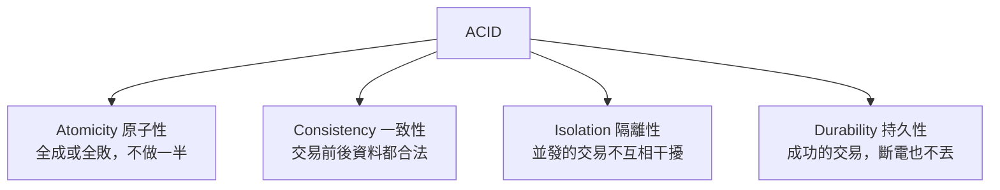

# [E-4-3] 交易（Transaction）：ACID 是什麼

> **目標**：理解資料庫「交易」——把多個操作綁成「全成或全敗」，以及保證它可靠的 ACID 四大特性。

## 一個經典問題：轉帳

A 轉帳 100 元給 B，要做兩件事：

```
1. A 的餘額 - 100
2. B 的餘額 + 100
```

問題來了——如果做完第 1 步（A 扣了 100），系統**剛好在這時當機**，第 2 步沒做（B 沒收到）。結果：**100 元憑空消失了！** A 少了 100，B 沒多。災難。

這就是為什麼需要**交易（Transaction）**：

> **交易把「多個操作」綁成「一個不可分割的單位」——要嘛「全部成功」，要嘛「全部失敗（回到原樣）」，不會「做一半」。**

轉帳要嘛「兩步都成功」，要嘛「兩步都不做（回滾）」——絕不會「扣了沒加」。

## ACID：交易可靠的四大保證

資料庫的交易，靠 **ACID** 四個特性保證可靠（這是 SQL 資料庫的招牌，E-4-2）：



**① Atomicity（原子性）**：交易是「**原子**」的（不可分割）——要嘛全做、要嘛全不做。轉帳「扣了一定要加」，做一半會「回滾（rollback）」到原狀。這就是解決上面轉帳問題的關鍵。

**② Consistency（一致性）**：交易前後，資料都維持「**合法狀態**」（符合規則）。例如「餘額不能為負」這種規則，交易不會破壞它。（注意：這個「一致性」和分散式 CAP 的一致性 E-13-6 是不同的概念，別混淆。）

**③ Isolation（隔離性）**：多個交易「**同時**」進行時，互不干擾——就像「各自單獨執行」一樣。例如兩個人同時轉帳，不會因為交錯而算錯。（隔離有不同「等級」，是並發控制的大主題。）

**④ Durability（持久性）**：交易一旦「**提交成功（commit）**」，資料就「**永久保存**」——就算下一秒斷電，資料也不會丟（已寫進硬碟）。

## 怎麼用交易

在 SQL，交易大致長這樣：

```sql
BEGIN;                              -- 開始交易
UPDATE accounts SET balance = balance - 100 WHERE id = 'A';
UPDATE accounts SET balance = balance + 100 WHERE id = 'B';
COMMIT;                             -- 提交（兩步都成功才生效）
-- 如果中間出錯 → ROLLBACK（全部回滾，當作沒發生）
```

`BEGIN` 開始、`COMMIT` 提交（全部生效）、`ROLLBACK` 回滾（全部取消）。包在交易裡的操作，享有 ACID 保證。

## 為什麼這對「業務」這麼重要

ACID 交易是 SQL 資料庫最大的價值之一（E-4-2）——對「**資料絕不能錯**」的業務（金流、訂單、庫存），它是必須的。沒有交易，「轉帳做一半、錢消失」這種災難隨時可能發生。

這也是為什麼「金流」這類應用偏好 SQL（有可靠的 ACID 交易），而不是「最終一致」的 NoSQL（E-4-2、E-13-11）。

## 延伸：分散式下交易變難

ACID 交易在「**單一資料庫**」很可靠。但當操作跨「**多個服務 / 多個資料庫**」（微服務、分散式），就難了——這就是 **分散式交易** 的難題（E-13-14 的 2PC、Saga）。單機交易很美好，分散式要付出很多代價才能近似它。

## 小結

- **交易（Transaction）**：把多個操作綁成「全成或全敗」，不做一半（解決「轉帳扣了沒加」的災難）。
- **ACID**：原子性（全成全敗）、一致性（資料合法）、隔離性（並發不干擾）、持久性（成功不丟）。
- 用 `BEGIN`/`COMMIT`/`ROLLBACK`。
- 對「資料絕不能錯」的業務（金流）至關重要——這是 SQL 的招牌價值。
- 跨服務/資料庫的「分散式交易」很難（E-13-14）。

> SQL vs NoSQL → [課外讀物 E-4-2](./E-4-2-sql-vs-nosql.md)；分散式交易 → [課外讀物 E-13-14](../E-13-scaling/E-13-14-distributed-transactions.md)
