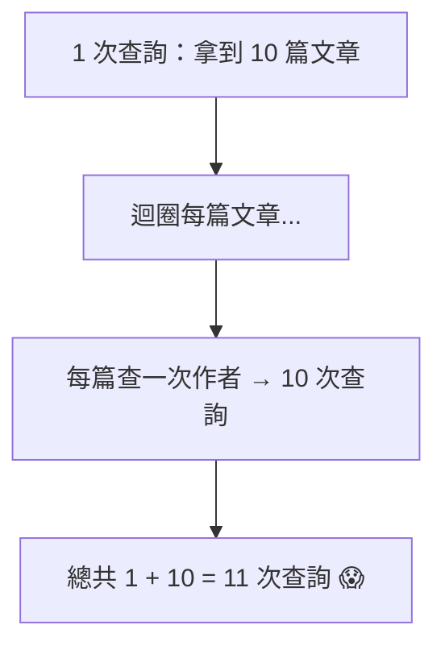

# [E-4-4] N+1 查詢問題：ORM 的常見效能陷阱

> **目標**：理解「N+1 查詢」這個 ORM 最常見的效能陷阱——一個不小心，一個頁面跑出幾百次資料庫查詢，以及怎麼解。

## 一個隱藏的效能殺手

你用 ORM（如 Prisma、EF Core，csharp Part 6）寫程式很方便——它把「物件操作」自動變成 SQL。但這份方便藏著一個經典陷阱：**N+1 查詢問題**。

它的可怕在於——**程式碼看起來很正常、很乾淨，卻在背後偷偷跑了幾百次查詢**，讓頁面變超慢。

## 問題長什麼樣

假設你要顯示「10 篇文章，以及每篇的作者名字」。用 ORM 很直覺地寫：

```
文章們 = 查詢所有文章()           // ← 1 次查詢，拿到 10 篇文章
for 文章 in 文章們:
    印出(文章.標題)
    印出(文章.作者.名字)          // ← 每篇都「順便」查一次作者！
```

看起來沒問題對吧？但問題在最後那行——**每跑一次迴圈，`文章.作者` 就偷偷發一次查詢去拿作者**。結果：



**這就是 N+1**：

> **1 次查詢拿到 N 筆主資料，然後「為每一筆」又各查一次關聯資料 → 總共 1 + N 次查詢。**

10 篇還好（11 次），但如果是「**列出 1000 個使用者，每個顯示他的部門**」——就變成 **1 + 1000 = 1001 次查詢**！一個頁面跑上千次資料庫查詢，慢到爆，資料庫也被打爆。

## 為什麼 ORM 容易讓你掉進去

問題在於 ORM 太「貼心」——`文章.作者` 這種寫法**看起來只是「存取一個屬性」**，你不會意識到「它背後偷偷發了一次資料庫查詢」。這個「方便的抽象」隱藏了「真實的成本」，讓你不知不覺寫出 N+1（呼應「漏抽象」的概念，E-12-10）。

## 怎麼解：Eager Loading（預先載入）

解法是——**別「一筆筆查關聯」，而是「一次把關聯也查回來」**。這叫 **Eager Loading（預先載入）**：

```
// ❌ N+1：分開查（1 + N 次）
文章們 = 查詢所有文章()
for 文章: 用 文章.作者 ...        // 每次偷偷查

// ✅ Eager Loading：一次查回來（1 或 2 次）
文章們 = 查詢所有文章().包含("作者")   // ← 叫 ORM「順便把作者也一起查回來」
for 文章: 用 文章.作者 ...           // 作者已經在手上了，不再查
```

各 ORM 的語法不同（Prisma 用 `include`、EF Core 用 `Include`、其他用 `with`/`join`），但概念一樣——**告訴 ORM「把關聯資料一起查回來」**，它就會用「一次 join」或「兩次查詢」搞定，而不是「N+1 次」。

效果：1001 次查詢 → 變成 1~2 次。效能天差地遠。

## 怎麼發現 N+1

N+1 很隱蔽（程式碼看起來正常），怎麼抓？

- **看資料庫的查詢日誌**：開發時開啟 ORM 的「印出 SQL」功能——如果你看到「一個操作跑出一堆重複的小查詢」，就是 N+1。
- **監控/APM 工具**：觀測性工具（E-14）能顯示「一個請求發了幾次 DB 查詢」，數字異常多就是 N+1。
- **效能變慢時**：頁面隨「資料筆數」變多而越來越慢（線性惡化），是 N+1 的典型症狀。

## 小結

- **N+1 查詢**：1 次查到 N 筆主資料，又「為每筆」各查一次關聯 → 1+N 次查詢。
- ORM 容易讓你掉進去——`物件.關聯` 看起來只是存取屬性，卻偷偷發查詢。
- 解法：**Eager Loading（預先載入）**——叫 ORM 用 `include`/`Include` 把關聯一次查回來（1~2 次）。
- 發現：看 ORM 的 SQL 日誌、用監控工具、注意「隨資料量線性變慢」。

> 索引與資料庫效能 → [課外讀物 E-4-1](./E-4-1-what-is-index.md)；ORM 的實作 → 參見 **csharp 課程** Part 6（EF Core）；漏抽象的概念 → [課外讀物 E-12-10](../E-12-design-patterns/E-12-10-dal-deep.md)
