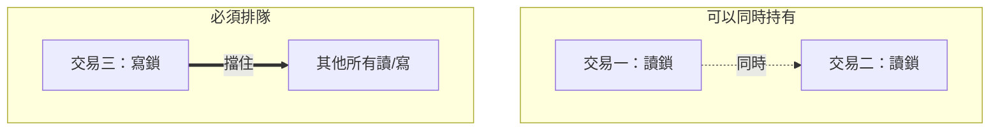
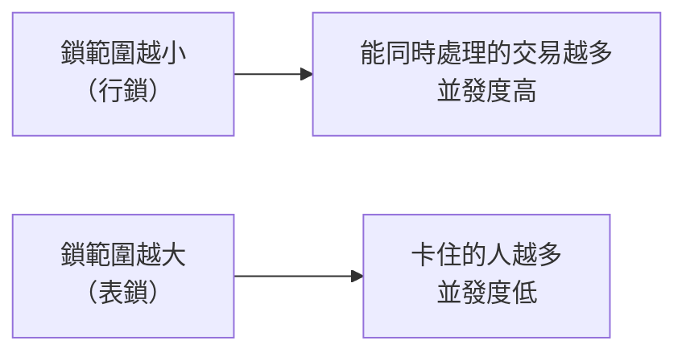

# [E-4-5] 資料庫鎖與並發控制：為什麼要排隊，怎麼別卡死

> **目標**：理解資料庫「鎖（lock）」是什麼、它保護什麼、代價是什麼，以及怎麼避免鎖競爭與死鎖（deadlock）。

## 一個問題：兩個人同時轉帳

在 E-4-3 我們用「交易」解決了「轉帳做一半」的問題。但還有一個更微妙的災難，光靠「全成或全敗」擋不住——**兩個交易同時動同一筆資料**。

假設帳戶 A 現在有 **1000 元**，同時發生兩筆轉出：

- 交易一：轉出 100
- 交易二：轉出 200

正確結果應該是 `1000 - 100 - 200 = 700`。但如果兩邊都用「先讀出來、算一算、再寫回去」的方式，而且**剛好交錯執行**：

```
交易一：讀到餘額 = 1000
交易二：讀到餘額 = 1000        ← 也讀到 1000，因為交易一還沒寫回
交易一：算 1000 - 100 = 900，寫回 900
交易二：算 1000 - 200 = 800，寫回 800   ← 覆蓋掉交易一的 900！
```

最後餘額變成 **800**。交易一那筆「扣 100」憑空消失了——明明扣了兩次，帳上只扣到一次。這叫 **更新遺失（lost update）**：後寫的人蓋掉了前一個人的結果，中間的修改被吃掉。

這正是 E-4-3 講的 ACID 裡 **Isolation（隔離性）** 要解決的問題——並發的交易不能互相干擾。而資料庫實作隔離性的主要機制，就是這章的主角：**鎖**。

## 鎖是什麼：廁所門鎖類比

想像公司只有一間廁所。你進去會**把門反鎖**，外面的人只能等；你出來開鎖，下一個才能進。門鎖確保「同一時間只有一個人在用」。

資料庫的鎖也是這個意思：

> **鎖是一種「使用權標記」——一個交易鎖住某筆資料時，其他想動它的交易必須等鎖放開。**

回到轉帳：如果交易一動 A 之前先「鎖住 A」，交易二就得在門外等，等交易一寫回 900 並放鎖，才輪到交易二讀（這時讀到的是 900，算出 700）。更新遺失就不會發生。

### 共享鎖 vs 排他鎖

但「只要有人用就全部要等」太浪費了——**很多人同時「讀」其實沒關係**，只有「寫」才需要獨占。所以鎖分兩種：

- **共享鎖（shared lock，又叫讀鎖）**：多個交易可以「同時持有」同一筆的共享鎖，一起讀沒問題。
- **排他鎖（exclusive lock，又叫寫鎖）**：要「寫」的時候拿，**獨占**——只要有人拿著排他鎖，其他人連讀鎖都拿不到。



這張圖表達：讀鎖之間相容（可共存），但寫鎖跟任何鎖都互斥（要獨占）。口訣：**讀讀不擋、讀寫互擋、寫寫互擋**。

## 鎖的粒度：鎖一筆，還是鎖一整張表？

鎖可以鎖不同「大小」的範圍，這叫**鎖的粒度（granularity）**：

- **行鎖（row lock）**：只鎖住「那一筆資料列」。別人動其他列完全不受影響。
- **表鎖（table lock）**：鎖住「整張表」。只要有人動這張表，其他所有人都得等。



當然是**行鎖並發度更高**——大家各動各的列，互不打擾。但這裡有個很多人踩的坑：

> **想鎖住「精準的那一筆」，你的 `WHERE` 條件必須走索引（index，見 E-4-1）。**

如果 `UPDATE accounts SET ... WHERE id = 'A'` 的 `id` 沒有索引，資料庫得**掃全表**去找 A，過程中可能把掃到的一堆列（甚至整張表）都鎖住。加對索引，鎖才收得住在「那一筆」。這也是 E-4-1 講的索引，除了「查得快」之外的另一個重要價值。

## 代價一：等待 → 延遲

鎖不是免費的。A 鎖住一筆，B 想動它就只能**乾等**。等待意味著：

- 請求變慢——B 的回應時間 = 自己的處理時間 **＋ 等 A 放鎖的時間**。
- 嚴重時 B 等到 **timeout（逾時）**，直接失敗。

對做 SRE（Site Reliability Engineering，網站可靠性工程）的人來說，這是很典型的災難來源：平常沒事，一到尖峰、大家搶同一筆熱門資料（熱點 row），排隊就爆開，**p99 延遲**（最慢那 1% 請求的耗時）瞬間飆高。使用者體感就是「偶爾轉圈圈很久」。

## 代價二：死鎖（Deadlock）

比「慢」更糟的是**完全解不開**。想像兩個交易各鎖了一半、又互相要對方手上的鎖：

- 交易一：已鎖住 **X**，正在等 **Y**。
- 交易二：已鎖住 **Y**，正在等 **X**。


這張圖畫的就是**循環等待**：兩邊都在等對方先放手，而對方也在等自己——永遠等不到。這就是 **死鎖（deadlock）**。

好消息是，資料庫會**主動偵測**到這種循環，然後**強制回滾（rollback）其中一個交易**當作犧牲者，讓另一個能繼續。被犧牲的那個交易會收到類似 `deadlock detected` 的錯誤，通常需要**重試**。死鎖不會真的把資料庫卡死，但會讓部分請求失敗，仍要盡量避免（後面談怎麼避免）。

## 悲觀鎖 vs 樂觀鎖

面對並發衝突，有兩種完全相反的心態，也對應兩種做法。

### 悲觀鎖（pessimistic locking）

心態：**「一定會撞，先鎖起來再說。」** 讀資料的當下就把它鎖住，別人碰不了，直到我提交。

在 SQL 用 `SELECT ... FOR UPDATE` 實現——它讀出資料的同時，對這些列加上**排他鎖**：

```sql
BEGIN;
-- FOR UPDATE：讀出 A 的餘額，並「立刻鎖住這一列」
-- 其他交易的 SELECT ... FOR UPDATE 會在這裡卡住等待
SELECT balance FROM accounts WHERE id = 'A' FOR UPDATE;

-- 這中間可以安心計算，因為沒人能動 A
UPDATE accounts SET balance = balance - 100 WHERE id = 'A';
COMMIT;   -- 提交後才放鎖，別人才輪得到
```

因為交易一鎖住 A 之後，交易二的 `SELECT ... FOR UPDATE` 會被擋在門外等，等交易一 `COMMIT` 才讀得到最新值，**更新遺失從根本上不可能發生**。

適合場景：**高衝突**——大家搶同一筆資料。例如搶票、秒殺扣庫存，衝突機率高，不如老實排隊，還省得一直重試。

### 樂觀鎖（optimistic locking）

心態：**「衝突很少見，先不鎖，出事再說。」** 不上任何資料庫鎖，而是加一個 `version`（版本號）欄位，靠它在寫回時「檢查有沒有被別人插隊改過」。

做法是：讀的時候把 `version` 一起讀出來；寫回時用 `WHERE version = 剛才讀到的值`，並讓 `version + 1`：

```sql
-- 1. 讀出資料，連 version 一起
SELECT balance, version FROM accounts WHERE id = 'A';
-- 假設讀到 balance = 1000, version = 5

-- 2. 在應用程式算好新餘額（1000 - 100 = 900），然後有條件地寫回
UPDATE accounts
SET balance = 900, version = 6
WHERE id = 'A' AND version = 5;   -- 關鍵：只有 version 還是 5 才更新
```

關鍵在最後那個 `AND version = 5`：

- 如果**沒人插隊**，資料庫裡 version 還是 5，更新成功，version 變 6。
- 如果**別人先改過**，version 已經被他加成 6，`WHERE version = 5` 就**匹配不到任何列，更新筆數為 0**——代表「我讀到的是舊資料」。這時應用程式要**重新讀一次、重算、再試一遍**（retry）。

用 pseudo code 表達重試邏輯：

```
重試直到成功（或超過次數上限）：
    讀出 (資料, 當前 version)
    算出 新資料
    受影響筆數 = UPDATE ... WHERE version = 當前 version
    如果 受影響筆數 == 1：
        成功，跳出
    否則：
        有人搶先改了 → 回到迴圈開頭重讀重算
```

適合場景：**低衝突**——大部分時候根本不會撞，何必付「鎖」的等待代價？偶爾撞到就重試一次，划算。例如編輯個人資料、後台改設定。

### 兩者怎麼選

| | 悲觀鎖 | 樂觀鎖 |
|---|---|---|
| 心態 | 假設一定會撞，先鎖 | 假設很少撞，不鎖 |
| 機制 | `SELECT ... FOR UPDATE` 加真正的鎖 | `version` 欄位 + 條件式 UPDATE |
| 衝突時 | 別人乖乖排隊等 | 更新失敗 → 應用層重試 |
| 適合 | **高衝突**（搶票、扣庫存） | **低衝突**（改設定、編輯資料） |
| 代價 | 等待、延遲、可能死鎖 | 衝突時要重試（撞太兇會一直重試） |

一句話：**撞得兇就悲觀（排隊），撞得少就樂觀（重試）。** 選錯了——高衝突用樂觀，會變成大家一直重試打空；低衝突用悲觀，是白白讓大家排隊。

## 如何避免鎖問題（實作守則）

| 方法 | 做法 | 為什麼有效 |
|---|---|---|
| **交易要短** | 交易內只放必要的讀寫；**別**在交易中放慢查詢、呼叫外部 API、`sleep`、等使用者輸入 | 持鎖時間 = 別人等待時間。交易開越久，鎖握越久，塞車越嚴重 |
| **固定加鎖順序** | 所有交易都照同一順序鎖資源（例如永遠先鎖 id 小的帳戶再鎖大的） | 死鎖需要「循環等待」；大家順序一致就不會有環，循環就打破了 |
| **行鎖 + 索引** | `WHERE` 條件走索引，讓資料庫精準鎖「那一筆」而非掃全表 | 鎖範圍越小，並發度越高，撞在一起的機率越低（見 E-4-1） |
| **低衝突改用樂觀鎖** | 用 `version` 欄位取代 `FOR UPDATE` | 沒有實體鎖就沒有等待與死鎖，衝突罕見時整體更快 |
| **選較低隔離等級** | 業務允許時用 `READ COMMITTED` 而非 `SERIALIZABLE` | 隔離等級越嚴，資料庫加的鎖越多、範圍越大。夠用就好，別過度隔離 |

最後這點補充一下：SQL 的**隔離等級（isolation level）**是「隔離性要多嚴」的旋鈕，常見由鬆到嚴是 `READ COMMITTED` → `REPEATABLE READ` → `SERIALIZABLE`。越嚴的等級，資料庫為了擋住更多並發異常，就得加更多、更大範圍的鎖，並發度也就越低。原則是**在正確的前提下，選夠用的最鬆等級**，不要無腦拉到最嚴。

## 小結

- **更新遺失（lost update）**：兩個交易同時「讀-改-寫」同一筆，後寫的蓋掉前一個——鎖就是用來擋這個的，也是 ACID「隔離性」的實作機制。
- **鎖分共享鎖（讀鎖）與排他鎖（寫鎖）**：讀讀不擋，但只要有人寫就獨占；**行鎖**比表鎖並發度高，前提是 `WHERE` 走**索引**。
- 鎖的代價是**等待（延遲、timeout，p99 飆高）**與**死鎖**（循環等待，資料庫會回滾其中一個交易）。
- **悲觀鎖**（`FOR UPDATE`，先鎖）適合高衝突；**樂觀鎖**（`version` 欄位 + 重試）適合低衝突。
- 避免鎖問題：**交易短、固定加鎖順序、行鎖＋索引、低衝突用樂觀鎖、選夠用的隔離等級**。

> 回顧交易與 ACID（隔離性從哪來）→ [課外讀物 E-4-3：交易（Transaction）：ACID 是什麼](./E-4-3-transaction-acid.md)
> 另一種常見的資料庫效能陷阱 → [課外讀物 E-4-4：N+1 查詢問題](./E-4-4-n-plus-one.md)
