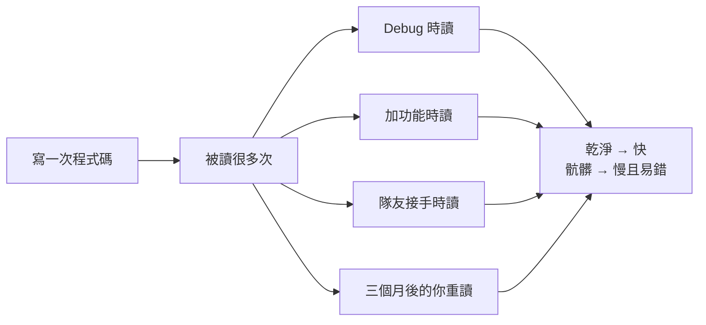

# [E-6-1] Clean Code 是什麼？為什麼程式碼需要「乾淨」

> **這篇在說什麼**：能跑的程式碼只是及格線，「乾淨」的程式碼才是專業的起點——因為程式碼被「讀」的次數，遠遠多於被「寫」的次數。

## 概念說明

想像你走進兩間餐廳的廚房。

第一間：刀具隨手亂放，調味料瓶沒有標籤，生肉和蔬菜混在同一塊砧板上，冰箱裡有不知道放了幾天的東西。這間廚房「能不能做出菜」？能。但每次出餐都像在賭命——找一罐鹽要翻三個櫃子，新來的廚師完全不知道東西在哪，而且遲早會出食安問題。

第二間：刀掛在刀架上、依用途排列，調味料整齊貼標籤，食材分區存放，動線清楚。新廚師走進來，五分鐘就能上手。

**兩間廚房都「能出菜」，但只有一間能讓團隊長久、安全、快速地運作。**

程式碼就是你的廚房。Clean Code（整潔的程式碼）指的不是「跑得起來的程式碼」，而是「讓人一看就懂、容易修改、不容易出錯」的程式碼。

---

這裡有一個很多初學者沒意識到的事實：

> **程式碼被「讀」的次數，遠遠多於被「寫」的次數。**

你寫一個函式可能花十分鐘，但接下來這個函式會被讀很多次——你自己回頭 debug 要讀它，加新功能要讀它，三個月後忘記細節要重讀它，隊友接手要讀它。

所以寫程式碼真正的對象，不是電腦，而是**未來的人類讀者**——通常就是三個月後、已經忘光細節的你自己。電腦不在乎你變數叫 `x` 還是 `activeUser`，它照跑。但人類在乎。

Clean Code 的核心精神，就是這句話：

> **寫程式碼時，假設下一個讀到它的人是個會知道你住哪、而且脾氣不好的維護者。** 然後寫得讓他看得懂。

## 深入一點

### 「能跑」不等於「好」

新手最容易掉進的陷阱，是把「能跑」當成終點。

```typescript
// ❌ 能跑，但是一場災難
function p(a: any[]) {
  let r = 0
  for (let i = 0; i < a.length; i++) {
    if (a[i].s === 1) {
      r = r + a[i].pr * a[i].q
    }
  }
  return r
}
```

這段程式碼「能跑」。它會回傳一個數字。但是——`p` 是什麼？`a` 裡面裝什麼？`s === 1` 的 `1` 是什麼意思？`pr`、`q` 又是誰？要看懂它，你得在腦中當偵探，逐行還原作者的意圖。

同樣的邏輯，寫成乾淨的版本：

```typescript
// ✅ 一樣的功能，但讀起來像在讀說明書
const OrderStatus = {
  PAID: 'paid',
} as const

interface OrderItem {
  status: string
  price: number
  quantity: number
}

function calculatePaidItemsTotal(items: OrderItem[]): number {
  return items
    .filter((item) => item.status === OrderStatus.PAID)
    .reduce((total, item) => total + item.price * item.quantity, 0)
}
```

兩段程式碼**對電腦來說完全等價**，跑出來的結果一模一樣。但對人類來說，第二段是文件，第一段是謎題。差別不在「會不會跑」，而在「下一個人能不能接手」。

> **常見錯誤** — 很多人會這樣想：
> 「反正功能做出來了，測試也過了，乾淨不乾淨之後再說。」
> 問題是，「之後」幾乎不會到來。趕著上線、趕著下一個需求，那段「之後再整理」的程式碼會一直留著，越積越多，直到沒有人敢動它。
> 正確的心態：**乾淨是在寫的當下就要做的事，不是事後的裝潢。** 取一個好名字、拆一個太長的函式，只要幾秒鐘，但省下的是未來無數小時的痛苦。

---

### 為什麼「乾淨」會直接變成錢

這不是潔癖，是經濟學。軟體專案的成本，大部分不是花在「第一次寫出來」，而是花在「後續的維護與修改」。



這張圖說明：寫程式碼是一次性成本，讀程式碼卻是反覆發生的成本——所以為「讀」優化，回報遠大於為「寫」省事。

骯髒的程式碼會讓每一次修改都變慢、變危險。你以為改 A 不會影響 B，結果整個系統爆炸。這種「不敢動」的恐懼，就是技術債（technical debt）的利息——你當初省下的整理時間，加倍奉還。

---

### 乾淨的程式碼長什麼樣子？

Clean Code 沒有單一公式，但有幾個一眼能感受到的特徵：

```typescript
// 特徵一：名字會說話，不需要注解就懂它在幹嘛
const activeSubscribers = users.filter((user) => user.isSubscribed)

// 特徵二：函式短小，只做一件事
function isAdult(birthYear: number): boolean {
  const CURRENT_YEAR = 2026
  const ADULT_AGE = 18
  return CURRENT_YEAR - birthYear >= ADULT_AGE
}

// 特徵三：沒有 magic number，數字背後的意義被命名出來
// （上面的 ADULT_AGE 就是一例，而不是直接寫 >= 18）
```

對照之下，骯髒的程式碼通常有這些味道（這在業界真的叫 **code smell**，程式碼的「臭味」）：名字含糊（`data`、`temp`、`x`）、函式超長、巢狀超深、到處是看不懂的數字、複製貼上的重複邏輯。

這篇只是開場，把「為什麼要乾淨」講清楚。接下來這個系列會把每一種「乾淨的技巧」拆開細談：

- **命名**——怎麼取出會自己說話的名字
- **函式設計**——怎麼讓一個函式只做一件事
- **反模式**——那些常見的壞習慣，以及怎麼修掉它們

把這幾件事做好，你的程式碼就會從「能跑」升級到「專業」。

## 延伸閱讀

> 第一步，先學會把名字取好 → [E-6-2 命名的藝術：讓名字說話](./E-6-2-naming.md)

> 接著學怎麼設計一個只做一件事的函式 → [E-6-3 函式設計：Single Responsibility 與純函式](./E-6-3-function-design.md)
