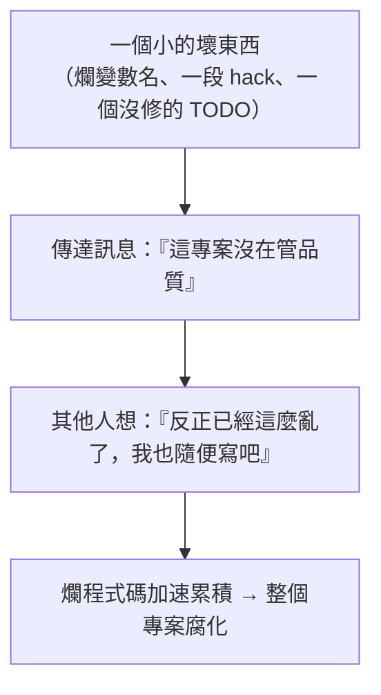

# [E-6-10] 趣味：破窗理論——為什麼一個壞變數名會帶壞整個專案

> **目標**：透過「破窗理論」這個社會學概念，理解為什麼「程式碼品質會傳染」——一個小的壞習慣，可能慢慢拖垮整個專案。

## 一個社會學理論

1980 年代，犯罪學家提出了著名的「**破窗理論（Broken Windows Theory）**」：

> **一棟建築，如果有一扇窗戶破了卻沒人修，很快地，其他窗戶也會被打破。** 因為「一扇破窗」傳達了一個訊息——「**這裡沒人在乎、沒人管**」，於是人們更不會珍惜它，破壞會加速蔓延。

反之，一個維護良好、乾淨整潔的環境，會讓人「不好意思」去破壞它、亂丟垃圾。

## 它怎麼套用到程式碼

《The Pragmatic Programmer》（務實程式設計師）這本經典把破窗理論用到了軟體上——這是工程界很有名的比喻：

> **程式碼裡的「破窗」（壞味道、爛程式碼、被忽略的問題），會「傳染」。**

具體怎麼發生：

舉例：

- 專案裡有個變數叫 `data2`（爛命名，E-6-2）放著沒人改 → 新來的人看到「喔，原來這專案命名可以這麼隨便」→ 他也跟著亂命名。
- 有一段「先這樣 hack 一下」的爛程式碼留著 → 大家有樣學樣，hack 越來越多。
- 一堆 `// TODO` 沒人處理 → 大家覺得 TODO 反正不會做，繼續堆。

**一扇沒修的破窗，慢慢變成整棟廢墟。** 程式碼的腐化，常常不是「一次崩壞」，而是「一個個小破窗累積」的結果。

## 啟示：及時修破窗

破窗理論給工程師的啟示很實際：

**① 別放著小問題不管**

看到「破窗」（爛命名、壞味道、小 bug），**及時修掉**——別想「反正只是小問題」。因為小問題會傳染、會累積。「保持乾淨」比「之後大掃除」省力得多。

**② 維持高標準，從第一行開始**

一個專案的「品質基調」往往在早期就定下了。從第一行就保持乾淨（好命名、好結構、有測試）——這會形成正向循環，大家都「不好意思」弄髒它。這呼應這套課程 CLAUDE.md 的精神——「從第一行程式碼就養成好習慣」。

**③ 這也是為什麼 Code Review 重要**

Code Review（E-6-9）就是「**及時修破窗**」的機制——在爛程式碼進主線前就攔下來、要求改善，不讓破窗出現。

## 反過來：乾淨會傳染

好消息是——**正向的也會傳染**。一個乾淨、整潔、有好慣例的專案，會讓加入的人「自動提高標準」——他看到大家都好好命名、好好寫測試，他也會跟著做。

所以「保持乾淨」不只是潔癖，而是一種**會自我強化的文化**——值得從一開始就投資。

## 小結

- 破窗理論：一扇沒修的破窗，會讓更多窗被打破（傳達「沒人在乎」的訊息）。
- 套用到程式碼：一個小的壞東西（爛命名、hack、沒修的問題）會「傳染」，讓人覺得「反正都這麼亂了」，加速腐化。
- 啟示：**及時修小問題**、從第一行維持高標準、用 Code Review 攔下破窗。
- 反之，乾淨的程式碼也會「傳染」——是會自我強化的好文化。

> Clean Code 與反模式 → [課外讀物 E-6-1](./E-6-1-what-is-clean-code.md)、[E-6-6 反模式](./E-6-6-anti-patterns.md)；Code Review → [E-6-9](./E-6-9-code-review.md)
