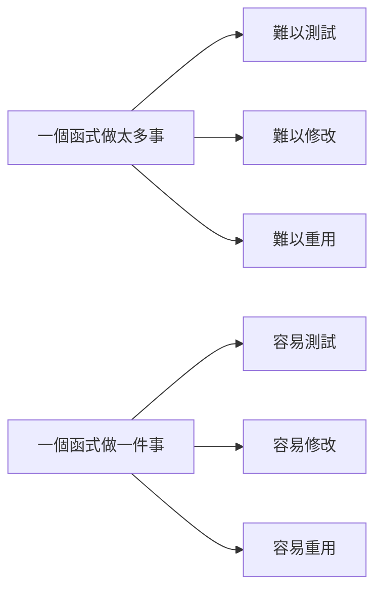

# [E-6-3] 函式設計：Single Responsibility 與純函式

> **這篇在說什麼**：一個函式只做一件事，這句話聽起來很簡單，但真正做到它可以讓你的程式碼品質跳一個量級。

## 概念說明

你有沒有見過一個函式，裡面有 200 行程式碼，做了 10 件不同的事？修改它像在拆炸彈——你不知道改了這一行，會不會引爆旁邊的邏輯。

這類函式通常叫做「上帝函式」（God Function），名字很霸氣，但它其實是維護地獄的入口。

想像一把瑞士刀。理論上很方便——剪刀、刀片、開瓶器、螺絲起子全部合一。但你有沒有想過，**一把只有刀片的刀，反而切東西切得更準、更快？** 瑞士刀是旅行應急用的，不是專業廚師用的。

函式也一樣。**一個函式試圖做所有事，最後什麼都做不好，而且誰都不敢動它。**

## 深入一點

### Single Responsibility：一個函式，一個理由改變

看一個具體的例子。假設你要處理新使用者註冊：

```typescript
// ❌ 這個函式做了太多事
async function processNewUser(userData: unknown): Promise<void> {
  // 驗證資料
  if (!userData || typeof userData !== 'object') {
    throw new Error('無效的使用者資料')
  }
  const { name, email, password } = userData as Record<string, string>
  if (!email.includes('@')) throw new Error('Email 格式錯誤')
  if (password.length < 8) throw new Error('密碼太短')

  // 雜湊密碼
  const hashedPassword = await bcrypt.hash(password, 10)

  // 存進資料庫
  const userId = await db.insert('users', { name, email, hashedPassword })

  // 發送歡迎信
  await emailClient.send({
    to: email,
    subject: '歡迎加入！',
    body: `嗨 ${name}，你的帳號已建立。`,
  })

  // 記錄活動
  await logger.info(`新使用者註冊：${email}，ID：${userId}`)
}
```

這個函式有幾個問題：
1. 你想改驗證邏輯，要動這個函式
2. 你想換 email 服務，也要動這個函式
3. 你想調整密碼雜湊方式，還是這個函式
4. 你想寫測試——你需要同時 mock 資料庫、email 服務、logger……

**每當任何一個相關的事情改變，這個函式就必須跟著改。** 這就是違反 Single Responsibility 的代價。

---

拆開來的樣子：

```typescript
// ✅ 每個函式只有一個改變的理由

function validateUserData(userData: unknown): { name: string; email: string; password: string } {
  if (!userData || typeof userData !== 'object') {
    throw new Error('無效的使用者資料')
  }
  const { name, email, password } = userData as Record<string, string>
  if (!email.includes('@')) throw new Error('Email 格式錯誤')
  if (password.length < 8) throw new Error('密碼太短')
  return { name, email, password }
}

async function hashPassword(plainPassword: string): Promise<string> {
  return bcrypt.hash(plainPassword, 10)
}

async function saveUser(params: { name: string; email: string; hashedPassword: string }): Promise<number> {
  return db.insert('users', params)
}

async function sendWelcomeEmail(params: { name: string; email: string }): Promise<void> {
  await emailClient.send({
    to: params.email,
    subject: '歡迎加入！',
    body: `嗨 ${params.name}，你的帳號已建立。`,
  })
}

async function logNewUserRegistration(params: { email: string; userId: number }): Promise<void> {
  await logger.info(`新使用者註冊：${params.email}，ID：${params.userId}`)
}

// 組合起來的主函式現在只是在「編排」
async function registerUser(userData: unknown): Promise<void> {
  const { name, email, password } = validateUserData(userData)
  const hashedPassword = await hashPassword(password)
  const userId = await saveUser({ name, email, hashedPassword })
  await sendWelcomeEmail({ name, email })
  await logNewUserRegistration({ email, userId })
}
```

現在每個函式都可以獨立測試、獨立替換。換 email 服務？只改 `sendWelcomeEmail`，其他完全不動。

---

### 「20 行法則」

如果你的函式超過 20 行，停下來問自己：**這個函式在做幾件事？**

不是說超過 20 行就一定要拆，但這個長度通常是個警訊。函式太長的常見原因：

1. 混了不同層次的邏輯（高層的「編排」和低層的「實作細節」混在一起）
2. 做了多件獨立的事（用 "and" 才能描述它的工作）
3. 太多的巢狀條件（多個 `if/else` 疊在一起）

---

### 如何判斷函式做太多事？

有個簡單的語言測試：**試著用一句話描述這個函式在做什麼。**

- 「這個函式驗證使用者資料」——清楚，沒問題
- 「這個函式驗證使用者資料**並且**存到資料庫**並且**發送歡迎信」——「並且」出現了，代表你應該拆開它

函式名字裡如果出現 `And`，也是同樣的警訊：

```typescript
// ❌ 名字裡的 And 是壞味道
function saveAndSendEmail(user: User): void { ... }
function validateAndFormat(input: string): string { ... }

// ✅ 各做各的
function saveUser(user: User): void { ... }
function sendWelcomeEmail(user: User): void { ... }
```

---

### 純函式（Pure Function）：最好測試、最容易理解的函式

純函式有兩個特性：
1. **相同的輸入，永遠產生相同的輸出**
2. **沒有副作用（side effects）**——不改變外部狀態、不讀寫資料庫、不發送請求

```typescript
// ✅ 純函式：給同樣的 name 和 date，永遠得到同樣的結果
function formatWelcomeMessage(name: string, date: string): string {
  return `嗨 ${name}！你在 ${date} 加入了我們。`
}

// ❌ 不是純函式：輸出取決於「現在幾點」，每次呼叫結果不同
function formatWelcomeMessageWithTime(name: string): string {
  const now = new Date().toLocaleString()
  return `嗨 ${name}！你在 ${now} 加入了我們。`
}

// ❌ 也不是純函式：改變了外部的 userList（副作用）
function addUserToList(user: User, userList: User[]): void {
  userList.push(user)  // 修改了傳入的陣列！
}

// ✅ 改成純函式：回傳新陣列，不改原本的
function addUserToList(user: User, userList: User[]): User[] {
  return [...userList, user]
}
```

純函式的好處在於**測試極度簡單**——你不需要 mock 任何外部服務，只需要給輸入、驗證輸出：

```typescript
// 測試純函式只需要這樣：
test('formatWelcomeMessage 應該包含使用者名稱', () => {
  const result = formatWelcomeMessage('Alice', '2024-01-01')
  expect(result).toContain('Alice')
})

// 測試不純的函式則需要 mock Date、mock 資料庫…很麻煩
```

---

### 函式越小，測試越容易

這不是巧合。**函式的 Single Responsibility 和可測試性是直接相關的。** 一個函式依賴越多外部東西（資料庫、時間、隨機數、外部 API），就越難測試。

設計函式時，可以問自己：「我要測試這個函式，需要準備哪些東西？」如果答案超過兩三樣，通常代表這個函式做了太多事。



這張圖說明：函式的責任範圍，直接決定了它的可維護性。

## 延伸閱讀

> 函式命名的細節回顧 → [E-6-2 命名的藝術：讓名字說話](./E-6-2-naming.md)

> Single Responsibility 在類別和模組層面的完整討論 → [E-7-2 S — Single Responsibility Principle](../E-7-solid/E-7-2-srp.md)
