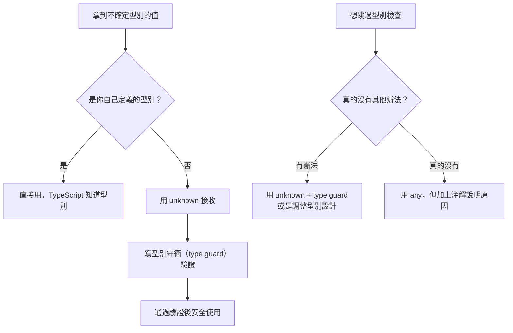

# [E-6-4] TypeScript 最佳實踐：strict、避免 any、型別推斷

> **這篇在說什麼**：TypeScript 可以嚴格，也可以很寬鬆。你用得有多嚴格，就決定了它幫你抓多少 bug。

## 概念說明

想像你買了一台高檔的車，內建了盲點偵測、車道輔助、自動煞車。但你把所有這些系統都關掉，說：「我自己來就好，這些提示太煩了。」

然後你說：「這台車的安全功能沒什麼用。」

用 `any` 就是這樣。TypeScript 有完整的型別安全系統，但一個 `any` 就能把某個地方的保護全部關掉。更糟的是，`any` 會傳染——一個函式回傳 `any`，呼叫它的地方也跟著失去型別保護。

TypeScript 能幫你抓多少 bug，完全取決於你讓它多認真工作。

## 深入一點

### `strict: true`：把所有安全功能打開

在 `tsconfig.json` 加上 `strict: true`，等於同時開啟一整包的嚴格檢查：

```json
{
  "compilerOptions": {
    "strict": true
  }
}
```

這個設定包含了幾個最重要的子項目：

---

**`strictNullChecks`：`null` 和 `undefined` 不再隱形**

```typescript
// strict: false 的世界（危險）
function getUserName(userId: number): string {
  const user = findUser(userId)  // findUser 可能回傳 undefined
  return user.name  // 如果 user 是 undefined，這裡會爆掉——但 TypeScript 不會警告你
}

// strict: true 的世界（安全）
function getUserName(userId: number): string {
  const user = findUser(userId)  // TypeScript 知道 user 是 User | undefined
  return user.name  // ❌ 編譯錯誤！必須先處理 undefined 的情況

  // 正確做法：
  if (user === undefined) {
    throw new Error(`找不到 ID 為 ${userId} 的使用者`)
  }
  return user.name  // ✅ TypeScript 確認 user 此時一定是 User，不會是 undefined
}
```

---

**`noImplicitAny`：不能讓 TypeScript 默默推斷出 `any`**

```typescript
// ❌ 這個 callback 的參數 item 被隱含推斷為 any——TypeScript 不知道它是什麼
const result = items.map(item => item.name)

// 如果 items 沒有型別宣告，就必須明確標注
const result = (items as Product[]).map(item => item.name)
// 或是確保 items 一開始就有正確的型別
```

---

**`strictFunctionTypes`：函式參數的型別必須完全對應**

這個比較進階，簡單說就是：TypeScript 會更嚴格地檢查你把函式當成參數傳遞時的型別相容性，避免一些邊緣情況下的型別漏洞。

---

### 為什麼 `any` 是危險的

`any` 的問題不只是「失去型別保護」，而是它會讓 bug 在一個完全不相關的地方才爆炸，讓你找不到根源：

```typescript
// 假設你從 API 拿到資料，偷懶用了 any
const userData: any = await fetchUserProfile(userId)

// 因為是 any，TypeScript 讓你寫任何東西都不報錯
console.log(userData.naem)      // 拼錯了！應該是 name，但沒有錯誤提示
console.log(userData.emailAddr) // 欄位名稱也錯了，還是沒有提示
const age: number = userData.age  // age 可能根本不存在，TypeScript 照樣接受
```

真正的問題會在程式執行時才出現：

```
TypeError: Cannot read properties of undefined (reading 'naem')
```

你看到這個錯誤，要從哪裡開始找？你不知道是哪個 `any` 讓這個 bug 滑進來的。

---

### 用 `unknown` 取代 `any`

當你確實不知道某個值的型別（例如 API 回應、`JSON.parse` 的結果），用 `unknown` 而不是 `any`：

```typescript
// ❌ any 讓你直接使用，但沒有保護
const response: any = await fetch('/api/user').then(r => r.json())
console.log(response.name)  // 沒有錯誤，但也沒有保護

// ✅ unknown 強迫你先驗證型別才能使用
const response: unknown = await fetch('/api/user').then(r => r.json())
console.log(response.name)  // ❌ 編譯錯誤！必須先確認 response 的型別

// 正確做法：驗證後才使用
function isUserProfile(data: unknown): data is UserProfile {
  return (
    typeof data === 'object' &&
    data !== null &&
    'name' in data &&
    'email' in data
  )
}

if (isUserProfile(response)) {
  console.log(response.name)  // ✅ TypeScript 知道這裡 response 是 UserProfile
}
```

`unknown` 和 `any` 的差別：
- `any`：TypeScript 完全放棄，你愛怎麼用就怎麼用
- `unknown`：TypeScript 說「我不知道這是什麼，但你必須先告訴我，才能使用它」

---

### 讓 TypeScript 自己推斷，不要過度標注

TypeScript 很聰明，很多情況你不需要寫型別，它自己能推斷出來：

```typescript
// ❌ 過度標注（TypeScript 已經知道了，不需要你再說）
const userName: string = 'Alice'
const userAge: number = 25
const isActive: boolean = true
const scores: number[] = [90, 85, 92]

// ✅ 讓 TypeScript 推斷
const userName = 'Alice'      // TypeScript 知道是 string
const userAge = 25            // TypeScript 知道是 number
const isActive = true         // TypeScript 知道是 boolean
const scores = [90, 85, 92]  // TypeScript 知道是 number[]
```

```typescript
// ❌ 過度標注函式的中間步驟
const doubled: number[] = scores.map((score: number): number => score * 2)

// ✅ 只標注必要的地方（函式參數），其他讓 TypeScript 推斷
const doubled = scores.map(score => score * 2)  // TypeScript 推斷出 number[]
```

**什麼時候要明確寫型別？**

1. 函式的參數（TypeScript 無法從呼叫端推斷）
2. 公開 API 的回傳型別（讓使用者知道預期的型別）
3. 當 TypeScript 推斷出的型別比你預期的更寬泛

```typescript
// 這三種情況要明確標注

// 1. 函式參數
function getUserById(userId: number): Promise<User | null> {
  // ...
}

// 2. 公開 API 的回傳型別
export function createApiResponse<T>(data: T): ApiResponse<T> {
  return { success: true, data }
}

// 3. TypeScript 推斷得太寬泛
const statusCode = 200  // 推斷為 number，但你可能想要的是 200 這個字面量型別
const statusCode2 = 200 as const  // 推斷為字面量型別 200
```

---

### 正確處理 `null`，不要用 `!` 逃避

TypeScript 提供了一個「非空斷言運算子」`!`，告訴 TypeScript「這個值我保證不是 null 或 undefined」：

```typescript
const user = getUser()
console.log(user!.name)  // 告訴 TypeScript：我保證 user 不是 null
```

這個用法看起來很方便，但它其實是在說謊。你只是把 TypeScript 的警告關掉，但如果 `user` 真的是 `null`，程式一樣會在執行時爆掉。

更好的做法是真正處理 `null`：

```typescript
function getUserName(userId: number): string {
  const user = getUser(userId)

  // 方法一：提早回傳
  if (user === null) {
    throw new Error(`找不到 ID 為 ${userId} 的使用者`)
  }
  return user.name

  // 方法二：提供預設值
  return user?.name ?? '匿名使用者'
}
```

`!` 唯一合理的使用情境：你確定在特定的執行順序下，某個值「邏輯上不可能為 null」，且這個保證很難用型別系統表達。但這種情況很少見，每次使用 `!` 前都要三思。

---



這張圖說明：遇到不確定型別的情況，優先用 `unknown` + 型別守衛，而不是直接用 `any`。

## 延伸閱讀

> 型別系統之外，還有哪些程式碼品質問題值得注意 → [E-6-6 常見反模式大全](./E-6-6-anti-patterns.md)
