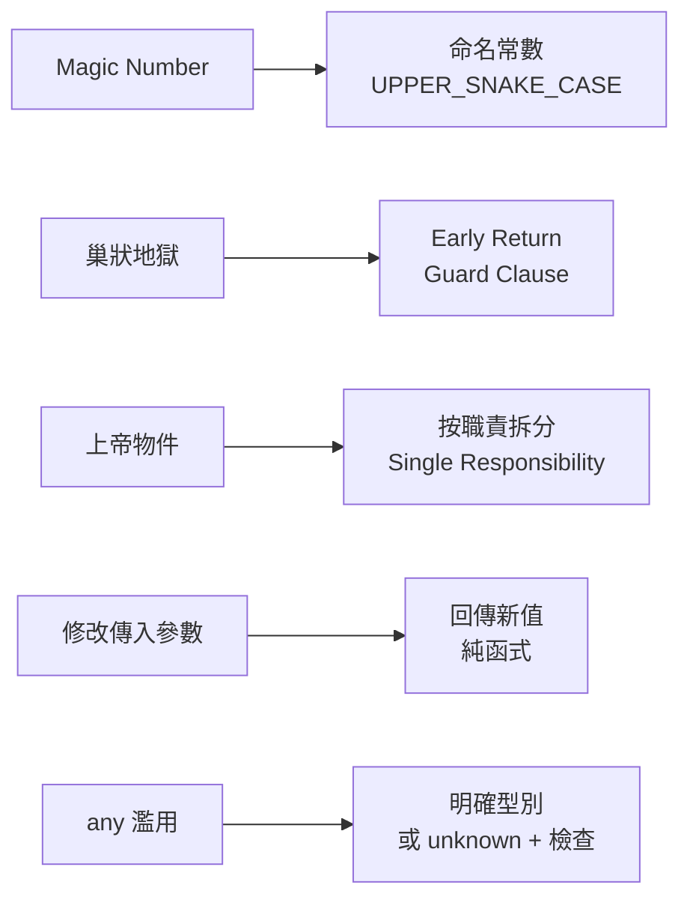

# [E-6-6] 常見反模式大全：Magic Number、巢狀地獄、上帝物件

> **這篇在說什麼**：反模式（anti-pattern）是「看起來能解決問題、實際上製造更多問題」的常見壞習慣。認得它們，你就能在寫的當下就避開，而不是事後痛苦地清理。

## 概念說明

想像餐廳裡有一位「萬能員工」——他同時負責收銀、做菜、洗碗、進貨、發薪水。老闆覺得很省人事費。但有一天他請假，整間店直接停擺，因為**沒有任何人知道他腦中那套運作方式**。

這就是反模式的本質：**短期看起來方便或省事，長期卻讓整個系統變得脆弱、難改、難懂。**

反模式不是「會出錯的程式碼」——它們通常都「能跑」。正是因為能跑，才更危險，因為它們會默默地留在程式碼裡，慢慢腐蝕整個專案。

下面我們逐一拆解最常見的幾種反模式，每一種都給你「壞 → 好」的對照。看過一次，你以後就會在腦中自動亮紅燈。

## 深入一點

### 反模式一：Magic Number（魔術數字）

「魔術數字」指的是程式碼裡突然冒出來、沒有任何解釋的數字或字串。它之所以「魔術」，是因為只有原作者知道它代表什麼，其他人只能用猜的。

> **常見錯誤** — 很多人會這樣寫：
> ```typescript
> // ❌ 3 是什麼？86400 又是什麼？
> if (user.status === 3) {
>   grantAccess()
> }
> const expiresAt = now + 86400
> ```
> 問題是：`3` 代表什麼狀態？「已驗證」？「被封鎖」？沒人知道。`86400` 是秒數沒錯，但你得自己心算才知道那是「一天」。每個讀到的人都要停下來查或猜，而且如果同一個 `3` 散落在十個地方，哪天規則改了，你得逐一找出來改，漏一個就是 bug。
>
> 正確做法：**把數字背後的意義命名出來。**
> ```typescript
> // ✅ 用常數說出它的意義
> const UserStatus = {
>   PENDING: 1,
>   VERIFIED: 2,
>   BLOCKED: 3,
> } as const
>
> const ONE_DAY_IN_SECONDS = 60 * 60 * 24
>
> if (user.status === UserStatus.BLOCKED) {
>   denyAccess()
> }
> const expiresAt = now + ONE_DAY_IN_SECONDS
> ```
> 現在程式碼自己會說話，而且規則集中在一處，要改只改一個地方。

---

### 反模式二：巢狀地獄（Nesting Hell）

當 `if`、`for`、callback 一層包一層、縮排越來越深，程式碼就會往右邊一直延伸，讀起來像在爬樓梯。超過三層巢狀，通常就是該重構的訊號。

> **常見錯誤** — 很多人會這樣寫：
> ```typescript
> // ❌ 每多一個條件就多縮一層，主邏輯被埋在最深處
> function getDiscount(user: User): number {
>   if (user) {
>     if (user.isActive) {
>       if (user.membership) {
>         if (user.membership.level === 'gold') {
>           return 0.2
>         } else {
>           return 0.1
>         }
>       } else {
>         return 0
>       }
>     } else {
>       return 0
>     }
>   } else {
>     return 0
>   }
> }
> ```
> 問題是：真正重要的那行（`return 0.2`）藏在五層縮排底下，而且你得在腦中維護一堆「現在我在哪個 if 裡面」的狀態。
>
> 正確做法：用 **early return**（提早回傳）或 **guard clause**（守衛子句）——先把不合格的情況擋掉、立刻 return，讓主邏輯保持在最外層。
> ```typescript
> // ✅ 先處理例外情況並提早離開，主邏輯一目了然
> function getDiscount(user: User): number {
>   if (!user) return 0
>   if (!user.isActive) return 0
>   if (!user.membership) return 0
>
>   const GOLD_DISCOUNT = 0.2
>   const REGULAR_DISCOUNT = 0.1
>   return user.membership.level === 'gold' ? GOLD_DISCOUNT : REGULAR_DISCOUNT
> }
> ```
> 縮排被攤平了，每個守衛子句都在說「不符合這個條件就別往下走」，主邏輯清清楚楚留在最後。

---

### 反模式三：上帝物件（God Object）

「上帝物件」是一個 class（或 module）攬下了所有事——管使用者、管訂單、管 email、管報表、管日誌。就像那位萬能員工，它什麼都知道、什麼都做，結果什麼都動不得。

> **常見錯誤** — 很多人會這樣寫：
> ```typescript
> // ❌ 一個 class 管整間餐廳
> class RestaurantManager {
>   createUser(user: User) { /* ... */ }
>   validatePassword(password: string) { /* ... */ }
>   saveOrderToDatabase(order: Order) { /* ... */ }
>   calculateTax(amount: number) { /* ... */ }
>   sendEmail(to: string, body: string) { /* ... */ }
>   generateMonthlyReport() { /* ... */ }
>   writeLog(message: string) { /* ... */ }
> }
> ```
> 問題是：這個 class 有太多「改變的理由」——email 服務換了要改它，稅率邏輯變了要改它，報表格式調整也要改它。它變成所有改動的交會點，任何人碰它都可能誤傷別的功能，而且根本沒辦法單獨測試其中一塊。
>
> 正確做法：**按職責拆開，一個 class 只負責一件事。**
> ```typescript
> // ✅ 每個 class 只有一個改變的理由
> class UserService {
>   create(user: User) { /* ... */ }
> }
>
> class OrderRepository {
>   save(order: Order) { /* ... */ }
> }
>
> class EmailService {
>   send(to: string, body: string) { /* ... */ }
> }
>
> class ReportGenerator {
>   generateMonthly() { /* ... */ }
> }
> ```
> 這正是 SOLID 裡「S」（Single Responsibility）原則在 class 層面的應用。

---

### 反模式四：直接修改傳入的參數（Mutation）

當一個函式偷偷改掉了傳進來的物件或陣列，呼叫它的人完全不知道自己的資料被動了手腳。這種「副作用」是最難追的 bug 來源之一。

> **常見錯誤** — 很多人會這樣寫：
> ```typescript
> // ❌ 函式偷改了傳入的陣列
> function addTax(items: CartItem[]): CartItem[] {
>   const TAX_RATE = 0.05
>   items.forEach((item) => {
>     item.price = item.price * (1 + TAX_RATE) // 直接改了原本的 item！
>   })
>   return items
> }
>
> const originalCart = getCart()
> const taxedCart = addTax(originalCart)
> // 慘了：originalCart 裡的價格也被改掉了，因為它們是同一個物件
> ```
> 問題是：呼叫者以為自己手上的 `originalCart` 還是原始資料，結果它在不知不覺中被改了。當這種隱形改動散落在程式各處，你會花好幾個小時，才搞懂「這個值到底是在哪裡被改的」。
>
> 正確做法：**不要改傳入的東西，回傳一份新的。**
> ```typescript
> // ✅ 純函式：產生新陣列，原資料完全不動
> function addTax(items: CartItem[]): CartItem[] {
>   const TAX_RATE = 0.05
>   return items.map((item) => ({
>     ...item,
>     price: item.price * (1 + TAX_RATE),
>   }))
> }
> ```
> 現在 `originalCart` 永遠是原樣，`addTax` 的結果是獨立的新資料，行為可預測。

---

### 反模式五：`any` 濫用

TypeScript 的價值，在於它會在你寫錯型別時當場提醒你。但只要寫上 `any`，就等於對 TypeScript 說「這塊你別管」——你親手關掉了它的保護。

> **常見錯誤** — 很多人會這樣寫：
> ```typescript
> // ❌ 用 any 逃避型別問題
> function getUserName(user: any): any {
>   return user.naem // 打錯字了，但 any 不會警告你
> }
> ```
> 問題是：`user.naem` 是個 typo，正確應該是 `name`。如果有正確型別，TypeScript 會立刻標紅；但因為是 `any`，編譯器完全沉默，這個 bug 會一路活到正式環境，使用者看到 `undefined`。`any` 表面上讓你「先過編譯」，實際上是把問題往後推到最難 debug 的地方。
>
> 正確做法：**老老實實描述型別；真的不確定就用 `unknown` 並做檢查。**
> ```typescript
> // ✅ 明確的型別，typo 當場被抓到
> interface User {
>   name: string
>   email: string
> }
>
> function getUserName(user: User): string {
>   return user.name // 若打成 user.naem，編譯器立刻報錯
> }
> ```

---

### 一張圖記住：反模式 → 對應的好習慣



這張圖把五種反模式和它們的「解藥」配成一對——遇到左邊的味道，就往右邊的方向修。

## 延伸閱讀

> 想更深入理解「一個函式只做一件事」怎麼做到 → [E-6-3 函式設計：Single Responsibility 與純函式](./E-6-3-function-design.md)

> 上帝物件的解法背後，是一整套設計原則 → [E-7-1 SOLID 總覽：五個原則一次看懂](../E-7-solid/E-7-1-solid-overview.md)
