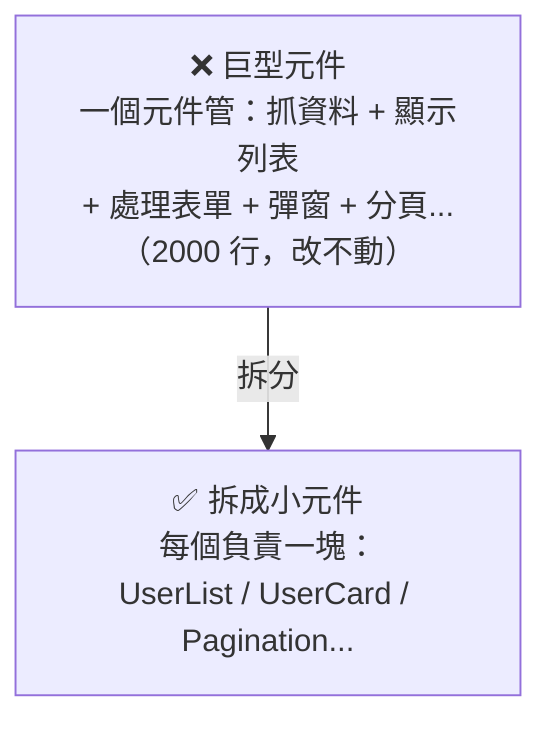

# [E-6-7] 前端 Clean Code：元件設計原則

> **目標**：理解前端（尤其元件化框架如 React）的 Clean Code 原則——怎麼設計乾淨、好維護的元件。

## 前端也需要 Clean Code

Clean Code（E-6-1）不只適用後端——前端，尤其用 React 這類「元件化」框架時，同樣需要好的設計。亂寫的前端，會變成「一個 2000 行的巨型元件、改一個地方壞三個地方」的惡夢。

這篇講幾個前端元件設計的核心原則（呼應 basic Part 6 React、E-7 SOLID）。

## ① 元件單一職責：一個元件做一件事

最重要的原則（呼應 E-7-2 單一職責）：**一個元件應該只負責「一件事」**。

當一個元件做太多事（又抓資料、又顯示、又處理一堆邏輯），它會變得龐大、難懂、難測、難重用。把它**拆成小元件**，每個專注一件事——好讀、好測、好重用。

## ② 分離「邏輯」與「呈現」

一個好用的模式——**把「邏輯」和「畫面」分開**：

- **呈現元件（Presentational）**：只負責「**長什麼樣**」——接收資料（props）、畫出畫面。沒有複雜邏輯。
- **容器/邏輯**：負責「**資料怎麼來、邏輯怎麼跑**」——抓資料、處理狀態，再傳給呈現元件。

（在 React，現在常用「**自訂 Hook**」把邏輯抽出來，讓元件本身專注呈現。）

好處：呈現元件好重用、好測（給不同資料就畫不同畫面）；邏輯獨立、好測。這呼應後端的「分層」（MVC，E-12-2）——**把不同職責分開**。

## ③ Props 要清楚、別過度傳遞

- **Props 命名要清楚**（E-6-2）：`isLoading`、`onSubmit` 一看就懂，別用 `data`、`flag`。
- **別「props 鑽透（prop drilling）」**：把一個 prop 一層層往下傳好幾層元件——很煩、難維護。深層共用的狀態，用「狀態管理 / Context」處理。

## ④ 元件要「可預測」（純粹一點）

好元件像「**純函式**」（E-6-3）——**給一樣的 props，畫出一樣的結果**，不要有奇怪的副作用。這讓元件好理解、好測、好除錯。副作用（抓資料、訂閱事件）要放在框架提供的對應機制裡（如 React 的 useEffect），別散落。

## ⑤ 避免前端的反模式

| 反模式 | 問題 |
|--------|------|
| **巨型元件** | 一個元件幾千行、什麼都管（違反單一職責）|
| **邏輯與畫面糾纏** | 業務邏輯散在 JSX 裡，難測難改 |
| **Prop drilling** | props 一層層硬傳，難維護 |
| **重複的 UI 沒抽成元件** | 同樣的卡片寫了五次（違反 DRY）|

## 核心心法

前端 Clean Code 的核心，其實和後端一樣（E-6、E-7）——只是套用在「元件」上：

> **小而專注的元件（單一職責）+ 分離邏輯與呈現 + 清楚的命名 + 可預測（純粹）+ 重用而非重複。**

把元件當成「樂高積木」——每塊小、職責清楚、可組合、可重用，組出複雜的 UI。而不是「一坨大泥球」。

## 小結

- 前端（元件化框架）同樣需要 Clean Code。
- 原則：**元件單一職責**（小而專注）、**分離邏輯與呈現**、**清楚的 props**（別 prop drilling）、**可預測**（像純函式）、**重用而非重複**。
- 反模式：巨型元件、邏輯畫面糾纏、prop drilling、重複 UI。
- 核心和後端一樣（E-7 SOLID），套用在元件上。

> Clean Code 總覽 → [課外讀物 E-6-1](./E-6-1-what-is-clean-code.md)；單一職責 → [課外讀物 E-7-2](../E-7-solid/E-7-2-srp.md)；React → 參見 **basic 課程** Part 6
