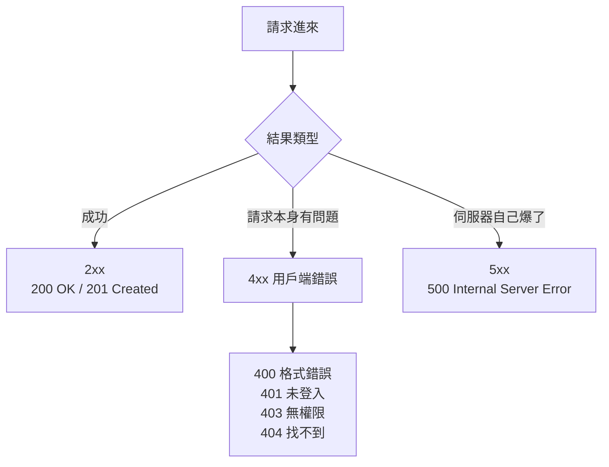
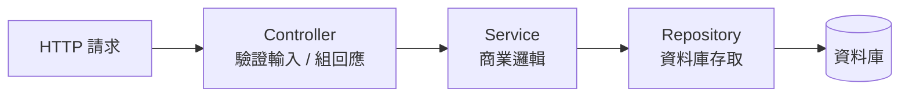

# [E-6-8] 後端 Clean Code：API 設計與錯誤處理原則

> **這篇在說什麼**：後端 API 是前端、第三方、甚至未來的你會反覆打交道的「介面」。一致的回應格式、誠實的錯誤處理、清楚的分層，能讓整個系統好用、好懂、好維護。

## 概念說明

把後端想成一間餐廳的廚房，前端是外場的服務生。服務生（前端）不需要、也不應該知道廚房裡怎麼運作——他只透過一個固定的「出餐窗口」拿餐點，並用一張固定格式的單子溝通。

如果這個窗口時好時壞——有時候回傳 `{ user: ... }`，有時候回傳 `[ ... ]`，出錯時有時回 `{ error: "..." }`、有時直接回一段純文字、有時甚至什麼都不回——那外場就會天天崩潰，每接一道菜都要重新猜「這次是什麼格式」。

**後端 Clean Code 的核心，就是讓這個「窗口」穩定、可預測、誠實。** 前端只要學一次規則，就能信任它永遠照規則來。

這篇會接續課程 Part 4-B（錯誤處理）和 Part 4-D（分層架構）的概念，把它們收斂成幾條實際可用的原則。

## 深入一點

### 原則一：一致的回應格式

最讓前端崩潰的，不是「出錯」，而是「格式每次都不一樣」。先決定一套固定的回應結構，然後所有 API 都照它走。

> **常見錯誤** — 很多人會這樣寫：
> ```typescript
> // ❌ 每個 endpoint 回的形狀都不一樣
> app.get('/users', (req, res) => res.json(userList))        // 回陣列
> app.get('/users/:id', (req, res) => res.json(user))        // 回物件
> app.post('/users', (req, res) => res.json({ ok: true }))   // 又是另一種形狀
> ```
> 問題是：前端每接一個 API 都要重新研究「這次資料藏在哪一層」。一旦其中一個格式悄悄變了，前端就壞了，而且很難一眼看出問題。
>
> 正確做法：**用一個統一的外層包裝（envelope），把資料固定放在同一個欄位。**
> ```typescript
> // ✅ 統一的成功回應結構
> interface SuccessResponse<TData> {
>   success: true
>   data: TData
> }
>
> function sendSuccess<TData>(res: Response, data: TData): void {
>   const body: SuccessResponse<TData> = { success: true, data }
>   res.json(body)
> }
>
> app.get('/users', (req, res) => sendSuccess(res, userList))
> app.get('/users/:id', (req, res) => sendSuccess(res, user))
> ```
> 現在前端永遠從 `response.data` 拿資料，不管哪個 endpoint 都一樣。

---

### 原則二：一致的錯誤格式 + 用對 HTTP 狀態碼

REST（Representational State Transfer，一種設計 API 的風格）的重點之一，就是善用 HTTP 狀態碼來表達「結果是什麼類型」。狀態碼是給機器看的分類，回應 body 裡的 `error` 訊息是給人看的說明，兩者都要有。

最常被搞混的是 **401 和 403**：

- **401 Unauthorized**：其實是「未驗證」——我不知道你是誰（沒登入、token 過期）。
- **403 Forbidden**：「已驗證但無權限」——我知道你是誰，但這件事你不能做（例如一般使用者想刪別人的帳號）。

```typescript
// ✅ 統一的錯誤回應結構
interface ErrorResponse {
  success: false
  error: string
}

function sendError(res: Response, statusCode: number, message: string): void {
  const body: ErrorResponse = { success: false, error: message }
  res.status(statusCode).json(body)
}

// 用對狀態碼 + 對人有意義的訊息
sendError(res, 401, '請先登入')
sendError(res, 403, '你沒有權限刪除這位使用者')
sendError(res, 404, `找不到 ID 為 ${userId} 的使用者`)
```

下面這張圖整理幾個最常用的狀態碼分類：



這張圖說明：狀態碼的第一個數字就先粗分了「誰的問題」——4 開頭是用戶端的問題，5 開頭是伺服器的問題。

---

### 原則三：錯誤訊息要對人有意義，但不洩漏內部細節

錯誤訊息有兩個讀者：使用者（要看得懂、能行動）和攻擊者（你不想讓他看到任何內部結構）。這兩件事要同時顧到。

> **常見錯誤** — 很多人會這樣寫：
> ```typescript
> // ❌ 把原始錯誤直接丟給前端
> catch (error) {
>   res.status(500).json({ error: String(error) })
>   // 可能洩漏：資料表名稱、SQL 語法、檔案路徑、堆疊資訊…
> }
> ```
> 問題是：`error` 裡常常藏著「`column users.password_hash does not exist`」這種訊息，等於把資料庫結構送給攻擊者。對一般使用者來說，這串東西也完全看不懂、無法行動。
>
> 正確做法：**對外給一句乾淨、安全的訊息；完整細節留在伺服器的 log 裡。**
> ```typescript
> // ✅ 對外安全，對內保留完整資訊
> catch (error) {
>   logger.error('建立使用者失敗', { error }) // 完整細節進 log，供工程師排查
>   sendError(res, 500, '系統暫時無法處理請求，請稍後再試') // 對外的乾淨訊息
> }
> ```

---

### 原則四：絕對不要「吃掉」error

「吃掉 error」指的是把例外接住後什麼都不做，讓它無聲無息地消失。這是後端最危險的習慣之一——出事了，但沒有任何人知道。

> **常見錯誤** — 很多人會這樣寫：
> ```typescript
> // ❌ 接住了卻什麼都不做
> try {
>   await saveOrder(order)
> } catch (error) {
>   // 空的！錯誤就這樣被默默吃掉了
> }
> ```
> 問題是：訂單可能根本沒存進去，但程式繼續往下跑，回給前端「成功」。使用者以為下單了，資料庫裡卻什麼都沒有——而且因為沒有 log，你連「出過錯」都不知道，等客訴進來才開始大海撈針。
>
> 正確做法：**至少要記錄它，並且讓呼叫端知道出事了。**
> ```typescript
> // ✅ 記錄 + 往上拋，讓上層決定怎麼回應
> try {
>   await saveOrder(order)
> } catch (error) {
>   logger.error('儲存訂單失敗', { orderId: order.id, error })
>   throw error // 不要假裝沒事，讓上層的錯誤處理接手
> }
> ```

---

### 原則五：分層——驗證、商業邏輯、資料存取各司其職

這正是 Part 4-D 講的分層架構。一個 API 進來，會經過三種不同性質的工作，把它們混在一個函式裡就是後端版的「上帝物件」。常見的分法是 **Controller → Service → Repository**：

- **Controller**：只負責「接收請求、驗證輸入、回傳回應」——它是窗口，不做菜。
- **Service**：放「商業邏輯」——真正的規則在這裡（這道菜怎麼做）。
- **Repository**：只負責「跟資料庫打交道」——存取資料，不管商業規則。



這張圖說明：請求像流水線一樣一層層往內傳，每一層只關心自己那一段，換掉其中一層（例如資料庫換成另一套）不會波及其他層。

對應的程式碼骨架（Express 風格）：

```typescript
// Repository：只管資料存取
class UserRepository {
  async findById(userId: number): Promise<User | null> {
    return db.query('SELECT * FROM users WHERE id = ?', [userId])
  }
}

// Service：只管商業邏輯
class UserService {
  constructor(private readonly userRepository: UserRepository) {}

  async getActiveUser(userId: number): Promise<User> {
    const user = await this.userRepository.findById(userId)
    if (!user) throw new NotFoundError(`找不到 ID 為 ${userId} 的使用者`)
    if (!user.isActive) throw new ForbiddenError('此帳號已被停用')
    return user
  }
}

// Controller：只管 HTTP——驗證輸入、呼叫 service、組回應
app.get('/users/:id', async (req, res) => {
  try {
    const userId = Number(req.params.id)
    if (Number.isNaN(userId)) {
      return sendError(res, 400, 'id 必須是數字')
    }
    const user = await userService.getActiveUser(userId)
    sendSuccess(res, user)
  } catch (error) {
    if (error instanceof NotFoundError) return sendError(res, 404, error.message)
    if (error instanceof ForbiddenError) return sendError(res, 403, error.message)
    logger.error('取得使用者失敗', { error })
    sendError(res, 500, '系統暫時無法處理請求，請稍後再試')
  }
})
```

注意每一層的邊界有多乾淨：Controller 完全不碰 SQL，Repository 完全不知道 HTTP 狀態碼，Service 只專注在「什麼情況算合法」。要測試商業邏輯時，你可以單獨測 `UserService`，連伺服器都不用啟動。

## 延伸閱讀

> 分層的每一層都該是「只做一件事」的函式 → [E-6-3 函式設計：Single Responsibility 與純函式](./E-6-3-function-design.md)

> 想搞懂 HTTP 狀態碼與請求/回應的完整機制 → [E-3-3 HTTP 協定詳解](../E-3-network/E-3-3-http-protocol.md)
