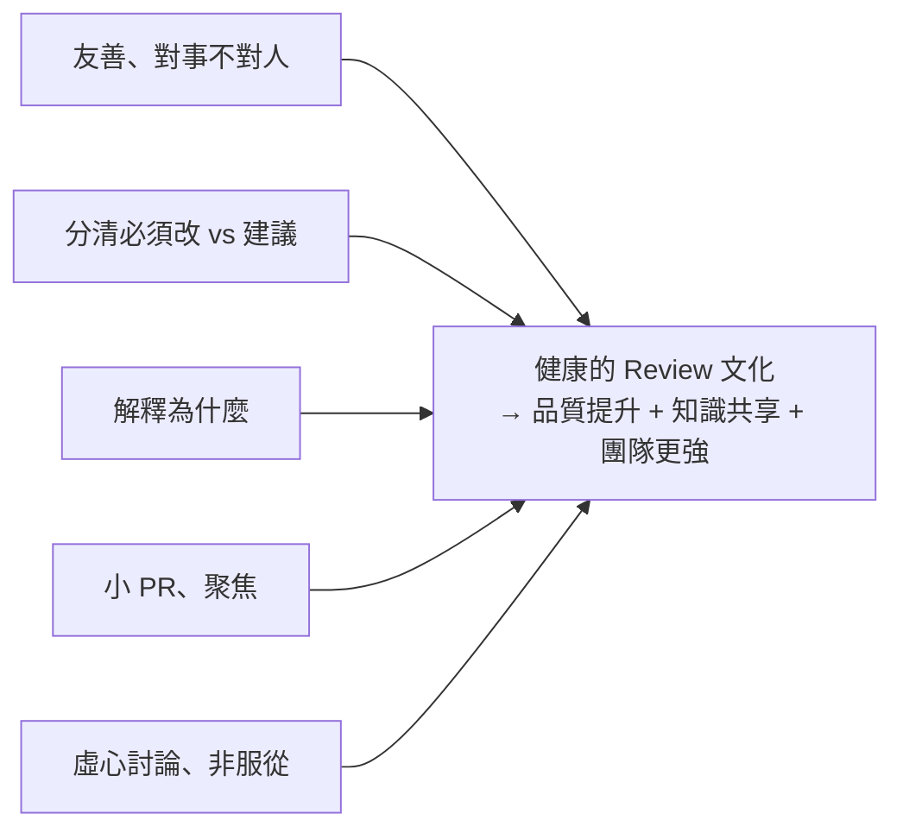

# [E-6-9] Code Review 思維：如何給出有建設性的回饋

> **目標**：理解 Code Review（程式碼審查）的價值，以及怎麼當一個好的審查者與被審查者——這是團隊協作的核心文化。

## Code Review 是什麼

**Code Review（程式碼審查）** 是「**程式碼合併進主線之前，由其他人檢視一遍**」的流程（通常透過 Pull Request，課外讀物 E-8-8）。它是現代團隊協作的標準實踐。

它不只是「抓 bug」，價值更廣：

- **抓問題**：bug、安全漏洞、效能問題、不符規範的地方。
- **知識共享**：審查者了解了這塊程式碼；作者學到審查者的建議。團隊不會「只有一個人懂某塊」。
- **維持品質與一致**：確保程式碼符合團隊的風格、規範（E-6）。
- **集體擁有**：程式碼是「團隊的」，不是「某個人的」。

## 怎麼當好的「審查者」

審查別人的程式碼時，幾個原則：

**① 對事不對人，語氣友善**

這是最重要的（呼應 SRE 無咎文化，sre Part 5-3）。Code review 很容易「傷感情」——別讓它變成批鬥。

```
❌ 「你這寫得很爛」「怎麼會這樣寫」
✅ 「這裡如果用 X 方式，會不會更清楚？」「我有點擔心這邊的效能，要不要考慮…」
```

**對「程式碼」給回饋，不是攻擊「人」**。用「建議、提問」的語氣，而非「命令、指責」。

**② 分清「必須改」與「建議」**

不是所有意見都同等重要。明確區分：

- **必須改的**（真的 bug、安全問題）：明確指出。
- **建議性的**（個人偏好、可改可不改）：標明「這只是建議 / nit（小事）」，別硬逼。

別把「個人風格偏好」當成「必須改」去糾纏——那會耗盡善意。

**③ 解釋「為什麼」**

別只說「這樣不好」，要說「為什麼」——「因為這樣在 X 情況會出錯」「因為這違反了我們的 Y 慣例」。這樣作者才學得到，也才服氣（呼應 E-6-5 注解的「解釋為什麼」）。

**④ 也要稱讚好的地方**

看到寫得好的，說一句「這個寫法很乾淨！」——review 不只挑毛病，正面回饋讓協作更愉快。

## 怎麼當好的「被審查者」

被 review 時，心態也很重要：

- **別把批評當人身攻擊**：對方是在幫你的「程式碼」變好，不是針對你。
- **虛心但不盲從**：好的建議接受；不同意的，禮貌地討論、解釋你的考量——review 是「對話」，不是「服從」。
- **小的 PR 比較好 review**：一次塞 2000 行的 PR，沒人審得動、也審不仔細。**拆成小的、聚焦的 PR**，review 才有效。

## 健康的 Code Review 文化

把以上串起來，一個健康的 review 文化：



反之，**糟糕的 review 文化**（語氣刻薄、糾纏小事、變成批鬥）會讓人害怕提交、不敢 review、傷團隊感情——比沒有 review 還糟。

## 小結

- Code Review = 程式碼合併前由他人檢視。價值：抓問題 + 知識共享 + 維持品質 + 集體擁有。
- 好審查者：**對事不對人、語氣友善**、分清「必須改 vs 建議」、**解釋為什麼**、也稱讚好的。
- 好被審者：別當人身攻擊、虛心但不盲從、**提交小而聚焦的 PR**。
- 健康的 review 文化讓團隊更強；刻薄的文化比沒 review 還糟。

> Pull Request 流程 → [課外讀物 E-8-8：Pull Request 文化](../E-8-git/E-8-8-pull-request.md)；無咎文化（對事不對人）→ 參見 **sre 課程** Part 5-3
