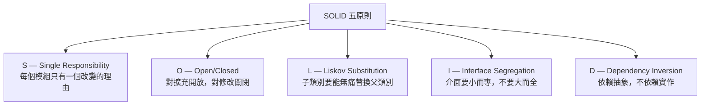

# [E-7-1] SOLID 總覽：五個原則一次看懂

> **這篇在說什麼**：SOLID 是五個幫助你寫出「好改、好擴充、不容易壞」程式碼的設計原則，這篇帶你快速掌握每個原則的精髓。

## 概念說明

1990 年代，軟體工程界有一個問題：**為什麼有些程式碼越改越爛，有些程式碼越改越好？**

Robert C. Martin——大家叫他 Uncle Bob——看著一個又一個軟體專案在維護地獄裡掙扎。功能加到一半，加不下去了，因為改 A 壞 B。想修 bug，發現修好了這邊，另一邊又出問題。最後整個專案變成一顆沒有人敢動的「大泥球」（Big Ball of Mud）。

他開始問：**有沒有一些共同的設計原則，可以讓程式碼更容易修改、更不容易壞？**

答案就是 SOLID。五個字母，五個原則，解決的都是同一個核心問題：**如何讓程式碼在長期維護下依然乾淨。**

---

讓我用一間餐廳來理解這五個原則：

一間運作良好的餐廳，每個角色都有明確的職責——廚師做菜、服務生點餐、收銀員結帳、經理管排班。這種分工讓餐廳即使換了廚師，也不需要重新訓練服務生；即使新增了外送服務，也不需要改動廚房的流程。

SOLID 就是把這種「設計好的系統」帶進程式碼的五個原則。

## 深入一點

### 五個原則一覽

---

### S — Single Responsibility Principle（單一職責原則）

**一個模組只有一個改變的理由。**

回到餐廳：廚師只負責做菜，不負責收款、不負責掃地。如果廚師什麼都管，當收款系統換了、掃地規定改了，廚師也要跟著被影響——這不合理。

程式碼版本：一個 `UserService` 不應該同時負責驗證資料、寫入資料庫、發送 email、產生日誌。每件事都是一個「改變的理由」，聚在同一個地方只會讓事情越來越複雜。

> 深入了解 → [E-7-2 S — Single Responsibility Principle](./E-7-2-srp.md)

---

### O — Open/Closed Principle（開放封閉原則）

**對擴充開放，對修改關閉。**

餐廳可以新增菜色（擴充），但這不應該要求廚師學習全新的料理流程、採購系統全部重寫（修改現有程式碼）。一道新菜加進菜單，現有的流程還是跑得動。

程式碼版本：你在設計一個付款系統，支援信用卡。後來要新增 LINE Pay。好的設計讓你「加一個新的付款方式」，而不是「修改現有的付款邏輯」。

> 深入了解 → [E-7-3 O — Open/Closed Principle](./E-7-3-ocp.md)

---

### L — Liskov Substitution Principle（里氏替換原則）

**子類別要能無痛替換父類別。**

如果你叫一個「廚師」來做事，換成「義大利廚師」（廚師的子類別），餐廳的基本運作應該不受影響——義大利廚師還是會做菜、還是能配合廚房流程。如果換了之後餐廳大亂，那「義大利廚師」就違反了里氏替換原則。

程式碼版本：一個函式接受 `Animal` 型別，你傳進去 `Dog`（Animal 的子類別），行為應該符合預期，不應該丟出意外的錯誤或完全不同的回傳值。

> 深入了解 → [E-7-4 L — Liskov Substitution Principle](./E-7-4-lsp.md)

---

### I — Interface Segregation Principle（介面隔離原則）

**客戶端不應該被迫依賴它用不到的介面。**

服務生只需要知道怎麼點餐、上菜、結帳。你不應該給服務生一本包含廚房操作手冊、設備維修程序、會計報表填寫方式的巨型手冊，然後說「這就是你的工作說明書」。服務生用不到這些，但被迫要「知道」它們存在。

程式碼版本：一個大型的 `IWorker` 介面包含 `cook()`、`serve()`、`manage()`、`repair()`，但廚師只需要 `cook()`。不如拆成 `ICookable`、`IServable`、`IManageable`，讓每個角色只實作它需要的介面。

> 深入了解 → [E-7-5 I — Interface Segregation Principle](./E-7-5-isp.md)

---

### D — Dependency Inversion Principle（依賴反轉原則）

**依賴抽象，不依賴實作。**

廚師在意的是「食材符合規格」——新鮮的雞胸肉、A 級的蔬菜。廚師不在意食材是從哪個供應商來的，只要符合規格就好。這讓餐廳可以換供應商，廚師的工作完全不受影響。

程式碼版本：你的 `OrderService` 不應該直接依賴 `MySQLDatabase`（具體實作），而應該依賴 `IDatabase`（抽象介面）。這樣換成 PostgreSQL 或測試用的假資料庫，`OrderService` 完全不需要改動。

> 深入了解 → [E-7-6 D — Dependency Inversion Principle](./E-7-6-dip.md)

---

### 什麼時候要套用 SOLID？

SOLID 不是清單，不是說每次寫程式都要把五個原則全部套上去。它們是**當你遇到問題時的解決工具**。

如果你的程式碼：
- 改一個地方，意外壞了另一個地方 → 可能違反了 SRP 或 DIP
- 每次新增功能都要改現有程式碼 → 可能違反了 OCP
- 介面實作到一半發現有些方法用不到 → 可能違反了 ISP

這些情況出現了，才回頭想「哪個原則能幫助我？」

SOLID 是工具，不是教條。能讓程式碼更容易理解和修改，才是真正的目的。

## 延伸閱讀

> 進入每個原則的詳細說明：

> S — 每個模組只做一件事 → [E-7-2 Single Responsibility Principle](./E-7-2-srp.md)

> O — 新功能不需要改舊程式碼 → [E-7-3 Open/Closed Principle](./E-7-3-ocp.md)

> L — 子類別的行為要符合預期 → [E-7-4 Liskov Substitution Principle](./E-7-4-lsp.md)

> I — 介面要小而精準 → [E-7-5 Interface Segregation Principle](./E-7-5-isp.md)

> D — 依賴抽象，不依賴實作 → [E-7-6 Dependency Inversion Principle](./E-7-6-dip.md)
