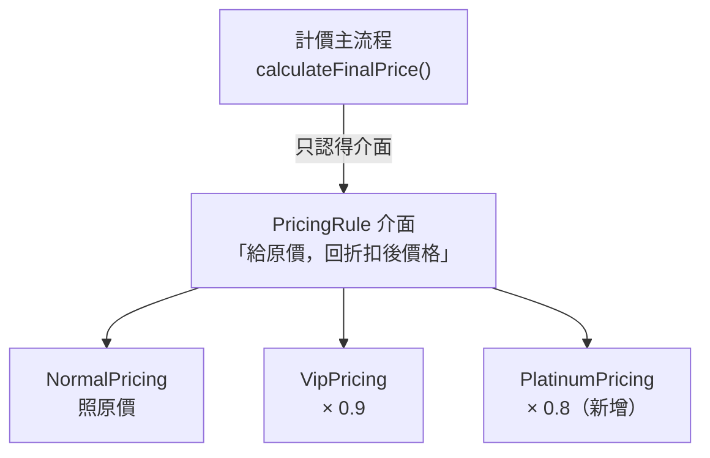

# [E-7-3] O — Open/Closed Principle

> **這篇在說什麼**：Open/Closed Principle 說的是「對擴充開放、對修改關閉」——新增功能時應該「加一段新程式碼」，而不是「改一段舊程式碼」。

## 概念說明

想像你的餐廳是賣咖啡的，菜單上有美式、拿鐵兩種。生意很好，你決定加賣「抹茶拿鐵」。

有兩種加菜的方式：

**方式一**：把廚房現有的「煮咖啡的那台機器」拆開來，硬塞一個抹茶模組進去。每加一種新飲料，就得再拆一次機器、改一次內部線路。改到第五種的時候，這台機器已經沒人敢碰了——動一條線，整台機器都可能壞掉。

**方式二**：機器本身不動，你只是「再插一個新的飲料卡匣」進去。要美式就插美式卡匣，要抹茶就插抹茶卡匣。機器只負責「讀卡匣、照著做」，至於有幾種卡匣，它一點都不在乎。

Open/Closed Principle 講的就是方式二：

> **對擴充開放（可以加新卡匣），對修改關閉（不用拆舊機器）。**

「修改舊程式碼」最可怕的地方在於：那段舊程式碼原本是好好運作的，你一改，就有機會把它弄壞。而且被你弄壞的可能不是你正在加的新功能，而是早就寫好、上線半年、你以為很穩的舊功能。

## 深入一點

### 一個越改越危險的計價函式

假設你在做一個訂單系統，要依會員等級算折扣。一開始只有「一般」和「VIP」兩種：

> **常見錯誤** — 很多人會這樣寫：

```typescript
type MemberLevel = 'normal' | 'vip'

function calculatePrice(originalPrice: number, level: MemberLevel): number {
  if (level === 'normal') {
    return originalPrice
  }
  if (level === 'vip') {
    return originalPrice * 0.9 // VIP 打 9 折
  }
  throw new Error(`未知的會員等級：${level}`)
}
```

現在看起來沒問題。但下週老闆說要加一個「白金會員」打 8 折，下下週又要加「鑽石會員」打 7 折……

每加一種會員，你都得**回來改這個 `calculatePrice` 函式**，往那串 `if` 裡再塞一段。問題是：

- 這個函式越長越難讀，最後變成一坨 `if-else` 地獄。
- 每次改它，你都有機會手滑改壞「白金會員」那段——而白金會員的折扣明明早就上線正常運作了。
- 這個函式有太多「改變的理由」（每種會員規則都是一個理由），其實也順帶違反了 SRP。

這就是**對修改開放**——每次擴充功能都要動到既有程式碼。OCP 要我們反過來。

---

### 換個思路：讓「種類」自己負責自己的規則

關鍵的轉念是：與其用一個函式 `if` 判斷所有種類，不如讓**每一種會員自己知道怎麼算折扣**。計價的主流程只負責「呼叫你算」，不負責「知道你是哪一種、該怎麼算」。

先用 pseudo code 表達這個想法：

```
定義一個共同規格：「會員」都要會回答「給我原價，我告訴你折扣後的價格」

一般會員：照原價
VIP 會員：原價 × 0.9
白金會員：原價 × 0.8

主流程：
    不管你是哪一種會員，我就問你「折扣後多少」
    你自己回答，我直接用
```

用 Mermaid 圖看這個結構：



這張圖在表達：主流程只依賴上方的 `PricingRule` 介面，完全不知道下面到底有幾種計價方式。要新增「白金」時，只是在右下角多掛一個盒子，箭頭都不用動。

---

### 用 TypeScript 重構

第一步，定義一個所有計價規則都要遵守的「共同規格」（介面）：

```typescript
// 每一種計價規則，都要能回答「給我原價，折扣後是多少」
interface PricingRule {
  calculate(originalPrice: number): number
}
```

第二步，每一種會員等級各自實作這個介面。注意：**每種規則只管自己**，彼此完全不知道對方存在：

```typescript
class NormalPricing implements PricingRule {
  calculate(originalPrice: number): number {
    return originalPrice
  }
}

class VipPricing implements PricingRule {
  private readonly VIP_DISCOUNT_RATE = 0.9

  calculate(originalPrice: number): number {
    return originalPrice * this.VIP_DISCOUNT_RATE
  }
}
```

第三步，主流程只認得 `PricingRule` 介面，不認得任何具體的會員等級：

```typescript
// 這個函式永遠不用改——不管未來有幾種會員
function calculateFinalPrice(originalPrice: number, rule: PricingRule): number {
  return rule.calculate(originalPrice)
}
```

---

### 現在來加「白金會員」

重點來了：新增功能時，舊程式碼**一行都不用動**。你只是「插一個新卡匣」：

```typescript
// 全新的檔案、全新的 class，舊的 NormalPricing / VipPricing 完全不受影響
class PlatinumPricing implements PricingRule {
  private readonly PLATINUM_DISCOUNT_RATE = 0.8

  calculate(originalPrice: number): number {
    return originalPrice * this.PLATINUM_DISCOUNT_RATE
  }
}

// 使用時
const price = calculateFinalPrice(1000, new PlatinumPricing()) // 800
```

對照一下兩種做法的差別：

- **重構前**：加白金會員 → 改 `calculatePrice` 函式 → 有機會弄壞 VIP 的邏輯。
- **重構後**：加白金會員 → 新增一個 `PlatinumPricing` class → 舊的測試全部不受影響，因為舊 code 根本沒被碰。

這種「用一組可替換的策略物件來取代 `if/switch`」的手法，有個正式名稱叫**策略模式（Strategy Pattern）**。但你不用記名字，記得那個「插卡匣」的畫面就好。

---

### 不是叫你「永遠不能改程式碼」

OCP 常被誤解成「程式碼一旦寫好就不准動」，這是不對的。修 bug 當然要改；需求本質變了當然要改。

OCP 真正的目標是：**讓「可預期會一直增加的東西」變成擴充點。**

你早就知道「會員等級未來會越來越多」，所以把「會員等級」設計成可以插卡匣的擴充點。但你不需要為了「也許永遠不會發生」的變化過度設計——那會掉進另一個坑：過早最佳化、把簡單的東西搞得很複雜。

判斷的訣竅很簡單：**當你發現自己第二次、第三次回來改同一個 `if/switch`，就是該套 OCP 的訊號了。**

## 延伸閱讀

> 回到 SOLID 的完整總覽 → [E-7-1 SOLID 總覽：五個原則一次看懂](./E-7-1-solid-overview.md)

> 繼續看下一個原則 → [E-7-4 L — Liskov Substitution Principle](./E-7-4-lsp.md)
