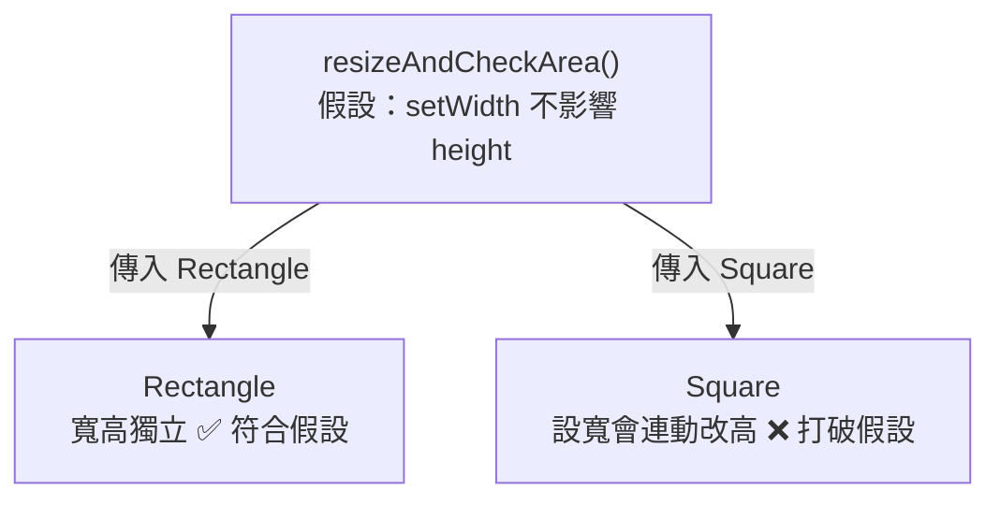

# [E-7-4] L — Liskov Substitution Principle

> **這篇在說什麼**：Liskov Substitution Principle 說的是「子類別要能無痛替換父類別」——任何用到父類別的地方，換成子類別後程式都還是對的，不會出現意外的錯誤或怪行為。

## 概念說明

回到我們的餐廳。你的廚房裡有一個職位叫「廚師」，工作流程很單純：給他食材，他做出菜。整間餐廳的運作都建立在「只要是廚師，給食材就會出菜」這個假設上。

有一天你招募了一位「義大利廚師」。義大利廚師是廚師的一種，所以照理說，餐廳任何需要廚師的地方，都可以放一位義大利廚師上去，運作不變——服務生照樣點單、出菜口照樣等菜。這就是「無痛替換」。

但假設你招來的是一位「只會擺盤、不會開火的裝飾師」，你卻把他當成「廚師」塞進廚房。服務生送單進來，他擺了個漂亮的空盤子出去——因為他根本不會做菜。整個出菜流程當場崩潰。

這位裝飾師雖然名義上「繼承」了廚師，但他**不能無痛替換真正的廚師**。這就是違反 Liskov Substitution Principle 的樣子：

> **如果 S 是 T 的子類別，那麼程式中所有用到 T 的地方，都應該能換成 S 而不出問題。**

換句話說，「繼承」不只是「長得像、有同樣的方法」，而是**行為上真的能頂替**。

## 深入一點

### 經典反例：正方形繼承長方形

數學課教過：正方形是一種長方形（長和寬剛好相等的長方形）。聽起來，讓 `Square` 繼承 `Rectangle` 天經地義。我們來試試看。

先定義長方形，它有寬、高，可以分別設定，還能算面積：

```typescript
class Rectangle {
  protected width = 0
  protected height = 0

  setWidth(width: number): void {
    this.width = width
  }

  setHeight(height: number): void {
    this.height = height
  }

  getArea(): number {
    return this.width * this.height
  }
}
```

現在做正方形。正方形的特性是「長寬必須相等」，所以一旦設定寬，高也要跟著變；設定高，寬也要跟著變：

> **常見錯誤** — 很多人會這樣寫：

```typescript
class Square extends Rectangle {
  // 為了維持「長寬相等」，設寬的時候強制把高也設成一樣
  setWidth(width: number): void {
    this.width = width
    this.height = width
  }

  setHeight(height: number): void {
    this.width = height
    this.height = height
  }
}
```

看起來很合理對吧？`Square` 確實永遠保持長寬相等了。問題出在「替換」的那一刻。

---

### 替換的瞬間，假設被打破了

假設有人寫了一個函式，它**只知道自己拿到一個長方形**。它做了一件對任何長方形都成立的事：把寬設成 5、高設成 4，那面積理所當然該是 20。

```typescript
// 這個函式對「任何長方形」都應該成立
function resizeAndCheckArea(rectangle: Rectangle): void {
  rectangle.setWidth(5)
  rectangle.setHeight(4)

  // 對長方形來說，這裡的面積「一定」是 5 × 4 = 20
  console.log(`預期面積 20，實際面積 ${rectangle.getArea()}`)
}

resizeAndCheckArea(new Rectangle()) // 實際面積 20 ✅
resizeAndCheckArea(new Square()) // 實際面積 16 ❌
```

傳 `Square` 進去時，`setHeight(4)` 把寬也偷偷改成了 4，於是面積變成 4 × 4 = 16，而不是這個函式以為的 20。

這個函式沒有寫錯。它對「長方形」的假設完全正確。**是 `Square` 偷偷違反了「寬高可以獨立設定」這個父類別承諾的行為。** 這就是 LSP 的違反：`Square` 在型別上是 `Rectangle`，但在行為上不能安全頂替它。

用一張圖看清楚問題：



這張圖在表達：問題不在 `Square` 這個 class 本身寫得對不對，而在於它「冒充 `Rectangle`」時，破壞了呼叫端對 `Rectangle` 的合理假設。

---

### 另一個經典：企鵝是鳥，但企鵝不會飛

同樣的陷阱換個故事。「鳥會飛」聽起來很自然，於是有人把 `fly()` 放進 `Bird`：

> **常見錯誤** — 很多人會這樣寫：

```typescript
class Bird {
  fly(): void {
    console.log('拍動翅膀飛起來')
  }
}

// 企鵝是鳥，所以繼承 Bird……但企鵝不會飛
class Penguin extends Bird {
  fly(): void {
    // 為了「誠實」，丟出錯誤——但這正是災難的開始
    throw new Error('企鵝不會飛！')
  }
}

function letItFly(bird: Bird): void {
  bird.fly() // 拿到 Penguin 時，這裡會炸掉
}
```

任何接受 `Bird` 並呼叫 `fly()` 的程式，碰到 `Penguin` 就會爆炸。`Penguin` 無法無痛替換 `Bird`，因為它不滿足「鳥都會飛」這個被寫進父類別的承諾。

問題的根源是**繼承關係設計錯了**：`fly()` 不該是「所有鳥」的能力。修正方式是把「會飛」這件事抽出來，只給真的會飛的鳥：

```typescript
interface Bird {
  layEgg(): void // 所有鳥都會下蛋，這個放在 Bird 沒問題
}

// 「會飛」是另一個能力，誰會飛誰才實作它
interface CanFly {
  fly(): void
}

class Sparrow implements Bird, CanFly {
  layEgg(): void {}
  fly(): void {
    console.log('麻雀飛走了')
  }
}

// 企鵝是鳥，但它只是不實作 CanFly——完全合理，不需要丟錯誤
class Penguin implements Bird {
  layEgg(): void {}
}
```

現在 `letItFly` 的參數型別會是 `CanFly` 而不是 `Bird`，TypeScript 在編譯期就不允許你把 `Penguin` 傳進去——**問題在你寫程式時就被擋住，而不是上線後才爆炸。**（把能力拆成小介面這件事，正是下一篇 ISP 的主題。）

---

### 怎麼判斷自己有沒有違反 LSP？

不用背數學定義，記住這個生活化的判斷：

> **「子類別有沒有偷偷拿掉、或扭曲父類別承諾過的行為？」**

幾個典型的危險信號：

- 子類別覆寫某個方法後，**丟出父類別不會丟的錯誤**（像 `Penguin.fly()`）。
- 子類別讓某個方法**產生父類別呼叫者意料之外的副作用**（像 `Square.setWidth` 連帶改了 height）。
- 你在某個方法裡開始寫 `if (x instanceof Square)` 來特別處理某個子類別——這幾乎總是 LSP 出問題的味道。

當你發現「這個子類別其實做不到父類別答應的事」，通常代表**這段關係根本不該用繼承**。改用組合、或把共同能力拆成更小的介面，往往才是對的路。

## 延伸閱讀

> 回顧上一個原則 → [E-7-3 O — Open/Closed Principle](./E-7-3-ocp.md)

> 繼續看下一個原則 → [E-7-5 I — Interface Segregation Principle](./E-7-5-isp.md)
