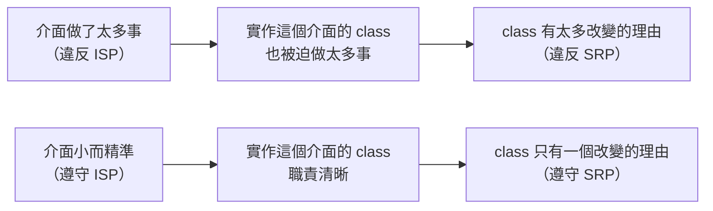

# [E-7-5] I — Interface Segregation Principle

> **這篇在說什麼**：介面不應該把用不到的方法塞給實作它的人——小而精準的介面，比大而全的介面更好用、更好維護。

## 概念說明

你去一間餐廳，服務生走過來，拿給你一本厚厚的手冊。

你翻開來，發現裡面有：點餐流程、廚房設備操作說明、食材採購 SOP、財務報表填寫方式、衛生稽查應對指南……

服務生說：「這就是你點餐需要知道的所有事情。」

你只是想點一盤義大利麵。

---

這就是「胖介面（Fat Interface）」的問題：**它把所有可能用到的方法都塞在同一個介面裡，然後逼著每個實作者都要面對那些跟自己無關的東西。**

Interface Segregation Principle 說的是：

> **客戶端不應該被迫依賴它用不到的介面。**

## 深入一點

### 胖介面的問題

假設你在設計一個餐廳員工系統：

```typescript
// ❌ 一個包山包海的巨型介面
interface RestaurantWorker {
  cook(): void        // 廚師才做的事
  serve(): void       // 服務生才做的事
  wash(): void        // 洗碗工才做的事
  manage(): void      // 經理才做的事
  repair(): void      // 維修人員才做的事
  doAccounting(): void // 會計才做的事
}
```

然後你要實作 `Chef`（廚師）：

```typescript
// ❌ 廚師被迫實作所有方法，包括他根本不做的事
class Chef implements RestaurantWorker {
  cook(): void {
    console.log('做菜中...')
  }

  serve(): void {
    throw new Error('我是廚師，不是服務生！')  // 被迫實作，只能丟例外
  }

  wash(): void {
    throw new Error('我是廚師，不洗碗！')       // 同上
  }

  manage(): void {
    throw new Error('我是廚師，不管人！')       // 同上
  }

  repair(): void {
    throw new Error('我是廚師，不修東西！')     // 同上
  }

  doAccounting(): void {
    throw new Error('我是廚師，不做帳！')       // 同上
  }
}
```

這個設計有幾個問題：

1. **實作者被迫撒謊**：`Chef` 宣稱它實作了 `serve()` 和 `manage()`，但這些方法只是丟例外——這違反了合約精神
2. **讀程式碼的人被誤導**：看到 `Chef implements RestaurantWorker`，會以為廚師能做所有事
3. **改動 `RestaurantWorker` 影響所有人**：你在介面裡加一個新方法，所有實作這個介面的 class 都要跟著改——即使那個方法跟它們完全無關

---

### 拆成小介面

```typescript
// ✅ 每個介面只描述一種職責

interface Cookable {
  cook(): void
}

interface Servable {
  serve(): void
  takeOrder(order: string): void
}

interface Washable {
  wash(): void
}

interface Manageable {
  manage(): void
  scheduleShift(workerId: number): void
}

interface Repairable {
  repair(equipment: string): void
}

// 每個角色只實作它真正會做的介面
class Chef implements Cookable, Washable {
  cook(): void {
    console.log('做菜中...')
  }

  wash(): void {
    console.log('洗碗中...')  // 廚師有時候也洗自己的器具
  }
}

class Waiter implements Servable {
  serve(): void {
    console.log('上菜中...')
  }

  takeOrder(order: string): void {
    console.log(`記錄點單：${order}`)
  }
}

class Manager implements Manageable, Servable {
  manage(): void {
    console.log('管理中...')
  }

  scheduleShift(workerId: number): void {
    console.log(`排班員工 ${workerId}`)
  }

  // 經理有時候也要幫忙上菜
  serve(): void {
    console.log('幫忙上菜中...')
  }

  takeOrder(order: string): void {
    console.log(`經理代為記錄：${order}`)
  }
}
```

現在每個 class 只實作它真正會做的事，沒有任何「被迫撒謊」的方法。

---

### 在 TypeScript 中的實際應用

TypeScript 的介面設計最常遇到 ISP 問題的地方：

**API 回應型別**

```typescript
// ❌ 一個大型的 API 回應型別，塞了所有可能的欄位
interface ApiResponse {
  success: boolean
  data: unknown
  error: string
  errorCode: number
  message: string
  pagination: {
    page: number
    totalPages: number
    totalItems: number
  }
  metadata: Record<string, unknown>
}

// 有些 API 回成功但不需要分頁，有些只有 error 沒有 data
// 但用了這個介面，所有欄位都存在（可能是 undefined）

// ✅ 用聯合型別（union type）分開設計
interface SuccessResponse<T> {
  success: true
  data: T
}

interface PaginatedResponse<T> {
  success: true
  data: T[]
  pagination: {
    page: number
    totalPages: number
    totalItems: number
  }
}

interface ErrorResponse {
  success: false
  error: string
  errorCode: number
}

type ApiResponse<T> = SuccessResponse<T> | PaginatedResponse<T> | ErrorResponse
```

**React 元件的 props**

```typescript
// ❌ 一個元件接受一堆用不到的 props
interface ButtonProps {
  label: string
  onClick: () => void
  icon?: string
  iconPosition?: 'left' | 'right'
  isLoading?: boolean
  loadingText?: string
  isDisabled?: boolean
  disabledReason?: string
  variant?: 'primary' | 'secondary' | 'danger'
  size?: 'small' | 'medium' | 'large'
  fullWidth?: boolean
  // 加了 20 個 props，但大多數時候你只需要 label 和 onClick
}

// ✅ 基本介面 + 可選的 feature 組合
interface BaseButtonProps {
  label: string
  onClick: () => void
  variant?: 'primary' | 'secondary' | 'danger'
  size?: 'small' | 'medium' | 'large'
}

interface LoadableButtonProps extends BaseButtonProps {
  isLoading: boolean
  loadingText?: string
}

interface IconButtonProps extends BaseButtonProps {
  icon: string
  iconPosition?: 'left' | 'right'
}
```

---

### 「你不會需要它」原則

ISP 有個實用的配套心法：**YAGNI（You Ain't Gonna Need It）**。

在設計介面的時候，不要把「未來可能用到的方法」提前加進去。等到真的需要了，再擴充介面。

```typescript
// ❌ 「說不定以後會用到」的思維
interface UserRepository {
  findById(id: number): User | null
  save(user: User): void
  delete(id: number): void
  findByEmail(email: string): User | null
  findAllByRole(role: string): User[]     // 現在用不到，但「以後可能用到」
  findInactiveUsers(): User[]             // 現在也用不到
  exportToCSV(): string                   // 這個更扯，repository 不應該管 export
}

// ✅ 只定義現在真的需要的方法
interface UserRepository {
  findById(id: number): User | null
  save(user: User): void
  delete(id: number): void
}
```

介面越小，實作它的成本越低，測試它的成本也越低。等到真的需要 `findByEmail`，那時候再加——這叫做「進化式設計」，比一開始就設計完美還要務實。

---

### ISP 和 SRP 的關係

這兩個原則有很深的關聯：



這張圖說明：介面的設計方式，會直接影響實作端的 class 是否符合 SRP。好的介面設計讓 SRP 更容易達到。

## 延伸閱讀

> 回到 SOLID 五原則的全貌 → [E-7-1 SOLID 總覽：五個原則一次看懂](./E-7-1-solid-overview.md)

> 函式和模組層面的 Single Responsibility → [E-6-3 函式設計：Single Responsibility 與純函式](../E-6-best-practices/E-6-3-function-design.md)
