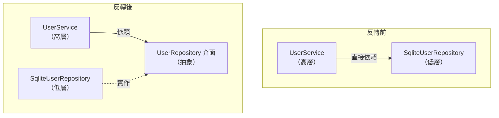

# [E-7-6] D — Dependency Inversion Principle

> **這篇在說什麼**：Dependency Inversion Principle 說的是「依賴抽象、不依賴實作」——高層的商業邏輯不該綁死在低層的細節（用哪個資料庫、哪個套件）上，兩邊都該依賴中間那層介面。

## 概念說明

回到餐廳。廚師在意的是「食材符合規格」——新鮮的雞胸肉、A 級的青菜。他不在乎這些雞胸肉是哪一家供應商送來的、用什麼卡車載來的。只要「符合規格」，廚師照樣能做菜。

正因為廚師依賴的是「規格」而不是「某一家供應商」，餐廳才能隨時換供應商——換了之後廚師完全無感，做菜流程一行都不用改。

反過來想，如果你的廚師非得用「大豐農場的雞胸肉」才會做菜，你只要想換供應商，就得重新訓練廚師。這就慘了——**高層的人（廚師）被低層的細節（哪家供應商）綁架了。**

Dependency Inversion Principle 講的就是這件事：

> **高層模組不該依賴低層模組，兩者都該依賴抽象。**

這裡的「規格」就是程式裡的「介面（interface）」。廚師依賴「食材規格」，就像 Service 依賴「Repository 介面」，而不是依賴「某個具體的資料庫實作」。

## 深入一點

### 課程的分層架構：Service 不該知道資料存在哪

還記得 Part 4-D 講的分層架構嗎？我們把後端拆成幾層，其中：

- **Service 層**：負責商業邏輯。例如「註冊使用者前要先檢查 email 沒被用過」。這是**高層模組**——它在乎的是「業務規則」。
- **Repository 層**：負責實際存取資料。例如「去 SQLite 撈一筆使用者」。這是**低層模組**——它在乎的是「資料怎麼存、怎麼撈」。

問題來了：Service 該不該知道「資料是存在記憶體陣列、還是 SQLite、還是雲端資料庫」？

**不該。** Service 只該知道「我能存一個使用者、能用 email 找一個使用者」——至於背後是陣列還是 SQLite，與業務規則完全無關。

---

### 先看綁死實作的寫法

> **常見錯誤** — 很多人會這樣寫：

```typescript
// 低層：具體的 SQLite 實作
class SqliteUserRepository {
  findByEmail(email: string): User | null {
    // 直接對 SQLite 下查詢
    return sqlite.query('SELECT * FROM users WHERE email = ?', [email])
  }

  save(user: User): void {
    sqlite.query('INSERT INTO users VALUES (?)', [user])
  }
}

// 高層：Service 在內部「自己 new 出」一個具體的 SQLite repository
class UserService {
  private readonly repository = new SqliteUserRepository() // ❌ 綁死了

  register(newUser: User): void {
    const existing = this.repository.findByEmail(newUser.email)
    if (existing) {
      throw new Error(`email ${newUser.email} 已被註冊`)
    }
    this.repository.save(newUser)
  }
}
```

問題出在 `new SqliteUserRepository()` 這一行——**Service 直接依賴了具體的 SQLite 實作。** 後果：

- 想把資料庫換成 PostgreSQL？要改 `UserService`。
- 寫測試時不想真的連資料庫、只想用一個假的記憶體版本？也要改 `UserService`。
- 高層的「業務規則」被低層的「資料庫選擇」綁架了，方向反了。

---

### 把箭頭反過來：兩邊都指向中間的介面

DIP 的「Inversion（反轉）」就是指依賴箭頭的方向被反轉了。原本是「高層 → 低層」，我們插一個介面進中間，讓**兩邊都指向介面**：



這張圖在表達：反轉後，低層的 `SqliteUserRepository` 反而要「往上」去配合介面（虛線箭頭代表實作），而高層的 Service 只依賴中間那個穩定的介面，不再碰到任何具體實作。

---

### 用 TypeScript 落實：定義介面 + 建構子注入

第一步，定義「規格」——Service 需要的能力，寫成一個介面。注意這個介面**只描述「能做什麼」，完全不提怎麼做**：

```typescript
interface UserRepository {
  findByEmail(email: string): User | null
  save(user: User): void
}
```

第二步，Service 不再自己 `new`，而是透過**建構子把依賴傳進來**。它的型別是介面，不是任何具體實作：

```typescript
class UserService {
  // 依賴的是「介面」，所以 Service 永遠不知道背後是 SQLite 還是陣列
  constructor(private readonly repository: UserRepository) {}

  register(newUser: User): void {
    const existing = this.repository.findByEmail(newUser.email)
    if (existing) {
      throw new Error(`email ${newUser.email} 已被註冊`)
    }
    this.repository.save(newUser)
  }
}
```

這個「從外面把依賴傳進來」的手法，就叫**依賴注入（Dependency Injection）**。DIP 是「要依賴抽象」的原則，依賴注入是「怎麼把抽象塞進去」的具體做法——兩者常一起出現，但不是同一件事。

第三步，各種具體實作各自去滿足這個介面：

```typescript
// 正式環境用 SQLite
class SqliteUserRepository implements UserRepository {
  findByEmail(email: string): User | null {
    return sqlite.query('SELECT * FROM users WHERE email = ?', [email])
  }
  save(user: User): void {
    sqlite.query('INSERT INTO users VALUES (?)', [user])
  }
}

// 測試或開發初期用記憶體陣列——一行業務邏輯都不用改
class InMemoryUserRepository implements UserRepository {
  private readonly users: User[] = []

  findByEmail(email: string): User | null {
    return this.users.find((user) => user.email === email) ?? null
  }
  save(user: User): void {
    this.users.push(user)
  }
}
```

---

### 收割成果：在「組裝的地方」決定要用哪一個

現在 `UserService` 對「資料存哪」完全無感。決定權移到了程式啟動、組裝物件的那一個地方：

```typescript
// 正式環境
const userService = new UserService(new SqliteUserRepository())

// 測試環境——同一個 UserService，餵不同的 repository 就好
const userServiceForTest = new UserService(new InMemoryUserRepository())
```

看出威力了嗎：

- **換資料庫**：寫一個新的 `class PostgresUserRepository implements UserRepository`，然後在組裝那行換掉就好。`UserService` 一個字都不用動。（這其實也正是上一篇 OCP「對擴充開放、對修改關閉」的體現。）
- **寫測試**：直接餵 `InMemoryUserRepository`，測試跑超快、不依賴任何真實資料庫。

---

### 一句話記住 DIP

> **不要讓「重要的東西」依賴「容易換掉的東西」。**

業務規則（怎麼算錢、怎麼註冊）是你產品的核心，它應該很穩定。資料庫、第三方套件、外部 API 這些「細節」則常常會換。讓核心去依賴會變的細節，就是把房子蓋在流沙上。

DIP 要你在中間立一根穩定的柱子——介面——讓核心扶著柱子站，而會變的細節去配合柱子。這樣不管底下怎麼換，上面的核心都穩穩的。

## 延伸閱讀

> 回顧上一個原則 → [E-7-5 I — Interface Segregation Principle](./E-7-5-isp.md)

> 回到 SOLID 的完整總覽 → [E-7-1 SOLID 總覽：五個原則一次看懂](./E-7-1-solid-overview.md)
