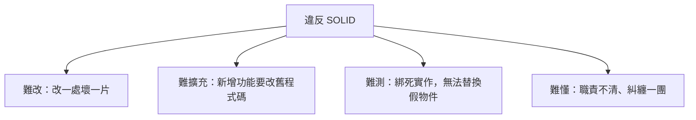

# [E-7-8] SOLID 反例大賞：違反原則的程式碼長什麼樣子

> **目標**：透過「違反每個 SOLID 原則」的具體反例，反過來加深對五原則的理解——看壞例子，更懂為什麼要遵守。

## 從反面學 SOLID

學原則時，「**看違反它的壞例子**」往往比「看正面例子」更有感——因為你會「痛」，會記住。這篇把五個 SOLID 原則，各配一個「反例」，看看違反它們的程式碼長什麼樣、會有什麼苦。

## 違反 S（單一職責，E-7-2）：上帝物件

```
class UserManager {
    驗證密碼() {...}
    寄送 email() {...}
    產生報表() {...}
    連接資料庫() {...}
    處理付款() {...}
    壓縮圖片() {...}
    // ……一個 class 管所有事，3000 行
}
```

**問題**：這個 class 什麼都做（「上帝物件」，E-6-6）——改任何一個功能都動到它，牽一髮動全身，沒人敢碰、無法測。

**苦**：改「寄 email」的邏輯，結果不小心弄壞了「付款」——因為它們擠在同一個巨型 class。

## 違反 O（開放封閉，E-7-3）：一直改舊程式碼

```
function 算運費(類型) {
    if (類型 === "宅配") return ...
    else if (類型 === "超商") return ...
    else if (類型 === "限時") return ...
    // 每新增一種，就要「改」這個函式、加一個 else if
}
```

**問題**：每次新增運送方式，都要「**修改**」這個既有函式——違反「對修改封閉」。

**苦**：改這個函式時，可能不小心弄壞既有的邏輯；而且這個函式越來越長。（正解：Strategy 模式，E-12-7。）

## 違反 L（里氏替換，E-7-4）：子類別不能替換父類別

```
class Bird { fly() {...} }
class Penguin extends Bird {
    fly() { throw new Error("企鵝不會飛！"); }   // ← 違反！
}

// 程式碼期待「所有 Bird 都能 fly」
function 讓鳥飛(bird: Bird) { bird.fly(); }
讓鳥飛(new Penguin());   // 💥 爆炸！企鵝不會飛
```

**問題**：`Penguin` 是 `Bird` 的子類別，但它**不能無縫替換** `Bird`（呼叫 `fly()` 會爆）。

**苦**：任何「用 Bird 的地方」傳進 Penguin 都可能爆——繼承關係設計錯了。（正解：別讓 Penguin 繼承「會飛的 Bird」。）

## 違反 I（介面隔離，E-7-5）：大而全的介面

```
interface Worker {
    work(); eat(); sleep();
}
class Robot implements Worker {
    work() {...}
    eat() { /* 機器人不用吃，但被逼實作這個空方法 */ }
    sleep() { /* 同上，被逼實作 */ }
}
```

**問題**：`Worker` 介面太肥，逼 `Robot` 實作它用不到的 `eat`/`sleep`。

**苦**：一堆「為了符合介面而寫的空方法」，混亂又誤導。（正解：拆成小介面 Workable/Eatable，E-7-5、E-7-7。）

## 違反 D（依賴反轉，E-7-6）：依賴具體實作

```
class OrderService {
    private gateway = new StripeGateway();   // ← 直接 new 具體類別！
    // OrderService 和 Stripe「綁死」了
}
```

**問題**：`OrderService` 直接依賴具體的 `StripeGateway`，沒有依賴抽象。

**苦**：要換成 PayPal？得「改 OrderService 的程式碼」；要測試？沒辦法換成假的 gateway（測試還得連真 Stripe）。（正解：依賴 `PaymentGateway` 介面、注入進來，E-7-6、E-7-7。）

## 反例的共同苦難

回頭看這些反例，違反 SOLID 的程式碼共同的「苦」：



而遵守 SOLID，正是為了避免這些苦——**好改、好擴充、好測、好懂**。所以 SOLID 不是「為了優雅」的學院派教條，而是「為了讓你（和同事）以後不痛苦」的務實智慧。

## 小結

- 從「反例」學 SOLID 特別有感：
  - 違反 S → 上帝物件（什麼都管，改一處壞一片）
  - 違反 O → 一直改舊程式碼（新增要改既有）
  - 違反 L → 子類別不能替換父類別（傳進去就爆）
  - 違反 I → 大而全的介面（被逼實作空方法）
  - 違反 D → 依賴具體（綁死、難換難測）
- 共同的苦：難改、難擴充、難測、難懂。
- 遵守 SOLID 就是為了避免這些苦——務實，不是教條。

> SOLID 各原則正面教學 → [E-7-1 總覽](./E-7-1-solid-overview.md) 及 E-7-2~6；用 TypeScript 實踐 → [E-7-7](./E-7-7-solid-in-typescript.md)
