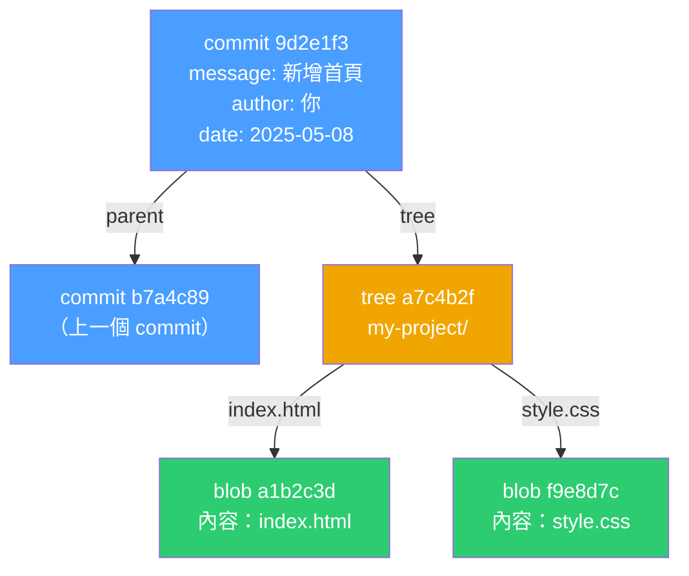

# [E-8-1] Git 的內部運作：blob、tree、commit 是什麼

> **這篇在說什麼**：掀開 Git 的引擎蓋，看看 `git commit` 的時候，Git 到底把什麼東西存到哪裡去了。

## 概念說明

你有沒有想過，每次你執行 `git commit`，Git 到底在做什麼？

它不是只是把「哪些行改了」記下來，也不是把整個資料夾複製一份。Git 有自己一套非常聰明的方式來儲存資料——所有東西都存在 `.git/objects` 這個資料夾裡，而且每個物件都用一串獨特的 SHA-1 雜湊值來識別。

先來建立直覺。假設你有一個小專案：

```
my-project/
├── index.html     （裡面寫著 "<h1>Hello</h1>"）
└── style.css      （裡面寫著 "body { color: red; }"）
```

你執行了 `git commit`。Git 內部會建立**三種物件**來記錄這個快照。

## 深入一點

### 物件一：blob — 儲存檔案內容

**blob（Binary Large Object）** 只做一件事：儲存一個檔案的內容。

Git 拿到 `index.html` 的內容（`<h1>Hello</h1>`），計算它的 SHA-1 雜湊值，得到一串像這樣的 ID：

```
a1b2c3d4e5f6...（40個字元，通常只用前7位：a1b2c3d）
```

然後把這個檔案的內容存到 `.git/objects/a1/b2c3d4e5f6...`。

幾個重點：
- blob 只存**內容**，不存檔案名稱
- 如果兩個不同名字的檔案，內容完全一樣，Git 只會存一份 blob（節省空間）
- 只要內容改了一個字，SHA-1 就完全不同——所以 Git 永遠知道檔案有沒有被動過

### 物件二：tree — 儲存目錄結構

blob 不記得自己叫什麼名字，也不知道自己在哪個資料夾。**tree** 來補這個：

```
tree（代表 my-project/ 這個資料夾）
├── index.html → blob a1b2c3d（指向剛才那個 blob）
└── style.css  → blob f9e8d7c（指向 CSS 的 blob）
```

tree 是一張「名冊」，記錄「這個資料夾裡有哪些檔案（名稱），以及每個檔案對應到哪個 blob」。如果有子資料夾，tree 也可以指向另一個 tree。

### 物件三：commit — 儲存一個時間點的快照

**commit** 把所有東西綁在一起，記錄「這一刻的完整狀態」：

```
commit 9d2e1f3
├── tree: a7c4b2f     ← 指向根目錄的 tree
├── parent: b7a4c89   ← 上一個 commit 的 ID（第一個 commit 沒有 parent）
├── author: 你的名字 <信箱>
├── date: 2025-05-08 14:30:00
└── message: "新增首頁 HTML 結構"
```

commit 本身不存任何檔案內容，它只是指向 tree，而 tree 再指向 blob。

### 三者的關係圖



這張圖說明：每個 commit 指向一個 tree，tree 指向各個 blob。commit 之間透過 `parent` 串成一條鏈，這就是 Git 的「版本時間軸」。

### SHA-1：Git 的身分證系統

每個 blob、tree、commit 都有一個 40 字元的 SHA-1 雜湊值作為 ID。你在 `git log --oneline` 看到的 `9d2e1f3` 就是完整 SHA-1 的前 7 位。

SHA-1 有一個特性：只要內容稍微改動，產生的雜湊值就完全不同。Git 利用這個特性來**保證資料完整性**——如果有人偷偷改了某個 commit 的內容，SHA-1 就會對不上，Git 立刻知道。

### 自己動手看

如果你好奇，可以在有 Git 的專案裡執行這些指令：

```bash
# 看 .git/objects 裡有什麼
find .git/objects -type f

# 看某個 object 的內容（把 a1b2c3d 換成你的 commit ID）
git cat-file -p a1b2c3d

# 看 tree 的內容
git ls-tree HEAD
```

這樣你就能親眼看到 commit、tree、blob 之間的關係。

## 延伸閱讀

> 了解 Git 的內部結構之後，Branch 其實就更好理解了 → [課外讀物 E-8-2：Branch 與 Merge：平行宇宙的概念](./E-8-2-branch-and-merge.md)
