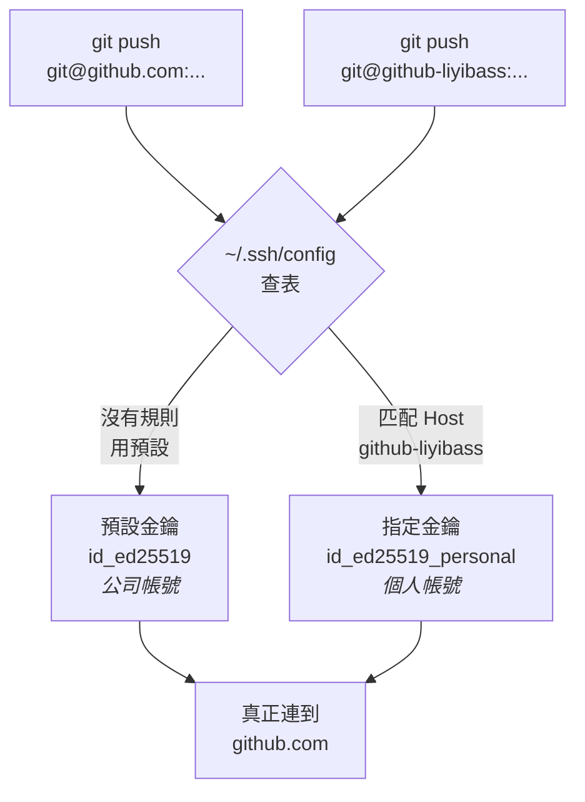

# [E-8-10] 一台電腦，兩個 GitHub 帳號

> **這篇要解決的問題**：公司帳號和個人帳號在同一台電腦上打架，push 時冒出 `ERROR: Repository not found`。

## 先破除一個很貴的誤解

大多數人第一次遇到這個問題時，會這樣想：

```
我把 git config 的 user.email 改成個人信箱了，
那 GitHub 應該就知道我是誰了吧？
```

**不會。** 這是整篇最重要的一句話：

> **`user.name` / `user.email` 只是寫在 commit 上的「署名」，跟「你是誰」完全無關。**
> GitHub 認的是你的 **SSH 金鑰**。

用日常比喻：

```
user.email    = 你在信件末尾簽的名字
              → 任何人都可以簽「王小明」，郵局不會查

SSH 金鑰      = 你進大樓時刷的門禁卡
              → 刷不過就是進不去，簽什麼名都沒用
```

所以錯誤訊息才會是 `Repository not found`（而不是「權限不足」）——GitHub 用**公司帳號**的身分幫你查詢，那個帳號底下確實沒有這個 repo，於是它誠實地說「找不到」。

> 💡 GitHub 刻意不回「你沒有權限」，因為那等於告訴陌生人「這個 private repo 存在」。
> **把「無權限」偽裝成「不存在」是資安上的標準做法**，代價就是錯誤訊息會誤導人。

---

## 解法的核心：SSH Config 的「假網域」

真正巧妙的地方在這裡。`~/.ssh/config` 允許你自訂一個**只存在於這台電腦上的假網域名稱**，並指定它該用哪把金鑰：



這張圖說明整個機制：`github-liyibass` **不是真的網域**，DNS 上不存在。它只是 SSH 設定檔裡的一個代號；SSH 查表後把它換成真正的 `github.com`，同時挑出對應的金鑰。

**兩條路最後都連到同一個 `github.com`，差別只在「刷哪張門禁卡」。**

---

## 設定步驟

### 1. 為新帳號產生專屬金鑰

```bash
ssh-keygen -t ed25519 -C "your_email@example.com" -f ~/.ssh/id_ed25519_personal
```

`-f` 指定檔名——**這步不能省**，不指定的話會覆蓋掉預設的 `id_ed25519`，公司帳號就掛了。

提示要求 passphrase 時可以直接 Enter 跳過。

### 2. 加入 SSH Agent

```bash
ssh-add ~/.ssh/id_ed25519_personal
```

### 3. 設定 SSH Config 分流

編輯 `~/.ssh/config`：

```text
# 個人帳號
Host github-liyibass
    HostName github.com
    User git
    IdentityFile ~/.ssh/id_ed25519_personal
```

| 欄位 | 意義 |
|---|---|
| `Host` | **你自己編的代號**，取什麼都可以 |
| `HostName` | 真正要連的位址，固定是 `github.com` |
| `User` | 固定是 `git`（GitHub 的 SSH 一律用這個帳號） |
| `IdentityFile` | 這個代號要用哪把金鑰 |

### 4. 把公鑰貼到 GitHub

```bash
pbcopy < ~/.ssh/id_ed25519_personal.pub
```

到該帳號的 **Settings → SSH and GPG keys → New SSH key** 貼上。

> ⚠️ 複製的是 **`.pub`**（公鑰）。沒有 `.pub` 的那個是私鑰，**任何情況下都不該離開這台電腦**。

### 5. 把 remote 改成你的代號

設定做完後，關鍵是 remote URL 要用**代號**而不是 `github.com`：

```bash
git remote set-url origin git@github-liyibass:liyibass/repo-name.git
#                             ^^^^^^^^^^^^^^^ 這裡換成代號
```

clone 新專案時同理：

```bash
git clone git@github-liyibass:liyibass/repo-name.git
```

### 6. 設定這個專案的署名（選擇性）

身分已經靠金鑰解決了，這步只是讓 commit 上的署名正確：

```bash
git config user.name "你的名字"
git config user.email "你的信箱"
```

不加 `--global`，才只對這個專案生效。

---

## 驗證

```bash
ssh -T git@github-liyibass
```

```
Hi liyibass! You've successfully authenticated, but GitHub does not provide shell access.
```

**看名字對不對**——如果冒出來的是公司帳號的名字，代表 config 沒生效或 remote 沒改到。

> 這裡的 `does not provide shell access` 不是錯誤，是正常的。
> 它只是告訴你「認證成功了，但你不能用 SSH 登入 GitHub 的機器」。

---

## 最常見的失敗：設定都對，但忘了改 remote

金鑰產了、config 寫了、公鑰也貼了，結果還是 `Repository not found`。

九成是這個原因：**remote URL 還停在 `git@github.com:`**。

SSH config 是**靠 Host 字串比對**的——URL 裡寫 `github.com`，就完全匹配不到 `Host github-liyibass` 那條規則，於是安安靜靜地用了預設金鑰。

```bash
git remote -v      # 檢查：冒號前面是代號還是 github.com？
```

> 💡 **教訓**：這類設定的失敗常常是「**規則寫好了但沒被觸發**」，而不是「規則寫錯了」。
> 排查時先確認**觸發條件**有沒有滿足，再去懷疑規則本身。

---

## 一個真實例子

這份課程 repo 自己就是這樣設定的：

```bash
git remote -v
# origin  git@github-liyibass:liyibass/software-engineer-roadmap.git
```

這台是公司電腦，預設金鑰綁的是公司帳號。要不是有這個分流，這個 repo 一行都推不上去。

---

## 延伸閱讀

> 想知道 commit 裡到底存了什麼（包含署名）→ [E-8-1：Git 的內部運作](./E-8-1-git-internals.md)

> 想知道哪些東西不該進版控（例如私鑰）→ [E-8-6：`.gitignore`](./E-8-6-gitignore.md)

> 想了解 SSH 金鑰背後的加密原理 → [E-10 資安系列](../E-10-security/)
