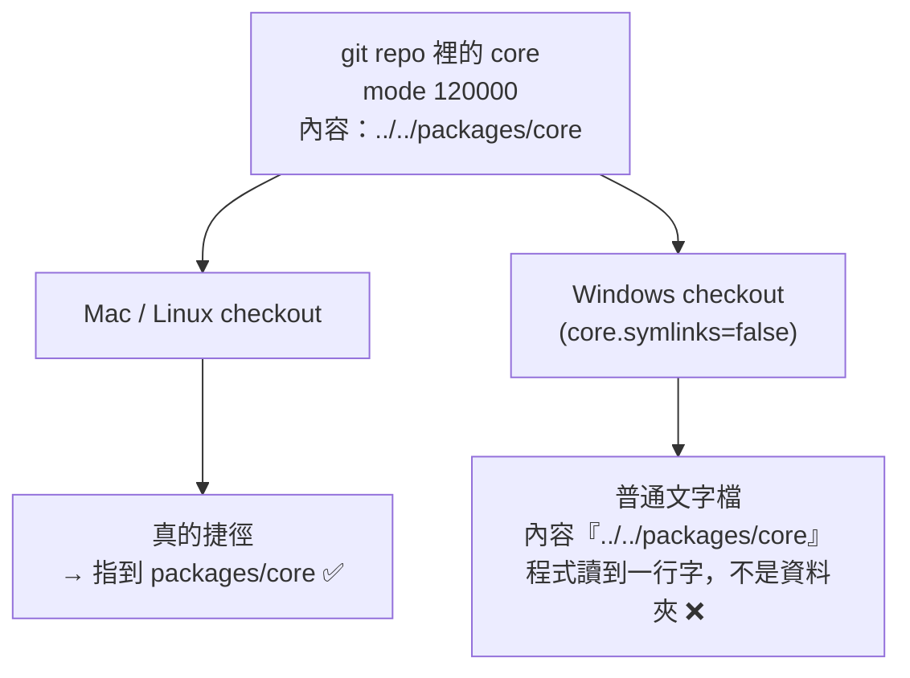

# [E-8-11] Symlink 進 git 嗎？跨專案共用一份程式碼的坑

> **這篇要解決的問題**：monorepo 裡好幾個子專案要共用同一份程式碼，你用 symlink（捷徑）把它連進每個專案，
> 在 Mac 上一切正常——直到隊友在 Windows 上 clone 下來，那個「共用的資料夾」變成一個裝著一行文字的怪檔案。

## 先講場景：為什麼會想用 symlink

假設你在做一系列小遊戲，機制一模一樣、只有美術不同。你不想把同一份「核心程式」複製 N 份
（改一次要同步 N 個地方，遲早會有一份忘了改、悄悄長歪）。直覺的解法是**捷徑**：

```
games/gameA/core  ──捷徑──▶  packages/core   （真正的檔案只有這一份）
games/gameB/core  ──捷徑──▶  packages/core
```

這個「捷徑」在檔案系統的正式名字叫 **symbolic link（符號連結，symlink）**——一個特殊檔案，
內容其實只是「我指向哪裡」的一段路徑，作業系統會透明地帶你去讀真正的目標。程式打開 `gameA/core`
時，完全感覺不出它是捷徑，就像那些檔案真的在那裡。

到目前為止都很美好。問題在於——**這個 symlink 該不該 commit 進 git？**

## git 眼中的 symlink

先破除一個誤解：

> **git 存 symlink，存的不是「目標資料夾的內容」，而是「那段指向路徑的字串」。**

也就是說 git 裡的 `gameA/core` 是一個**內容為 `../../packages/core` 的普通小檔案**，只是多標了一個
「我是 symlink」的模式位（mode `120000`）。在支援 symlink 的系統上，checkout 時 git 會照這個標記
把它還原成真正的捷徑。

用日常比喻：

```
symlink       = 一張寫著「東西在 3 樓 A 櫃」的便利貼
git 存的      = 便利貼上那行字（不是櫃子裡的東西）
checkout      = 照便利貼把捷徑重新貼回去
```

## Windows 上便利貼變成了廢紙

關鍵的坑在這裡：

> **Windows 的 git 預設 `core.symlinks=false`。**

於是 checkout 時，git **不會**把那個檔案還原成捷徑，而是**照字面把它寫成一個普通文字檔**——
內容就是那行 `../../packages/core`。你的程式打開 `gameA/core`，看到的不是一整個核心資料夾，
而是一個 13 bytes、裝著一行路徑的廢紙。整份共用程式碼憑空消失。



這張圖說的是：同一個 commit，在兩種系統 checkout 出來的東西完全不同——Mac 拿到捷徑，Windows 拿到廢紙。

而且「叫 Windows 使用者去開 `core.symlinks=true`」不是好解法：得開開發者模式或用管理員權限跑，
還得**每個隊友、每台機器都記得開**，忘一台就壞一台。把「會不會壞」交給「每個人有沒有記得設定」，
遲早會出事。

## 解法：連結不進 git，各機器自己建

比起跟 git 硬碰硬，更乾淨的做法是**根本不讓 git 管這個連結**：

1. `.gitignore` 把連結的路徑排除 → git 完全不知道有這東西。
2. 寫一支 `setup` 腳本，clone 之後跑一次，**在本機建連結**：
   - Mac / Linux → 建 symlink
   - Windows → 建 **junction**（目錄接合點，`mklink /J`）——它跟 symlink 效果一樣（作業系統當它是真資料夾），
     但**不需要管理員權限、也不用開發者模式**，正好補上 symlink 在 Windows 的痛點。

```bash
# clone 之後跑一次
make setup     # 內部呼叫腳本，依作業系統建 symlink 或 junction
```

這樣做的好處，以及一個一定要留的安全網：

- **好處**：改核心立刻反映到每個子專案（只有一份實體檔案），沒有「複製 N 份、忘了同步」的漂移。
- **安全網**：忘了跑 `setup` 會怎樣？程式找不到核心 → 一 build 就**大聲報錯**。這是刻意的——
  你要的是「忘了設定 → 當場紅」，不是「忘了設定 → 悄悄用到舊的複本」。**會吵的失敗，永遠好過安靜的錯誤。**

> 這正是 E-8-10 的同一種精神：有些「跨機器才會現形」的差異（SSH 金鑰、symlink 支援），
> 與其祈禱每台機器都一致，不如用一層本機設定把它明確地兜起來。

## 兩個容易忽略的細節

- **`.gitignore` 排除 symlink 時不要加尾斜線**。symlink 對 git 不算「目錄」，寫 `core/`（帶斜線）
  匹配不到它 → 那個連結反而會被 `git add -A` 加進版控，前功盡棄。要寫 `core`（不帶斜線）。
- **junction 存的是絕對路徑**（symlink 可以是相對路徑）。所以整個 repo 換位置後，Windows 上的
  junction 會斷掉，得重跑一次 `setup`。腳本要寫成**冪等**：已存在且指對就跳過，指錯就先拆掉再建。

## 一句話帶走

> symlink 在 git 裡存的是「一行指向路徑」，不是目標內容；Windows 預設不還原它。
> 跨機器要共用一份程式碼，**別把連結交給 git，交給一支 clone 後跑的 setup 腳本**——
> Mac 建 symlink、Windows 建 junction，忘了跑就讓它大聲報錯。

---

## 延伸閱讀

> 想知道 git 到底怎麼存檔案（blob、mode 位）→ [E-8-1：Git 的內部運作](./E-8-1-git-internals.md)

> 想知道哪些東西不該進版控、`.gitignore` 的比對規則 → [E-8-6：`.gitignore`](./E-8-6-gitignore.md)

> 同樣是「跨機器才現形」的 git 坑 → [E-8-10：一台電腦，兩個 GitHub 帳號](./E-8-10-multiple-github-accounts.md)
