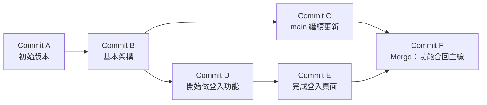

# [E-8-2] Branch 與 Merge：平行宇宙的概念

> **你會了解**：Git branch 是什麼、為什麼開發時要開 branch，以及 merge 的幾種運作方式——讀完之後，那些 branch 指令就不再是咒語了。

---

## 從一個很熟悉的困境說起

想像你在寫一篇很重要的報告，寫到一半，你突然有個新想法，想試試完全不同的開頭。

但你不想把現在寫好的部分改壞。

最直覺的做法是什麼？**複印一份**，在複本上亂改，原版安全地躺在那裡。

Git branch 做的就是這件事。只是它比「複印一份」聰明太多了——它不會真的把整個專案複製一遍，它只是建立一個新的**起點指標**，讓你從那個點開始往不同方向走。

---

## Branch 到底是什麼？

在 Git 的世界裡，每次 `git commit` 都會產生一個 commit 節點，每個節點都記得自己的上一個節點是誰。整個歷史就是這樣一條鏈串起來的。

**Branch 就是一個指向某個 commit 的指標，僅此而已。**

它不是一個獨立的資料夾，不是一個副本，只是一個貼紙，貼在某個 commit 上，說：「這條線從這裡開始算。」

`main`（或舊版的 `master`）是預設存在的那個 branch，通常代表「正式、穩定的版本」。

---

## 常用的 branch 指令

```bash
# 建立一個叫 feature/login 的新 branch（還沒切換過去）
git branch feature/login

# 切換到 feature/login
git checkout feature/login

# 上面兩行合併成一行（最常用）
git checkout -b feature/login

# 新版 Git 也可以用 switch（更語意化）
git switch -c feature/login

# 列出所有 branch，* 號標示你現在在哪裡
git branch
```

切換 branch 之後，你在這個 branch 上做的所有 commit，都不會影響其他 branch。你可以大膽試驗，改壞了就整個 branch 刪掉，main 毫髮無傷。

---

## 視覺化：平行宇宙長這樣

下圖是一個典型的開發流程：從 `main` 的 commit B 開出一條 `feature/login`，各自往前走，最後合回去：



這張圖裡，B 是兩條線的分岔點。`main` 繼續走到 C，`feature/login` 走到 D 再到 E，最後在 F 會合。

這就是「平行宇宙」——同一個時間點，兩條線各自發展，互不干擾，最後選擇要不要合併。

---

## Merge 的三種方式

合併 branch 的時候，Git 會根據情況選擇不同的策略。

### 1. Fast-forward Merge（快轉合併）

情況：`main` 在你開 branch 之後完全沒有動過，沒有任何分叉。

這時候 Git 不需要做任何「合併」的工作，只要把 `main` 的指標直接移到 feature branch 的最新 commit 就好了，就像把錄影帶快轉到最新畫面。

結果：歷史上看不出曾經有過 branch，一條直線。

### 2. Three-way Merge（三方合併）

情況：`main` 在你開 branch 之後也有新的 commit，兩條線都往前走了。

Git 會找三個節點來計算差異：
- 兩條線的共同祖先（分叉點）
- `main` 的最新 commit
- feature branch 的最新 commit

根據這三個版本，Git 計算出最終應該長什麼樣子，然後產生一個**新的 merge commit**（這個 commit 有兩個父節點，就是上圖的 F）。

結果：歷史上可以清楚看到「這裡合併過」。

### 3. Rebase（變基）

情況：你想讓歷史看起來像一條直線，好像 feature branch 是從 main 最新的地方開始的。

Rebase 做的事是：把你在 feature branch 上的 commit，「搬」到 main 最新 commit 的後面，重新播放一遍。

結果：歷史很乾淨，沒有 merge commit，但實際上改寫了 commit 的歷史。

> 原則：**公開的 branch 不要 rebase**。如果你的 branch 已經推到遠端給別人用了，rebase 會讓別人的歷史和你的對不上，造成混亂。Rebase 只適合在自己的本地 branch 上整理歷史用。

---

## Merge Conflict（合併衝突）

合併最讓人頭痛的情況：**兩個 branch 都改了同一個檔案的同一個位置**。

Git 不知道該保留哪個版本，只好把兩個都列出來，讓你自己決定：

```
<<<<<<< HEAD
const greeting = "你好";
=======
const greeting = "哈囉";
>>>>>>> feature/login
```

- `<<<<<<< HEAD`：你目前所在 branch（通常是 main）的版本
- `=======`：分隔線
- `>>>>>>> feature/login`：要合併進來的 branch 的版本

解決方式：
1. 手動編輯這個檔案，刪掉那些奇怪的標記，留下你想要的版本
2. `git add` 標記這個檔案已解決
3. `git commit` 完成合併

現代的編輯器（VS Code、Cursor）都有內建的衝突解決介面，會把這三個區塊用顏色區分，還有按鈕讓你一鍵選擇要哪個版本，比直接看文字友善很多。

---

## 為什麼不要直接改 main？

開 branch 看起來麻煩，為什麼不直接在 main 上改就好？

幾個實際原因：

**1. main 要保持隨時可部署**
如果你的功能做到一半，突然要緊急修一個線上 bug，你沒辦法一邊有半成品一邊去修別的東西。Branch 讓你可以「放下手邊的事，去處理緊急狀況，再回來繼續」。

**2. 多人同時開發**
五個工程師同時在 main 上改，每個人的 commit 混在一起，誰改了什麼根本搞不清楚。Branch 讓每個人的工作範圍是獨立的。

**3. 失敗成本低**
試了一個方向，發現行不通，直接 `git branch -d feature/xxx` 刪掉，main 完全不受影響。

---

## 小結

- Branch 是一個指向 commit 的指標，不是整個專案的副本
- 開 branch 讓你在不影響主線的情況下自由試驗
- Merge 有三種策略：Fast-forward（無分叉）、Three-way merge（有分叉，產生 merge commit）、Rebase（重播歷史，讓線條更直）
- Merge conflict 發生在兩邊都改了同一行，需要手動決定留哪個版本
- 保持 main 乾淨可部署，是養成好習慣的第一步

---

## 延伸閱讀

> 想了解團隊如何規範 branch 的使用方式 → [課外讀物 E-8-7：Git Flow 與 GitHub Flow](./E-8-7-git-flow.md)

> 想深入了解 Git 怎麼存 commit → [課外讀物 E-8-1：Git 的內部運作](./E-8-1-git-internals.md)
