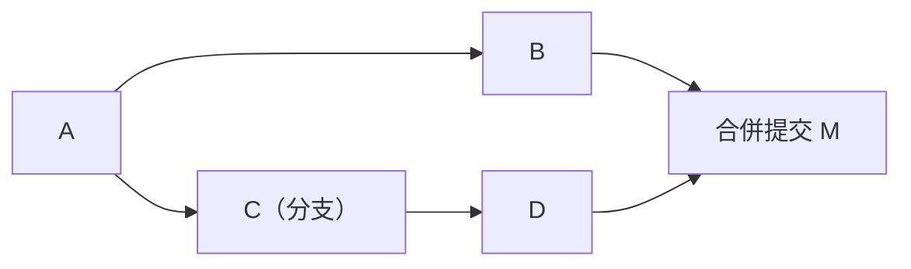
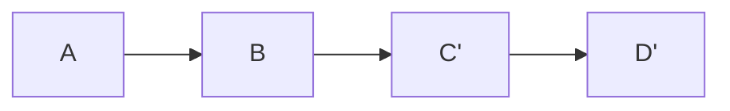

# [E-8-3] Rebase vs Merge：歷史要整齊還是要真實？

> **目標**：理解 git 整合分支的兩種方式——merge 與 rebase，它們產生的歷史長得不一樣，各有取捨。

## 兩種「把分支整合進來」的方式

你在分支上開發（E-8-2），完成後要把它「整合」回主分支。Git 有兩種方式：**merge（合併）** 和 **rebase（變基）**。它們達成類似目的，但「產生的歷史」很不同。

## Merge：保留真實歷史，留下合併點

**merge** 把兩個分支「**合在一起**」，產生一個「**合併提交（merge commit）**」：

- 它**保留了真實的歷史**——「這裡曾經有條分支，後來合回來了」清清楚楚。
- 缺點：歷史會有很多「分岔、合併」的線，**看起來較雜亂**（尤其多人協作時）。

## Rebase：改寫歷史，變成一直線

**rebase** 則是「**把你的提交，搬到對方最新的後面**」，假裝你是「從最新狀態開始開發的」：

- 它把你的提交（C、D）「重新接（rebase）」到 B 後面，變成 **C'、D'**——歷史變成**一直線、很整齊**。
- 缺點：它**改寫了歷史**（C、D 變成新的 C'、D'）——歷史「看起來」像從沒分岔過，但這「不是真實發生的順序」。

## 對照

| | Merge | Rebase |
|---|-------|--------|
| 歷史 | 保留分岔、有合併點（真實）| 拉成一直線（整齊）|
| 真實性 | ✅ 反映真實開發過程 | ⚠️ 改寫了歷史 |
| 可讀性 | 較雜亂（多分支時）| 乾淨、線性 |
| 比喻 | 「如實記錄」| 「整理過的故事」|

核心取捨就是標題那句：**歷史要「真實」（merge）還是要「整齊」（rebase）？**

## 黃金法則：別 rebase 已推送的公開分支

rebase 很好用，但有一條**鐵律**：

> **絕對不要 rebase「已經推送到遠端、別人可能用到的」分支（尤其是 main）。**

因為 rebase **改寫了歷史**（C → C'）。如果別人已經基於「舊的 C」工作，你把它改成「C'」，會造成嚴重的混亂——別人的歷史和你的對不上，一團糟。

安全的用法：

- **rebase 只用在「自己的、還沒推送的」本地分支**——例如整理自己的提交、把 main 的最新變更同步到自己的分支。
- **公開、共享的分支用 merge**——保留真實、不改寫別人依賴的歷史。

## 實務上常見的做法

很多團隊的做法是「**rebase 整理自己的分支 + merge 進主線**」：

1. 在自己的功能分支開發。
2. 要整合前，先 `git rebase main`——把 main 的最新變更同步進來，並讓自己的提交變整齊（這時還沒推送或只有自己用，安全）。
3. 再 merge 進 main（或透過 PR）。

這樣既享有 rebase 的「整齊」，又用 merge 保留「這個功能分支整合進來」的記錄。

## 小結

- **merge**：合併分支、留下合併提交——保留真實歷史，但較雜亂。
- **rebase**：把提交搬到最新後面、拉成一直線——歷史整齊，但「改寫了歷史」。
- 取捨：歷史要「真實」（merge）還是「整齊」（rebase）。
- **鐵律：別 rebase 已推送/共享的分支**（會害到別人）；rebase 只用在自己本地的分支。
- 常見做法：rebase 整理自己的分支 + merge 進主線。

> 分支與合併基礎 → [課外讀物 E-8-2：Branch 與 Merge](./E-8-2-branch-and-merge.md)；解決 Merge 衝突 → [E-8-4](./E-8-4-merge-conflict.md)
