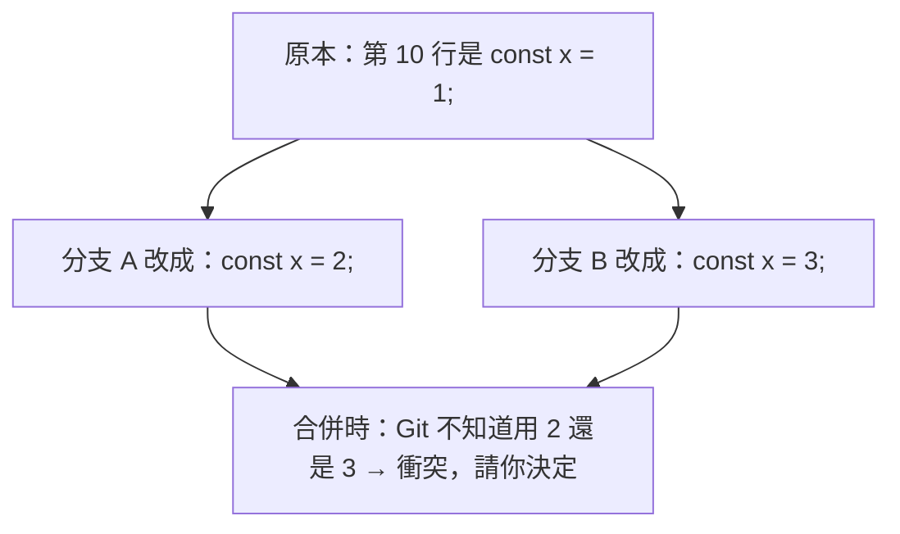

# [E-8-4] 解決 Merge Conflict：不要怕，冷靜處理

> **目標**：理解 merge 衝突是什麼、為什麼會發生，並學會冷靜地解決它——這是新手最害怕、但其實不難的事。

## 新手最怕的紅字

合併分支時（E-8-2、E-8-3），你可能看到可怕的訊息：

```
CONFLICT (content): Merge conflict in app.js
Automatic merge failed; fix conflicts and then commit the result.
```

很多新手看到「CONFLICT」就慌了。但其實——**衝突是正常的、可預期的，而且解決它不難**。這篇幫你不再害怕。

## 為什麼會衝突

Git 大部分時候能「自動合併」兩個分支的變更（你改檔案 A、我改檔案 B → 自動合併，沒問題）。但有一種情況它無法自動決定：

> **兩個分支，「同時改了『同一個檔案的同一行』」，而且改得不一樣。** Git 不知道「該用誰的」——所以它停下來，**請你（人）來決定**。



所以衝突不是「出錯」，而是「Git 很誠實地說：這裡我無法替你決定，請你來」。

## 衝突長什麼樣

Git 會在衝突的檔案裡，用特殊標記標出「兩邊各自的版本」：

```
<<<<<<< HEAD
const x = 2;              ← 你目前分支的版本
=======
const x = 3;              ← 要合併進來的分支的版本
>>>>>>> feature-branch
```

- `<<<<<<< HEAD` 到 `=======` 之間：**你這邊**的版本。
- `=======` 到 `>>>>>>>` 之間：**對方**的版本。

## 怎麼解決：三步驟

解決衝突就三步，冷靜做：

**① 打開衝突的檔案，找到標記**

找到 `<<<<<<<`、`=======`、`>>>>>>>` 這些標記。

**② 決定「最終要什麼」，編輯成正確的樣子**

你要「人工決定」最終版本——可能是：

- 用你的（刪掉對方的）。
- 用對方的（刪掉你的）。
- 兩個都要（合在一起）。
- 寫一個全新的。

**重點：把那些 `<<<<<<<`、`=======`、`>>>>>>>` 標記也刪掉**，只留下你要的最終程式碼：

```
const x = 3;     // ← 例如決定用對方的，刪掉標記和另一個版本
```

**③ 標記為已解決、完成合併**

```bash
git add 衝突的檔案        # 告訴 git「這個衝突我解決了」
git commit               # 完成合併（merge 的話）
```

完成！衝突解決了。

## 解決衝突的心法

- **別慌**：衝突是正常的，尤其多人協作。它不是「你做錯了」。
- **看懂標記**：HEAD 是你的、下面是對方的。搞清楚兩邊各想做什麼。
- **不確定就問**：如果衝突的是「別人寫的程式碼」，不確定該留哪個——**去問那個人**，別亂猜（猜錯可能弄丟重要變更）。
- **善用工具**：IDE（VS Code 等）有圖形化的衝突解決介面，比手動找標記友善很多——它會顯示「接受你的 / 接受對方的 / 都接受」的按鈕。
- **解完測試**：解決衝突後，跑一下程式/測試，確認沒解錯（呼應 E-9 測試的價值）。

## 怎麼減少衝突

衝突沒辦法完全避免，但可以減少：

- **常拉取、常整合**：別讓自己的分支離 main 太遠太久——越久差越多，衝突越大。常 `git pull` 把別人的變更同步進來。
- **小而頻繁的提交/PR**：大的、長命的分支容易累積大衝突（呼應 E-6-9 小 PR）。
- **團隊溝通**：別兩個人同時大改同一個檔案——分工時就避開。

## 小結

- Merge 衝突 = 兩個分支「改了同一個檔案的同一行」，Git 無法自動決定，請你來決定（正常、不是出錯）。
- 衝突標記：`<<<<<<< HEAD`（你的）/ `=======` / `>>>>>>>`（對方的）。
- 解決三步：打開檔案 → 編輯成最終版（刪掉標記）→ `git add` + `git commit`。
- 心法：別慌、看懂標記、不確定就問、用 IDE 工具、解完測試。
- 減少衝突：常整合、小 PR、團隊溝通。

> 分支與合併 → [E-8-2](./E-8-2-branch-and-merge.md)；Rebase vs Merge → [E-8-3](./E-8-3-rebase-vs-merge.md)
