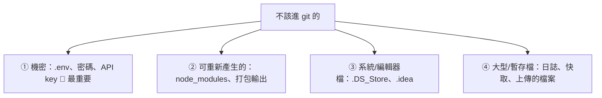

# [E-8-6] .gitignore：哪些東西不應該進版本控制

> **目標**：理解 `.gitignore` 的作用，以及「哪些檔案不該進版本控制」——這關乎乾淨、安全與團隊協作。

## 不是所有東西都該進 git

你可能以為「專案的所有檔案都該 commit 進 git」。**錯。** 有些檔案**不該、也不能**進版本控制。`.gitignore` 就是「告訴 git 忽略哪些檔案」的清單。

## .gitignore 是什麼

`.gitignore` 是一個放在專案裡的檔案，列出「**git 該忽略、不要追蹤的檔案/資料夾**」：

```
# .gitignore 範例
node_modules/        # 忽略整個 node_modules 資料夾
.env                 # 忽略環境變數檔（含機密！）
*.log                # 忽略所有 .log 檔
dist/                # 忽略打包輸出
.DS_Store            # 忽略 Mac 的系統檔
```

被列入的檔案，git 會「當作不存在」——不追蹤、不 commit、`git status` 也不顯示。

## 哪些東西不該進 git（重要）



**① 機密資訊（最重要！）**

`.env`、密碼、API 金鑰、憑證——**絕對不能進 git**。原因（呼應 aws-1-3 天價帳單、infra Part 2-6 安全）：

> git 會**永久記住歷史**——你 commit 了一個密碼，就算下次刪掉，它**還留在 git 歷史裡**，救不回來。如果這個 repo 推到公開的 GitHub，全世界都能挖出你的密碼/金鑰。**無數的資安事故、天價雲端帳單，都源自「不小心把金鑰 commit 進 git」。**

所以機密放 `.env`，並把 `.env` 加進 `.gitignore`——機密只在本機/伺服器（用環境變數讀取，E-1-5），永不進版控。

**② 可以重新產生的東西**

`node_modules/`（npm install 就會重生，E-2-3）、打包輸出 `dist/`、編譯產物——這些**重新產生就有**，commit 進去只是讓 repo 又肥又亂（node_modules 超大，E-2-3）。

**③ 系統/編輯器的檔案**

`.DS_Store`（Mac）、`.idea/`（JetBrains）、`.vscode/`（部分）——這些是「你個人環境的東西」，跟專案無關，別污染 repo。

**④ 大型/暫存檔**

日誌（`*.log`）、快取、使用者上傳的檔案——這些不屬於「程式碼」，不該進版控（會讓 repo 爆肥）。

## 該進 git 的

反過來，**該進 git 的是「程式碼 + 設定範本 + 文件」**：

- 你的原始碼。
- `package.json`、`.gitignore` 本身。
- **`.env.example`**（範本！）——列出「需要哪些環境變數」但**不含真實值**，讓別人知道要設什麼。真實的 `.env` 不進、但範本進。
- README、文件。

## 萬一不小心 commit 了機密怎麼辦

如果不小心把密碼/金鑰 commit 進去了（尤其推到遠端）：

1. **立刻「作廢」那個機密**——改密碼、撤銷並重新產生 API 金鑰。因為它已經外洩了，光「從 git 刪掉」沒用（歷史還在、可能已被別人看到）。
2. 再清理 git 歷史（較麻煩，用 `git filter-repo` 之類）。

**重點：機密一旦進過 git（尤其公開的），就視為「已外洩」**——第一要務是作廢它，不是「刪掉就沒事」。這就是為什麼一開始就用 `.gitignore` 擋住機密這麼重要。

## 小結

- `.gitignore` = 告訴 git「忽略哪些檔案、不要追蹤」的清單。
- 不該進 git：**機密（.env、金鑰——最重要）**、可重生的（node_modules、dist）、系統/編輯器檔、大型暫存檔。
- 該進 git：原始碼、設定、`.env.example`（範本，不含真值）、文件。
- **機密進過 git = 視為已外洩**——第一要務是「作廢它」（改密碼/撤金鑰），不是刪掉就好。

> 環境變數與機密 → [課外讀物 E-1-5](../E-1-terminal/E-1-5-environment-variables.md)；金鑰外洩的後果 → 參見 **aws 課程** Part 1-3、**infra 課程** Part 2-6
