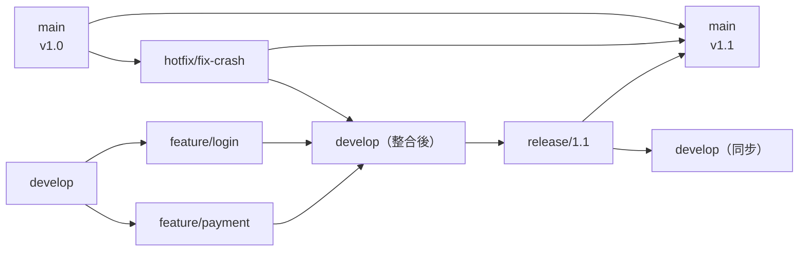
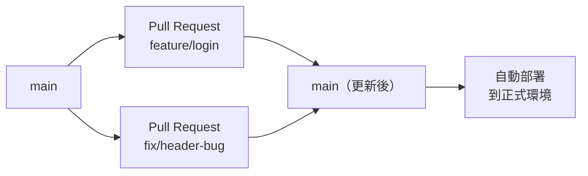

# [E-8-7] Git Flow 與 GitHub Flow：團隊怎麼規範分支使用

> **你會了解**：兩種主流的 Git 分支策略——適合有版本號產品的 Git Flow，以及適合現代 Web 開發的 GitHub Flow——以及你應該從哪個開始學。

---

## 一個人的混亂，五個人的災難

一個人寫程式的時候，branch 用得隨便一點沒關係。命名很隨意、分支沒有規則、什麼時候 merge 靠感覺——反正只有你一個人看。

但五個人同時在同一個 repo 工作，你突然發現：

- 有人直接在 main 上 commit，結果搞壞了正式環境
- 有人開的 branch 叫 `test2`、`final`、`final2`、`final_final`，沒有人知道哪個才是最新的
- 兩個人改了同一個地方，合併的時候打架了三個小時

這就是為什麼需要**分支策略**——一套大家都同意遵守的規則，讓多人協作變得可預測、可控制。

目前業界最常見的有兩種：**Git Flow** 和 **GitHub Flow**。

---

## Git Flow：有結構的傳統做法

Git Flow 是 2010 年由 Vincent Driessen 在一篇部落格文章裡提出的。他設計了五種固定角色的 branch，每種都有明確的職責。

### 五種 Branch 的角色

**`main`**
只放**已經正式上線的版本**。每次合入 main，都代表這個版本已經穩定、可以給使用者用。通常會打上版本標籤（`v1.0`、`v2.3`）。

**`develop`**
日常開發的主線。所有的新功能最終都會合回這裡。可以想成「下一個版本長什麼樣子」的地方。

**`feature/*`**
每個新功能開一個 branch，從 `develop` 開出來，做完之後合回 `develop`。
例如：`feature/user-authentication`、`feature/payment-integration`

**`release/*`**
當 `develop` 上的功能夠多了、準備要上線，就從 `develop` 開一個 release branch。
這個 branch 只做「最後的清理工作」：修小 bug、更新版本號、寫 changelog。
做完之後，同時合入 `main`（正式上線）和 `develop`（同步修復）。

**`hotfix/*`**
線上出了緊急 bug，從 `main` 直接開一個 hotfix branch，修完之後同時合入 `main` 和 `develop`。
這是唯一一種可以「跳過 develop」直接影響 main 的情況。

### Git Flow 的結構圖



這張圖表達的是：feature 合回 develop，develop 到一定程度開 release，release 做完合入 main 和 develop，hotfix 緊急從 main 出發再合回兩邊。

### Git Flow 適合什麼場合？

- **有版本號的桌面軟體或 SDK**：使用者安裝了 `v2.0`，你還需要維護 `v1.x` 的 bug fix
- **需要同時維護多個版本的產品**
- **上線頻率低、每次上線是一個大事件**的團隊（例如每個月或每季發布一次）

### Git Flow 的缺點

說實話，Git Flow 在現代 Web 開發裡已經有點過時了：

- 分支太多、規則太複雜，光是搞清楚「現在應該從哪個 branch 開出去」就要想半天
- 對**持續部署（Continuous Deployment，CD）**不友善——你沒辦法讓每個 commit 自動上線，因為流程太長
- release branch 這個概念在「隨時都能部署」的現代 Web 應用裡幾乎用不到

---

## GitHub Flow：簡單到只有一條規則

GitHub Flow 是 GitHub 自己在內部使用並推廣的做法，可以說是 Git Flow 的精簡版。

核心規則只有一條：**`main` 永遠是可以部署的狀態。**

其他所有東西都從這一條推導出來。

### 只有兩種 Branch

**`main`**
永遠是穩定的、可以部署到正式環境的版本。任何時候都不應該 broken。

**`feature/*`（或任意命名）**
任何改動——不管是新功能、bug fix、文件更新——都開一個新 branch，做完就透過 Pull Request 合回 main。

### 標準流程

```
開一個新 branch
    ↓
在上面 commit（可以 push 到遠端讓別人看到進度）
    ↓
開一個 Pull Request（PR）
    ↓
其他人做 code review，留下意見
    ↓
修改、討論、直到大家都覺得 OK
    ↓
merge 進 main
    ↓
自動部署（如果有設定 CI/CD 的話）
```

### GitHub Flow 的結構圖



這張圖表達的是：所有改動都是從 main 開出去，透過 PR 審查後合回 main，合了就直接部署。

---

## Pull Request（PR）是什麼？

這裡要特別說一下 Pull Request，因為初學者常常搞混。

**Pull Request 不是 Git 的功能，是 GitHub（或 GitLab、Bitbucket）的功能。**

它的意思是：「我在這個 branch 上做了一些改動，請幫我看一下，覺得 OK 的話就把它 merge 進 main。」

PR 是團隊協作裡非常重要的一個環節：

**Code Review 在這裡發生**
其他工程師可以在 PR 上逐行留言，指出問題、提出建議。你修改之後，他們可以重新看、重新批准（re-request review）。PR 沒有被批准就不能 merge，這是品質控制的第一道防線。

**CI/CD 通常接在 PR 上**
開了一個 PR，GitHub Actions（或其他 CI 工具）就會自動跑測試、跑 linter、檢查型別。如果測試掛了，PR 上會顯示紅燈，通常不允許 merge。這樣就保證了「進 main 的東西至少通過了基本測試」。

**記錄討論的地方**
幾個月後回來看，PR 裡的討論能告訴你「這段 code 為什麼長這樣」，比 commit message 更詳細。

---

## Git Flow vs GitHub Flow：怎麼選？

| | Git Flow | GitHub Flow |
|--|---------|------------|
| 複雜度 | 高（5 種 branch） | 低（2 種） |
| 上線頻率 | 低（版本發布） | 高（隨時可部署） |
| 適合類型 | 桌面軟體、SDK、需維護多版本 | Web 應用、SaaS、新創 |
| CD 友善度 | 低 | 高 |
| 學習成本 | 高 | 低 |

**建議：如果你是初學者，從 GitHub Flow 開始。**

規則少、好記，而且幾乎所有現代 Web 開發的工作環境都在用這個或類似的流程。等你熟悉之後，再去了解 Git Flow 的概念，你會更容易理解它在解決什麼問題。

---

## 小結

- Git Flow 有五種固定角色的 branch，適合有版本號、上線頻率低的產品，但規則複雜
- GitHub Flow 只有 `main` 和 feature branch，所有改動透過 Pull Request 合回 main，簡單且對 CI/CD 友善
- Pull Request 是 GitHub 的功能，是 code review 和 CI 測試的匯合點，不是 Git 指令
- 初學者先學 GitHub Flow，建立好習慣再說

---

## 延伸閱讀

> 想了解 Branch 的基本概念 → [課外讀物 E-8-2：Branch 與 Merge：平行宇宙的概念](./E-8-2-branch-and-merge.md)

> 想了解 commit 訊息規範 → [課外讀物 E-8-5：Commit 訊息規範：Conventional Commits](./E-8-5-commit-message.md)
