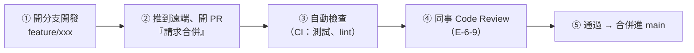

# [E-8-8] Pull Request 文化：Code Review 的流程

> **目標**：理解 Pull Request（PR）是什麼、它怎麼串起「分支開發 + Code Review + 合併」的協作流程。

## Pull Request：協作的核心流程

當團隊一起開發，怎麼把「某人寫的程式碼」安全地合併進主線？答案是 **Pull Request（PR，拉取請求；GitLab 叫 Merge Request）**——現代軟體協作的核心流程。

> **PR 是一個「請求」——「我在這個分支寫好了一個功能，請求把它合併進主分支（main）。請大家審查一下。」**

它把 E-8-2（分支）、E-6-9（Code Review）、E-8-3（合併）串成一個完整的協作流程。

## PR 的完整流程

逐步看：

1. **開分支開發**：從 main 開一個功能分支（E-8-2），在上面做你的功能。
2. **推到遠端、開 PR**：完成後推上去，在 GitHub/GitLab 開一個 PR——它會顯示「**你改了哪些檔案、和 main 的差異（diff）**」。
3. **自動檢查（CI）**：PR 通常會觸發 **CI（持續整合）**——自動跑測試、檢查格式（lint），確保沒弄壞東西（呼應 aws Part 9-1 CI/CD）。沒過就不能合併。
4. **Code Review**：同事在 PR 上**審查你的程式碼**（E-6-9）——留意見、提問、建議。你依回饋修改、再推上去（PR 會自動更新）。
5. **通過 → 合併**：CI 過了、review 通過（通常要至少一個人「approve」），就能**合併進 main**。

## 為什麼用 PR 而不是直接推 main

為什麼不直接 `git push` 到 main 就好，要這麼麻煩？因為 PR 提供了**保護與品質關卡**：

- **品質把關**：每段程式碼進 main 前，都經過「自動測試 + 人工 review」（E-6-9）——擋掉 bug 和爛程式碼（呼應 E-6-10 別讓破窗進來）。
- **知識共享**：透過 review，團隊了解彼此的程式碼，不會「只有一個人懂」。
- **記錄與討論**：PR 留下「這個功能為什麼這樣做、討論了什麼」的記錄——是很好的歷史文件。
- **保護 main**：通常會設「**保護 main 分支**」——不准直接推、一定要透過 PR + review。確保 main 永遠是「審查過、測試過」的乾淨狀態。

## 好的 PR 實踐

當好的 PR 提交者（呼應 E-6-9）：

- **PR 要小而聚焦**：一次只做一件事。塞 2000 行的巨型 PR，沒人審得動、review 品質差。
- **寫清楚 PR 說明**：這個 PR 做什麼、為什麼、怎麼測——讓 review 的人快速進入狀況。
- **自己先 review 一遍**：提交前自己看一次 diff，常能抓到低級錯誤。
- **回應 review 意見**：對每個意見回應（接受並改 / 解釋你的考量），別已讀不回。

## PR 與 Git Flow 的關係

PR 是「機制」，而「**什麼時候開分支、怎麼命名、怎麼合併**」是「策略」——這就是 **Git Flow / GitHub Flow**（E-8-7）。例如 GitHub Flow 很簡單：「從 main 開分支 → 開 PR → review → 合回 main」。PR 是執行這些流程的工具。

## 小結

- **Pull Request（PR）** = 「請求把我的分支合併進主線，請大家審查」——現代協作的核心流程。
- 流程：開分支 → 推上去開 PR → CI 自動檢查 → 同事 Code Review → 通過後合併。
- 價值：品質把關、知識共享、記錄討論、保護 main。
- 好實踐：PR 小而聚焦、寫清楚說明、自己先 review、回應意見。

> Code Review 怎麼做 → [課外讀物 E-6-9](../E-6-best-practices/E-6-9-code-review.md)；分支策略 → [E-8-7：Git Flow](./E-8-7-git-flow.md)；CI/CD → 參見 **aws 課程** Part 9-1
