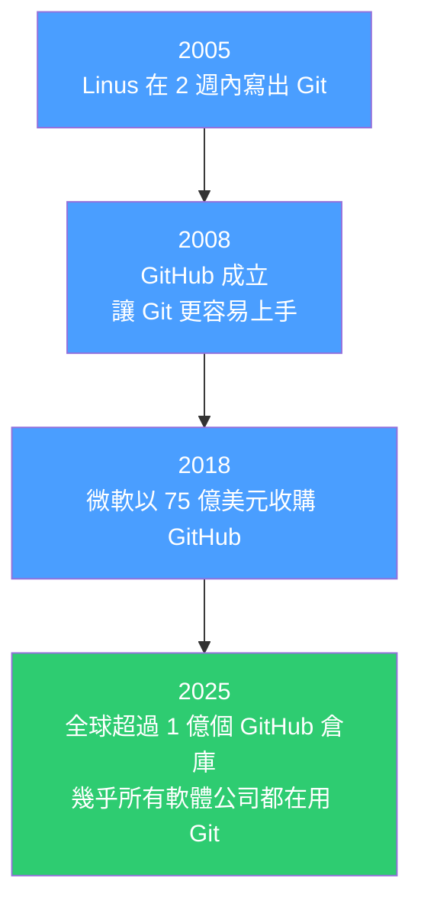

# [E-8-9] Linus Torvalds 在 2 週內寫出 Git 的故事

> **這篇在說什麼**：Git 不是慢慢演化出來的工具，而是一個人在憤怒和絕望中，用兩週時間砸出來的作品。

## 概念說明

### 背景：Linux 核心開發的混亂年代

在 2005 年之前，全世界最重要的開源軟體之一——Linux 作業系統的核心（kernel）——是用一個叫 **BitKeeper** 的版本控制系統來管理的。

Linux 核心是一個超級大型專案：幾千個貢獻者、每天幾百個改動、數百萬行程式碼。用 BitKeeper 的原因是它夠快、支援分散式開發——每個開發者可以在自己的電腦上有完整的版本歷史，不需要隨時連線到中央伺服器。

問題來了：**BitKeeper 是商業軟體，只是免費授權給 Linux 社群使用**。

### 危機：授權被撤了

2005 年，BitKeeper 的公司（BitMover）撤銷了給 Linux 社群的免費授權。原因是：有一個 Linux 開發者試圖透過逆向工程來了解 BitKeeper 的協定。BitMover 覺得這違反了授權條款，憤而停止合作。

Linus Torvalds——Linux 的創造者——突然面對一個大問題：**整個 Linux 核心開發的工作流程，全部建立在一個他現在不能用的工具上。**

他試著看看有沒有其他替代品：

```
CVS（Concurrent Versions System）？
    → 太慢，而且合併（merge）是噩夢
Subversion（SVN）？
    → 也太慢，而且是集中式的——每個操作都需要連線到中央伺服器
其他工具？
    → 都不夠好
```

Linus 的結論非常直接：**「沒有一個工具值得我用。」**

所以他做了一個工程師在走投無路時會做的事——**自己寫一個**。

## 深入一點

### Linus 的設計需求清單

Linus 在設計 Git 的時候，腦海中有幾個不可妥協的目標：

**分散式（Distributed）**
不能有單一中央伺服器。每個開發者的本機都有完整的版本歷史。就算網路斷了，你還是可以 commit、看 log、切 branch——一切照常。

**速度要快**
Linux 核心的 patch 作業量非常大，慢一點點就是浪費幾千個開發者的時間。Linus 對「慢」這件事的容忍度是零。

**資料完整性**
每個 commit、每個檔案都有一個 SHA-1 雜湊值。只要有人試圖竄改歷史，雜湊就對不上，立刻被發現。

**簡單的核心設計**
Git 的底層只有四種物件：blob、tree、commit、tag。從這四種基本元素，可以建立出所有複雜的版本控制功能。

### 兩週的衝刺

2005 年 4 月 3 日，Linus 開始寫 Git。

2005 年 4 月 7 日——**四天後**——他發出了 Git 的第一個公開公告，並且用 Git 管理 Git 自己的原始碼。

2005 年 4 月 29 日，Git 第一次被用來管理 Linux 核心的開發。

整個核心功能，大約花了兩週完成。

這個速度讓很多人難以置信。但 Linus 後來解釋：他不是在「發明」什麼新東西，他只是把腦海中清楚的設計，轉化成程式碼而已。他知道自己要什麼。

### "Git" 這個名字

Linus 把這個工具取名叫 **Git**。

在英式英語俚語裡，"git" 是一個罵人的詞，意思大概是「令人不悅的笨蛋」（unpleasant stupid person）。

Linus 說：「我用我自己的名字幫所有東西命名。Linux 是第一個，Git 是第二個。」

（他確實以自嘲出名，常把自己描述為傲慢又難搞的工程師。）

### 今天的 Git

Git 在 2005 年誕生，現在是全世界使用最廣泛的版本控制系統，沒有之一：



不只是軟體工程師，今天的設計師、資料科學家、學術研究者，都在用 Git 管理他們的工作。

Linus 本人已經把 Git 的維護交給了其他人（主要是 Junio C Hamano），專心回去做 Linux 核心了。但他留下來的，是一個改變整個軟體開發方式的工具。

## 延伸閱讀

> 好奇 Git 在電腦裡到底怎麼存東西？ → [課外讀物 E-8-1：Git 的內部運作：blob、tree、commit 是什麼](./E-8-1-git-internals.md)
