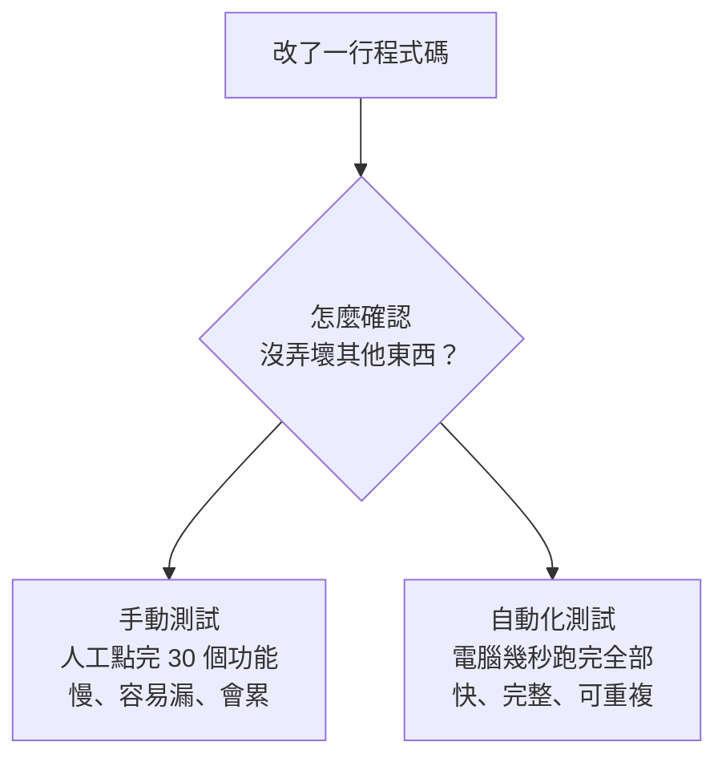
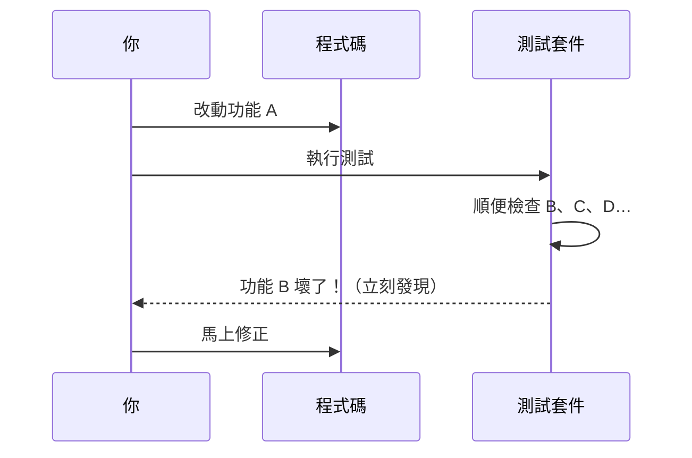

# [E-9-1] 為什麼要寫測試？沒有測試的程式碼像什麼

> **這篇在說什麼**：自動化測試不是「為了交差」的額外工作，它是一張安全網——讓你敢於修改自己的程式碼，而不必每次都祈禱不要弄壞什麼。

## 概念說明

想像一個走鋼索的特技演員。同樣的動作，有沒有下面那張安全網，他的表演方式會完全不同。

沒有安全網時，他每一步都小心翼翼，不敢嘗試任何高難度動作，因為一失誤就是墜落。有安全網時，他可以放膽嘗試、快速調整，就算失手了，網子會接住他——然後他爬起來再試一次。

**自動化測試就是程式碼的那張安全網。** 它不會讓你不犯錯，但它會在你犯錯的那一秒鐘立刻接住你，告訴你「這裡壞了」，而不是等到使用者在正式環境踩到地雷才發現。

另一個貼切的比喻是健康檢查。你不會等到身體垮了才看醫生——你會定期體檢，趁問題還小、還容易處理的時候就抓出來。測試就是程式碼的定期體檢：每次你改動程式碼，測試會跑一遍全身，告訴你哪裡出了狀況。

「測試」這個詞在這篇裡，指的是**自動化測試**（automated test）——你寫一段程式去驗證另一段程式的行為是否正確，然後讓電腦自動跑它，而不是靠人手動點來點去確認。

## 深入一點

### 手動測試不可規模化

很多人剛開始寫程式時，「測試」的方式是這樣的：寫完功能，打開瀏覽器或終端機，自己點一點、輸入幾個值，看看結果對不對。功能還小的時候，這樣完全沒問題。

問題出在**規模**。假設你的應用程式有 30 個功能，彼此之間還互相影響。今天你改了其中一個，要怎麼確認另外 29 個沒被你弄壞？

- 手動測試：你得把 30 個功能全部重新點一遍，每次改動都要。改十次，你就點了 300 次。
- 自動化測試：你寫好的測試跑一次只要幾秒鐘，改幾次就跑幾次，電腦不會累、不會漏、不會偷懶。



這張圖說明：功能一多，手動驗證的成本會爆炸性成長，而自動化測試的成本幾乎不變。

### 沒有測試時，每次改動都在賭

沒有測試的程式碼，最危險的不是「現在有沒有 bug」，而是「你不敢動它」。

來看一個具體情境。假設你有一個計算購物車總額的函式，需求是「滿 1000 元免運費」：

```typescript
function calculateShippingFee(cartTotal: number): number {
  const FREE_SHIPPING_THRESHOLD = 1000
  const STANDARD_SHIPPING_FEE = 60

  if (cartTotal >= FREE_SHIPPING_THRESHOLD) {
    return 0
  }
  return STANDARD_SHIPPING_FEE
}
```

某天產品經理說：「改成滿 800 免運，而且運費漲到 80。」你改了兩個數字。

問題來了——你怎麼確定改完之後，`cartTotal` 剛好等於 800 的邊界情況是對的？`cartTotal` 是 0（空購物車）時不會出怪事？如果沒有測試，你只能手動湊幾個數字試試看，然後**祈禱**沒漏掉什麼。這就是在賭。

如果你有測試，事情完全不一樣：

```typescript
import { describe, test, expect } from "vitest"

describe("calculateShippingFee", () => {
  test("剛好達到免運門檻時免運費", () => {
    expect(calculateShippingFee(800)).toBe(0)
  })

  test("低於門檻時收取標準運費", () => {
    expect(calculateShippingFee(799)).toBe(80)
  })

  test("空購物車收取標準運費", () => {
    expect(calculateShippingFee(0)).toBe(80)
  })
})
```

改完數字後，跑一次測試。如果全綠，你**知道**這些情況都正確，而不是「我覺得應該沒問題」。改動從一場賭博，變成一個有把握的動作。

### 測試最大的價值：防止回歸（Regression）

「回歸」（regression）指的是**一個本來會動的功能，因為後來的某次改動而壞掉了**。這是軟體開發裡最常見、也最讓人沮喪的問題——你修好了 A，卻不知不覺弄壞了 B。

測試之所以珍貴，是因為它把「正確的行為」用程式碼凍結了下來。只要那條測試還在，任何人（包括三個月後忘記細節的你自己）一旦不小心破壞了這個行為，測試立刻變紅。



這張圖說明：測試在你改 A 的同時，順手幫你守住了 B、C、D，讓回歸問題在進入正式環境前就被攔下來。

### 測試帶來的真正禮物：信心

把上面這些好處濃縮成一句話：**測試給你重構（refactor）和修改的信心。**

「重構」指的是不改變外部行為、只改善內部結構的整理工作。沒有測試時，重構是恐怖的——你不知道整理完還對不對。有測試時，你可以大膽地把一坨亂程式碼拆開、重組，然後跑測試確認行為沒變。

> **常見錯誤** — 很多人會說：「這個功能很簡單，不用寫測試。」
> 問題是：簡單的功能也會被改動，而且常常是別人在不了解全貌的情況下改動。今天簡單的函式，三個月後可能被加進五種特殊情況。沒有測試，那五種情況裡哪個壞了你完全不知道。
> 正確做法：對「會被重複使用、會被修改、出錯成本高」的程式碼寫測試。不是每一行都要測，但核心邏輯值得。

測試不是拖慢你的負擔，它是讓你**長期跑得更快**的關鍵——因為你不必每次改動都從頭驗證一遍，也不必活在「不知道哪裡會爆」的恐懼裡。

## 延伸閱讀

> 知道為什麼要測之後，來看看測試有哪幾種 → [E-9-2 測試的種類：單元測試 / 整合測試 / E2E 測試](./E-9-2-test-types.md)

> 想直接動手寫第一個測試 → [E-9-3 單元測試入門：用 Vitest 測試 TypeScript 函式](./E-9-3-unit-testing.md)
