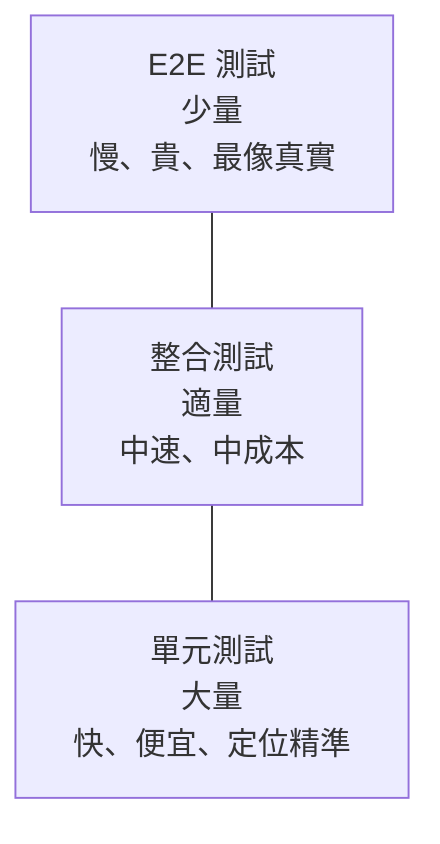

# [E-9-2] 測試的種類：單元測試 / 整合測試 / E2E 測試

> **這篇在說什麼**：測試不是只有一種。依照「測試的範圍大小」可以分成三個層級，各有各的用途、速度和成本——學會在對的地方用對的測試，比什麼都猛寫一通更重要。

## 概念說明

想像你在驗收一棟新蓋好的房子。你會怎麼檢查它蓋得好不好？

- **檢查單一零件**：這顆螺絲鎖緊了嗎？這塊磚的強度夠嗎？這條電線接對了嗎？範圍最小，但你可以一個一個快速確認，而且一旦出問題，馬上知道是哪個零件。
- **檢查一個房間**：水電接起來後，這間浴室的水龍頭打開有沒有熱水？馬桶沖水會不會漏？這是在驗收「好幾個零件組合在一起」能不能正常合作。
- **整棟走一遍**：你扮演住戶，從大門進來、開燈、用廚房、上廁所、開冷氣——完整體驗一遍，確認整棟房子「住起來」沒問題。最貼近真實，但也最花時間，而且如果出問題，你得回頭找是哪個環節壞的。

軟體測試的三個層級，對應的就是這三種驗收：

| 房子驗收 | 軟體測試 | 測什麼 |
|---------|---------|--------|
| 檢查單一零件 | 單元測試（Unit Test） | 單一函式 / 模組 |
| 檢查一個房間 | 整合測試（Integration Test） | 多個模組合作 |
| 整棟走一遍 | E2E 測試（End-to-End Test） | 完整使用者流程 |

「E2E」是 End-to-End 的縮寫，意思是「從頭到尾」——模擬一個真實使用者從打開應用程式到完成任務的整段流程。

## 深入一點

### 三個層級各自測什麼

**單元測試（Unit Test）** 測的是最小的可獨立驗證單位——通常就是一個函式。它不碰資料庫、不發送網路請求，只關心「給這個輸入，這個函式會不會給出正確的輸出」。

```typescript
import { describe, test, expect } from "vitest"

function calculateDiscount(price: number, discountRate: number): number {
  return Math.round(price * (1 - discountRate))
}

describe("calculateDiscount", () => {
  test("套用 20% 折扣", () => {
    // 純計算，不依賴任何外部資源，跑起來毫秒等級
    expect(calculateDiscount(1000, 0.2)).toBe(800)
  })
})
```

**整合測試（Integration Test）** 測的是「好幾個模組組合在一起能不能正常合作」。例如：API 路由收到請求後，有沒有正確呼叫資料庫、把資料存進去、回傳正確的回應。它會真的去碰資料庫（或測試用的資料庫），所以比單元測試慢。

```typescript
import { describe, test, expect } from "vitest"

describe("POST /api/todos", () => {
  test("建立待辦事項後能在資料庫查到", async () => {
    // 這裡測的是「API 路由 + 資料庫」兩個模組的合作
    const response = await request(app)
      .post("/api/todos")
      .send({ title: "寫測試" })

    expect(response.status).toBe(201)

    const saved = await db.findTodoById(response.body.id)
    expect(saved.title).toBe("寫測試")
  })
})
```

**E2E 測試** 測的是完整的使用者流程，連瀏覽器畫面都模擬。例如：開啟網站、輸入帳密登入、新增一筆待辦、勾選完成、確認畫面上真的打勾了。它跑的是整個系統，最接近真實使用者的體驗，但也最慢、最容易因為小事（畫面換個按鈕位置）而壞掉。

### 測試金字塔：為什麼底部要又寬又厚

這三種測試該各寫多少？經驗法則叫做「測試金字塔」（Test Pyramid）：**底部的單元測試最多，中間的整合測試適量，頂端的 E2E 測試最少。**



這張圖由上而下越來越寬，表達的就是「越底層的測試，數量應該越多」。

為什麼是這個形狀，而不是反過來？關鍵在三個維度的取捨：

| 維度 | 單元測試 | 整合測試 | E2E 測試 |
|------|---------|---------|---------|
| 速度 | 毫秒級（最快） | 秒級 | 數秒到數十秒（最慢） |
| 成本 | 低，好寫好維護 | 中 | 高，難寫易壞 |
| 定位問題 | 精準（直接指到那個函式） | 中等 | 模糊（只知道流程壞了，不知壞在哪） |
| 真實度 | 低（只測一小塊） | 中 | 高（最像真實使用者） |

單元測試又快又便宜又能精準定位問題，所以你可以放心地寫一大堆，覆蓋各種邊界情況。E2E 測試雖然最像真實，但又慢又貴又難維護，所以只用來覆蓋「最關鍵的幾條主流程」（例如：能不能登入、能不能下單）。

### 倒金字塔：常見的反模式

> **常見錯誤** — 有些團隊幾乎只寫 E2E 測試，覺得「反正它最像真實使用者，一個 E2E 抵很多單元測試」。這會養出一個「倒金字塔」：頂端又寬又重，底部細細的。
> 問題是：E2E 測試又慢又脆弱。整套跑下來可能要二十分鐘，而且任何一個小改動都可能讓一堆 E2E 同時變紅，你還得花時間查到底是真的壞了還是只是畫面動了一下。久而久之，大家開始忽略紅燈，測試就失去意義了。
> 正確做法：守住金字塔形狀。能用單元測試覆蓋的邏輯（尤其是純函式、計算、驗證），就用單元測試覆蓋；E2E 只留給少數最關鍵的使用者流程。

### 怎麼選？一個簡單的判斷

當你不確定某段邏輯該用哪種測試時，問自己：「**這段程式碼的正確性，取決於它自己，還是取決於它跟誰合作？**」

- 取決於它自己（純計算、純邏輯）→ 單元測試
- 取決於它跟別人合作（資料庫、API、外部服務）→ 整合測試
- 取決於整條使用者流程串起來能不能動 → E2E 測試

大部分的邏輯其實都能拆成「自己負責的計算」和「跟別人合作的編排」兩部分。把計算的部分抽成純函式，你就能用最便宜的單元測試覆蓋掉大半的風險——這也是為什麼下一篇我們先從單元測試開始學。

## 延伸閱讀

> 回頭看看為什麼測試這麼重要 → [E-9-1 為什麼要寫測試？沒有測試的程式碼像什麼](./E-9-1-why-test.md)

> 從金字塔最底層、最該先學的單元測試開始動手 → [E-9-3 單元測試入門：用 Vitest 測試 TypeScript 函式](./E-9-3-unit-testing.md)
