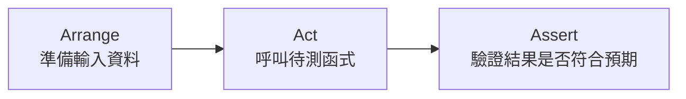

# [E-9-3] 單元測試入門：用 Vitest 測試 TypeScript 函式

> **這篇在說什麼**：實際動手寫第一個單元測試。學會 Vitest 的基本結構、AAA 原則，以及為什麼「純函式」是世界上最好測的東西。

## 概念說明

寫測試其實沒有想像中神秘。一個測試本質上就是在做一件你每天都在做的事——「我預期會發生 X，那我來確認一下到底是不是 X」。

把它想成餐廳廚房的試菜。主廚做好一道菜（這是你的函式），試菜員嘗一口（呼叫函式拿到結果），然後對照標準：「這道糖醋排骨，酸甜比例對嗎？」（驗證結果符不符合預期）。如果不對，這道菜不准上桌。

測試就是你幫每個函式安排的試菜員。它做的事永遠是三步：**準備好要測的東西 → 實際嘗一口 → 對照預期答案。** 這三步有個正式名字，叫做 AAA 原則，我們等等會詳細講。

這篇我們用 **Vitest** 這個測試框架。「測試框架」就是一套幫你寫測試、跑測試、漂亮地顯示結果的工具。Vitest 速度快、設定簡單，而且語法跟另一個老牌框架 Jest 幾乎一樣，學會它等於兩個都會了。

## 深入一點

### 一個測試的基本結構：describe / test / expect

Vitest 提供三個最核心的工具，你的測試幾乎都由它們組成：

- `describe`：把相關的測試**分組**，括號裡寫這組在測什麼。
- `test`：定義**一個**測試案例，括號裡用一句話描述「應該要怎樣」。
- `expect`：寫下你的**預期**，搭配 `.toBe()`、`.toContain()` 之類的「斷言」（assertion，意思是「我斷定結果應該是這樣」）。

來看一個最小的完整例子。假設我們有一個算待辦完成率的純函式：

```typescript
import { describe, test, expect } from "vitest"

// 待測的函式：算出待辦清單的完成百分比（0~100 的整數）
function calculateCompletionRate(total: number, completed: number): number {
  if (total === 0) {
    return 0
  }
  return Math.round((completed / total) * 100)
}

describe("calculateCompletionRate", () => {
  test("完成一半時回傳 50", () => {
    expect(calculateCompletionRate(10, 5)).toBe(50)
  })
})
```

`describe("calculateCompletionRate", ...)` 說「以下這組在測 `calculateCompletionRate`」；`test("完成一半時回傳 50", ...)` 描述這個案例的期望；`expect(...).toBe(50)` 則是斷言：我斷定呼叫結果應該等於 50。跑起來如果相符，這個測試就是綠的。

### AAA 原則：Arrange — Act — Assert

每個測試內部，最好都照著三個步驟寫，這就是 **AAA 原則**：

- **Arrange（準備）**：準備好測試需要的輸入資料、初始狀態。
- **Act（執行）**：實際呼叫你要測的那個函式。
- **Assert（斷言）**：檢查結果是不是符合預期。



這張圖說明：一個結構清楚的測試，永遠是「準備 → 執行 → 驗證」這條直線，不會跳來跳去。

把上面的例子用 AAA 寫清楚一點：

```typescript
test("完成一半時回傳 50", () => {
  // Arrange：準備輸入
  const total = 10
  const completed = 5

  // Act：執行待測函式
  const rate = calculateCompletionRate(total, completed)

  // Assert：驗證結果
  expect(rate).toBe(50)
})
```

簡單的測試三步寫在一起也沒問題，但當測試變複雜時，刻意用這三段把它分清楚，會讓任何人一眼看懂這個測試在幹嘛。

### 別只測「正常情況」——邊界與例外才是 bug 的溫床

只測「10 個完成 5 個 → 50」這種漂亮的情況是不夠的。真正會出 bug 的，往往是邊界條件和例外狀況。一個好的測試組會把這些都涵蓋進去：

```typescript
describe("calculateCompletionRate", () => {
  test("完成一半時回傳 50", () => {
    expect(calculateCompletionRate(10, 5)).toBe(50)
  })

  test("全部完成時回傳 100", () => {
    expect(calculateCompletionRate(4, 4)).toBe(100)
  })

  test("一個都沒完成時回傳 0", () => {
    expect(calculateCompletionRate(4, 0)).toBe(0)
  })

  // 邊界情況：空清單。如果沒處理好，這裡會變成 0 除以 0 = NaN
  test("清單為空時回傳 0 而不是 NaN", () => {
    expect(calculateCompletionRate(0, 0)).toBe(0)
  })

  // 四捨五入：1/3 ≈ 33.33，應該被 round 成 33
  test("除不盡時四捨五入", () => {
    expect(calculateCompletionRate(3, 1)).toBe(33)
  })
})
```

注意那個「清單為空」的測試——這正是 [E-9-1] 提到的安全網。如果哪天有人重構這個函式時拿掉了 `if (total === 0)` 的防護，這條測試會立刻變紅，攔住一個會在正式環境出現 `NaN%` 的 bug。

### 為什麼純函式最好測？

回顧一下 Part 2 學過的「純函式」（pure function）：相同輸入永遠給相同輸出，而且沒有副作用（不碰資料庫、不發請求、不依賴現在幾點）。

純函式之所以是測試的天堂，原因很單純：**它的正確性完全由輸入決定，你不需要準備任何外部環境。** 給輸入、拿輸出、比對，結束。

對照一個「不純」的函式，麻煩就來了：

> **常見錯誤** — 把計算邏輯和外部依賴混在一起：
> ```typescript
> // 同時做了「讀資料庫」和「算完成率」兩件事
> async function getCompletionRate(userId: number): Promise<number> {
>   const todos = await db.findTodosByUser(userId)  // 副作用：碰資料庫
>   const completed = todos.filter((t) => t.done).length
>   return Math.round((completed / todos.length) * 100)
> }
> ```
> 問題是：想測「完成率算得對不對」，你被迫得先準備一個資料庫、塞假資料進去、再清掉——只為了測那一行除法。又慢又麻煩。
> 正確做法：把純計算抽出來，讓它跟資料庫無關。
> ```typescript
> // 純函式，超好測
> function calculateCompletionRate(total: number, completed: number): number {
>   if (total === 0) return 0
>   return Math.round((completed / total) * 100)
> }
>
> // 負責「拿資料」的部分單獨一個函式，職責清楚
> async function getUserTodos(userId: number): Promise<Todo[]> {
>   return db.findTodosByUser(userId)
> }
> ```

這個「把計算和副作用拆開」的動作，正是單一職責原則（Single Responsibility Principle）的體現——拆開之後，每一塊都各自好測。

### 再一個例子：驗證 email 格式

驗證類的函式也是純函式，同樣好測。這種函式在 Part 2-9 的 CLI 小專案、以及 Part 4 後端接收使用者輸入時都會用到：

```typescript
import { describe, test, expect } from "vitest"

function isValidEmail(email: string): boolean {
  // 簡化版規則：要有 @，@ 前後都不能是空的
  const [localPart, domain] = email.split("@")
  if (email.split("@").length !== 2) return false
  return localPart.length > 0 && domain.length > 0
}

describe("isValidEmail", () => {
  test("正常的 email 通過驗證", () => {
    expect(isValidEmail("alice@example.com")).toBe(true)
  })

  test("沒有 @ 不通過", () => {
    expect(isValidEmail("aliceexample.com")).toBe(false)
  })

  test("@ 前面是空的不通過", () => {
    expect(isValidEmail("@example.com")).toBe(false)
  })

  test("有兩個 @ 不通過", () => {
    expect(isValidEmail("a@b@c.com")).toBe(false)
  })
})
```

寫測試時有個好習慣：先想「這個函式會遇到哪些情況」，每種情況寫一條測試。正常的、空的、格式錯的、邊界的——把這些列出來，你的測試就涵蓋得相當完整了。

### 一個好測試的特徵

最後總結，一個值得留下來的單元測試通常具備這些特質：

- **快**：純函式測試應該是毫秒級，你才會願意常常跑它。
- **獨立**：不依賴其他測試的執行順序，單獨跑也能過。
- **名字會說話**：`test("清單為空時回傳 0")` 一看就知道在測什麼，壞掉時你馬上懂。
- **一個測試一個重點**：別在一個 `test` 裡塞五件不相關的斷言，壞了你會分不清是哪件事壞的。
- **可重複**：跑一百次結果都一樣，不會今天綠明天紅（這種飄忽不定的測試叫 flaky test，是測試裡最討厭的東西）。

從純函式開始練習，你會發現寫測試其實滿有成就感的——每多一條綠燈，就多一塊「我確定這裡是對的」的踏實感。

## 延伸閱讀

> 想知道單元測試之外還有哪些測試層級 → [E-9-2 測試的種類：單元測試 / 整合測試 / E2E 測試](./E-9-2-test-types.md)

> 純函式好測的根本原因，是它職責單一 → [E-7-2 S — Single Responsibility Principle](../E-7-solid/E-7-2-srp.md)
