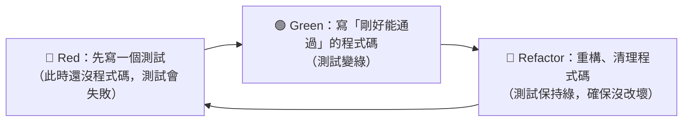

# [E-9-5] TDD：先寫測試，再寫程式碼

> **目標**：理解測試驅動開發（TDD）這個「先寫測試、再寫程式」的反直覺方法，以及它的紅綠重構循環與價值。

## 一個反直覺的順序

一般人的順序是「**先寫程式碼，（有空再）寫測試**」。**TDD（Test-Driven Development，測試驅動開發）** 把順序反過來：

> **先寫「測試」（描述你要的行為），再寫「程式碼」讓測試通過。**

聽起來很怪——「東西都還沒寫，怎麼先寫測試？」但這正是 TDD 的精髓：**測試先定義「我要什麼」，程式碼再去「滿足它」。**

## 紅 → 綠 → 重構（Red-Green-Refactor）

TDD 是一個小步快跑的循環：



1. **🔴 Red（紅）**：先寫一個測試，描述「我要的下一個小功能」。因為功能還沒寫，測試會**失敗（紅燈）**——這是對的。
2. **🟢 Green（綠）**：寫「**剛好足以讓測試通過**」的最少程式碼。測試變**通過（綠燈）**。先求能動，別求完美。
3. **🔵 Refactor（重構）**：現在有測試保護了，放心**重構、清理**程式碼（改善命名、結構）。重構時測試一直保持綠燈——確保你「改善了結構，但沒改壞行為」。

然後回到第 1 步，寫下一個測試……小步循環前進。

## 一個小例子

假設要寫一個 `add(a, b)` 函式，用 TDD：

```javascript
// 🔴 Red：先寫測試（add 還不存在，會失敗）
test("add(2, 3) = 5", () => {
  expect(add(2, 3)).toBe(5);
});

// 🟢 Green：寫最少的程式碼讓它過
function add(a, b) { return a + b; }
// → 測試通過！

// 🔵 Refactor：這麼簡單沒啥好重構，繼續下一個測試
// 🔴 Red：再寫 test("add(-1, 1) = 0") ……
```

每次都「先寫測試 → 寫程式通過 → 重構」，一小步一小步堆出完整功能。

## TDD 的好處

**① 測試覆蓋率天生就高**：因為「先寫測試」，每段程式碼天生都有對應的測試——不會有「忘了寫測試」的情況。

**② 逼你想清楚「要什麼」**：寫測試前，你得先想「這個函式『該怎麼用、該回傳什麼』」——這逼你從「使用者/呼叫者」的角度設計，常常設計出更好用的介面。

**③ 重構有安全網**：有測試保護，你敢大膽重構（呼應 E-9-1）——改壞了測試立刻紅燈告訴你。

**④ 小步前進、即時回饋**：每一步都有「綠燈」確認，不會「寫一大堆才發現全錯」。

## TDD 的爭議與務實看法

TDD 不是萬靈丹，工程界也有辯論：

- **學習曲線**：剛開始很不習慣（「怎麼先寫測試」），需要練習。
- **不是所有東西都適合**：探索性的、UI 的、需求還很模糊的東西，硬 TDD 可能綁手綁腳。
- **過度可能僵化**：為了「先寫測試」而過度設計，也是一種 over-engineering。

務實的看法：

> **TDD 是個很有價值的「思維工具」，尤其適合「邏輯清楚、行為明確」的東西（如業務規則、演算法）。** 不一定要 100% 嚴格 TDD，但「**先想清楚要什麼（測試的角度）再寫**」這個習慣，對任何開發都有幫助。很多人「部分採用」——關鍵邏輯用 TDD，其他靈活處理。

## 小結

- **TDD**：先寫測試（描述要的行為），再寫程式碼讓它通過——反直覺但強大。
- 循環：**🔴 Red**（寫測試、失敗）→ **🟢 Green**（寫最少程式碼通過）→ **🔵 Refactor**（重構、測試保持綠）。
- 好處：測試覆蓋率高、逼你想清楚需求、重構有安全網、小步即時回饋。
- 務實：很有價值（尤其邏輯明確的東西），但不必 100% 嚴格——「先想清楚再寫」的精神最重要。

> 為什麼測試 → [E-9-1](./E-9-1-why-test.md)；好測試的結構 → [E-9-4 AAA](./E-9-4-aaa-principle.md)
