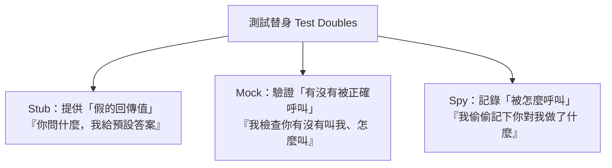

# [E-9-6] 測試替身：Mock、Stub、Spy 的差別

> **目標**：理解「測試替身」是什麼——用「假的」物件替換真實依賴來測試，以及 Mock、Stub、Spy 的差別。

## 問題：測試不該依賴「真實的外部東西」

你要測一個函式，但它依賴「外部的東西」——資料庫、第三方 API、寄信服務…。直接用真的會有問題：

- **慢**：連真資料庫、真 API 很慢（違反測試要 Fast，E-9-4）。
- **不可靠**：API 可能掛、網路可能斷——測試會「無辜失敗」（違反 Repeatable）。
- **有副作用**：測試真的寄了信、真的扣了款——糟糕！
- **難製造情境**：想測「API 回傳錯誤時怎麼辦」——你很難讓「真的 API」剛好回錯誤。

解法：用「**假的替身**」替換這些真實依賴——這就是**測試替身（Test Doubles）**。

## 測試替身：用「替身演員」代替

「測試替身」這個詞很傳神——就像電影裡的**替身演員**，在危險或特定場景代替真正的演員。測試裡，我們用「假的物件」代替「真實的依賴」，讓測試能快速、可靠、可控地進行。

幾種常見的替身（名字常被混用，但有區別）：



## Stub：提供假的回傳值

**Stub（樁）** 最單純——它「**回傳你預先設定好的假值**」，讓被測程式能繼續跑：

```javascript
// 真的 getUser 會連資料庫；用 stub 回傳假資料
const userServiceStub = {
  getUser: () => ({ id: 1, name: "測試用戶" })   // 永遠回這個假的
};

// 測試「處理使用者」的邏輯，不用連真資料庫
const result = processUser(userServiceStub);
```

用途：**讓被測程式拿到「可控的輸入」**。想測「使用者是 VIP 時的邏輯」→ 讓 stub 回傳「VIP 使用者」。想測「API 出錯」→ 讓 stub 回傳錯誤。你能輕鬆製造各種情境。

## Mock：驗證「有沒有被正確呼叫」

**Mock（模擬物件）** 比 stub 多一個重點——它**檢查「被測程式有沒有『正確地呼叫它』」**：

```javascript
// 測試「下單後有沒有寄確認信」
const emailMock = createMock();

placeOrder(order, emailMock);

// 驗證：emailMock 的「寄信」方法有沒有被呼叫、用對的參數
expect(emailMock.sendEmail).toHaveBeenCalledWith("user@example.com");
```

用途：**驗證「互動」**——「我這個函式，有沒有正確地『叫了寄信服務』？」你不關心「真的寄信」（用假的），而是關心「**有沒有在該寄的時候，正確地叫它**」。

## Spy：記錄被怎麼呼叫

**Spy（間諜）** 介於兩者——它「**包住真實或假的物件，偷偷記錄『它被怎麼呼叫』**」，事後你能檢查。它常可以「部分用真的、部分監看」。

實務上 Mock 和 Spy 的界線很模糊，很多測試框架（如 Jest、Vitest）的 `vi.fn()` / `jest.fn()` 同時能做 stub（設回傳值）和 spy/mock（記錄與驗證呼叫）的事。

## 三者對照

| 替身 | 重點 | 一句話 |
|------|------|--------|
| **Stub** | 提供假回傳值 | 「你問，我給預設答案」（控制輸入）|
| **Mock** | 驗證有沒有被正確呼叫 | 「我檢查你有沒有正確叫我」（驗證互動）|
| **Spy** | 記錄被怎麼呼叫 | 「我偷偷記下你對我做了什麼」 |

簡單記：**Stub 控制「輸入」，Mock/Spy 驗證「互動」。**

## 為什麼這對「單元測試」很重要

測試替身是寫「**單元測試**」（E-9-2）的關鍵——單元測試要「**只測這一個單元，隔離外部依賴**」。用替身把「資料庫、API、其他服務」換成假的，你就能：

- **快、可靠**：不連真的外部（Fast、Repeatable，E-9-4）。
- **可控**：輕鬆製造各種情境（包括錯誤）。
- **無副作用**：不會真的寄信、扣款。
- **真正隔離**：只測「你的邏輯」，外部壞了不影響。

這也呼應 SOLID 的依賴反轉（E-7-6）——**因為你的程式「依賴抽象（介面）而非具體」，所以測試時能輕鬆「注入假的替身」**。好設計讓測試變簡單。

## 小結

- **測試替身（Test Doubles）**：用「假的物件」替換真實依賴（資料庫、API…），讓測試快、可靠、可控、無副作用。
- **Stub**：提供假回傳值（控制輸入、製造情境）。
- **Mock**：驗證「有沒有被正確呼叫」（驗證互動）。
- **Spy**：記錄被怎麼呼叫。
- 簡記：Stub 控制輸入、Mock/Spy 驗證互動。
- 是單元測試的關鍵；好設計（依賴抽象，E-7-6）讓注入替身變簡單。

> 測試種類 → [E-9-2](./E-9-2-test-types.md)；依賴反轉讓測試容易 → [E-7-6](../E-7-solid/E-7-6-dip.md)、[E-12-3 Repository](../E-12-design-patterns/E-12-3-repository.md)
