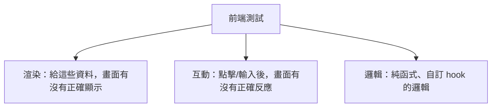

# [E-9-7] 前端測試：測試 React 元件的思維

> **目標**：理解前端（尤其 React 元件）怎麼測試，以及「測使用者看到/做的，而非實作細節」的核心思維。

## 前端也要測試

測試不只後端要做——前端的元件、互動邏輯，同樣需要測試（呼應 E-9-1）。亂改一個元件、不小心弄壞另一個功能，前端也常發生。

但前端測試有它的特性——它測的是「**使用者介面與互動**」，思維和後端略有不同。

## 核心思維：像「使用者」一樣測

前端測試最重要的原則：

> **測「使用者看到什麼、做什麼」，而不是「元件內部怎麼實作」。**

這呼應 E-9-4 的「測行為不測實作」，在前端特別重要。意思是：

```
❌ 測實作細節：「這個元件的 state.count 是不是 1」
   → 你重構（改 state 結構但畫面行為不變）→ 測試亂壞

✅ 測使用者體驗：「畫面上是不是顯示『數量：1』」「點按鈕後，數字有沒有變 2」
   → 只要使用者體驗對，內部怎麼改都行 → 測試穩定
```

著名的前端測試工具 **React Testing Library** 就是貫徹這個哲學——它鼓勵你「**像使用者一樣**找元素（用看到的文字、按鈕標籤）、像使用者一樣互動（點擊、輸入）」，而不是去戳元件內部。

## 前端測試大概在測什麼



**① 渲染測試**：「給這個元件這些 props/資料，它有沒有正確顯示？」例如「傳入使用者名 Alice，畫面有沒有出現『Alice』」。

**② 互動測試**：「使用者做了某個操作，畫面有沒有正確反應？」例如「點『+』按鈕，計數有沒有從 0 變 1」「填表單按送出，有沒有顯示成功訊息」。

**③ 純邏輯測試**：把元件裡「純邏輯」的部分（自訂 hook、工具函式）抽出來單獨測（這就回到一般的單元測試，E-9-3）。這也是為什麼前端 Clean Code（E-6-7）鼓勵「分離邏輯與呈現」——分離後邏輯更好測。

## 一個範例的思路

測一個「計數器」元件（概念示意，用 React Testing Library 風格）：

```javascript
test("點擊增加按鈕，計數從 0 變 1", () => {
  // Arrange：渲染元件
  render(<Counter />);

  // Assert：初始顯示 0（像使用者一樣，找畫面上的文字）
  expect(screen.getByText("數量：0")).toBeInTheDocument();

  // Act：像使用者一樣點按鈕
  fireEvent.click(screen.getByText("增加"));

  // Assert：畫面變成 1
  expect(screen.getByText("數量：1")).toBeInTheDocument();
});
```

注意——整個測試都在「**找畫面上看得到的東西、做使用者會做的動作、檢查使用者會看到的結果**」。完全沒碰元件內部的 state、變數。這樣即使你重構元件內部，只要「使用者體驗不變」，測試就不會壞。

## 前端測試的層次

前端測試也有不同層次（呼應 E-9-2）：

| 層次 | 測什麼 | 工具例 |
|------|--------|--------|
| **單元/元件測試** | 單一元件、純函式 | Vitest/Jest + React Testing Library |
| **整合測試** | 多個元件一起、含路由/狀態 | 同上 |
| **E2E（端對端）** | 真實瀏覽器跑整個流程 | Playwright、Cypress |

**E2E 測試**特別值得一提——它用「真的瀏覽器」模擬使用者「從頭走完一個完整流程」（登入 → 瀏覽 → 下單），最接近真實。但它慢、較脆弱，所以通常「少量、測關鍵流程」就好（呼應「測試金字塔」——大量單元測試 + 少量 E2E）。

## 小結

- 前端（元件）同樣要測試。
- 核心思維：**測「使用者看到/做的」，不測「實作細節」**——這樣重構不會亂壞測試。
- 測什麼：渲染（給資料畫面對不對）、互動（操作後反應對不對）、純邏輯（抽出來測）。
- 工具：React Testing Library（像使用者一樣測）、E2E 用 Playwright/Cypress。
- 層次：大量單元/元件測試 + 少量關鍵 E2E（測試金字塔）。

> 測行為不測實作 → [E-9-4 AAA](./E-9-4-aaa-principle.md)；前端 Clean Code（分離邏輯）→ [E-6-7](../E-6-best-practices/E-6-7-frontend-clean-code.md)；React → 參見 **basic 課程** Part 6
