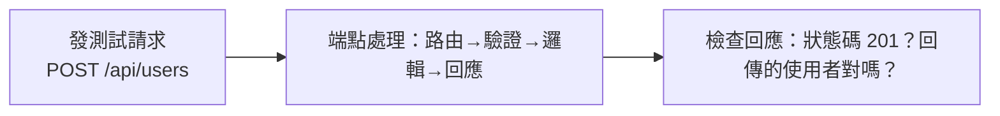

# [E-9-8] 後端 API 測試：測試整個端點

> **目標**：理解怎麼測試後端 API——不只測單一函式，而是測「整個端點」收到請求、回傳正確回應，這是整合測試的典型。

## 從單元測試到 API 測試

你學過單元測試（E-9-3，測單一函式）。但後端最重要的對外介面是 **API 端點**（basic Part 4）——「使用者打這個網址，得到對的回應嗎？」。測試 API 端點，是後端測試的核心，屬於**整合測試**（E-9-2）。

> **API 測試：模擬「發一個 HTTP 請求給你的端點」，檢查「回傳的狀態碼、內容是不是對的」。**

## 為什麼要測整個端點（而非只測函式）

單元測試只測「一個函式」，但一個 API 端點牽涉很多東西串在一起：路由、中介層、驗證、業務邏輯、（有時）資料庫。**測整個端點**能驗證「這些東西『串起來』有沒有正確運作」——這正是「整合測試」的價值（E-9-2）。



## 怎麼測：發請求、檢查回應

API 測試的工具能「**在測試裡發 HTTP 請求給你的 app**」（不用真的啟動伺服器、不用真的開瀏覽器）。例如 Node 生態的 **Supertest**（配 Express）：

```javascript
test("POST /api/users 建立使用者，回傳 201", async () => {
  // Act：發一個 POST 請求給端點
  const response = await request(app)
    .post("/api/users")
    .send({ name: "Alice", email: "alice@example.com" });

  // Assert：檢查回應（呼應 basic Part 4-B 狀態碼）
  expect(response.status).toBe(201);              // 建立成功
  expect(response.body.name).toBe("Alice");       // 回傳的內容對
});
```

這就是 AAA（E-9-4）——準備請求、發送（Act）、檢查回應（Assert）。它測的是「**整個端點的行為**」，從收到請求到回傳。

## API 測試該測哪些情況

別只測「正常情況」——好的 API 測試要涵蓋（呼應 E-9-4 測邊界）：

| 情況 | 例子 |
|------|------|
| **正常（happy path）** | 合法請求 → 200/201 + 正確內容 |
| **驗證失敗** | 缺欄位、格式錯 → 400 Bad Request |
| **找不到** | 查不存在的 id → 404 |
| **未授權** | 沒登入/沒權限 → 401/403（呼應 basic Part 4-D 認證）|
| **邊界** | 空字串、超長、特殊字元 |

這些對應 HTTP 狀態碼（basic Part 4-B、課外讀物 E-3-3）——好的 API 測試確認「**各種情況都回傳『對的狀態碼和內容』**」。

## 資料庫怎麼處理

API 測試常會碰到資料庫。兩種做法：

- **用測試資料庫**：連一個「專門給測試用的資料庫」，每次測試前清空/重置——測到「真的存取資料庫」的完整流程（更真實，但較慢）。
- **用測試替身**：把資料庫層換成假的（E-9-6 的 stub/mock）——更快、更隔離，但沒測到真的 DB 互動。

取捨：整合測試傾向「用測試資料庫」（要測真的串起來）；想快、想隔離就用替身。很多專案兩者都有。

## API 測試 vs E2E 測試

- **API 測試**：測「後端端點」的行為（發 HTTP 請求、檢查回應）——不含前端、不開瀏覽器。較快。
- **E2E 測試**（E-9-7）：用真瀏覽器，測「前端 + 後端」整個流程——最真實，但最慢。

API 測試是個「**性價比很高**」的層次——它涵蓋了後端的完整行為，又比 E2E 快很多。所以後端通常有「大量單元測試 + 適量 API 整合測試 + 少量 E2E」（測試金字塔）。

## 小結

- **API 測試**：模擬發 HTTP 請求給端點，檢查回傳的狀態碼、內容——屬於整合測試。
- 它測「整個端點串起來」（路由、驗證、邏輯…），比單元測試更全面。
- 用 Supertest 等工具，遵循 AAA：發請求 → 檢查回應。
- 要測各種情況：正常、驗證失敗（400）、找不到（404）、未授權（401/403）、邊界。
- 資料庫：用測試資料庫（真實）或測試替身（快）。
- 性價比高的層次——比 E2E 快、比單元測試全面。

> 測試結構 AAA → [E-9-4](./E-9-4-aaa-principle.md)；測試替身 → [E-9-6](./E-9-6-test-doubles.md)；HTTP 狀態碼 → 參見 **basic 課程** Part 4-B、[課外讀物 E-3-3](../E-3-network/E-3-3-http-protocol.md)
