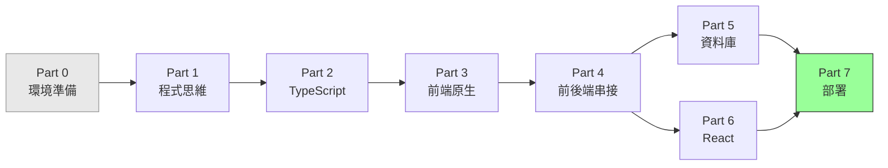
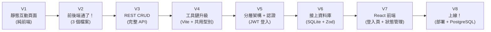
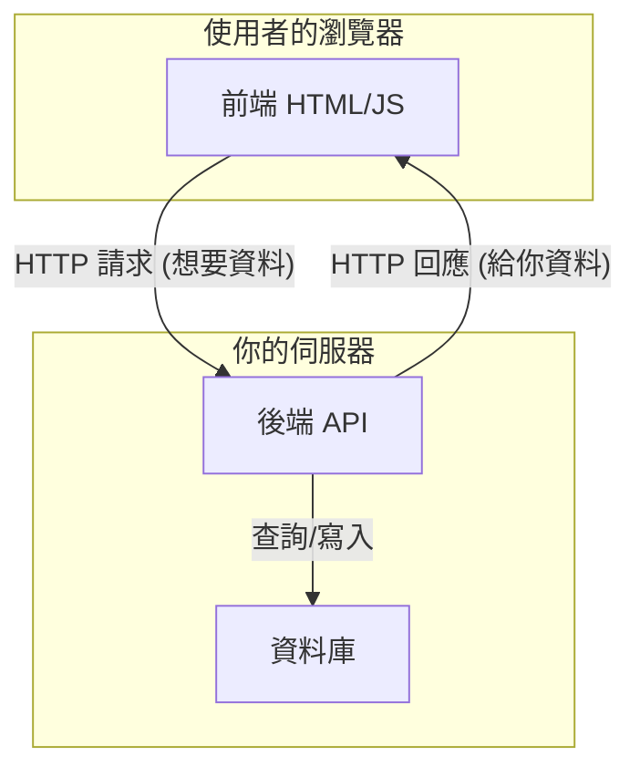
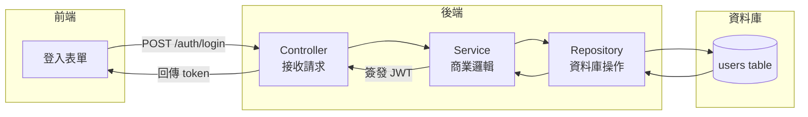
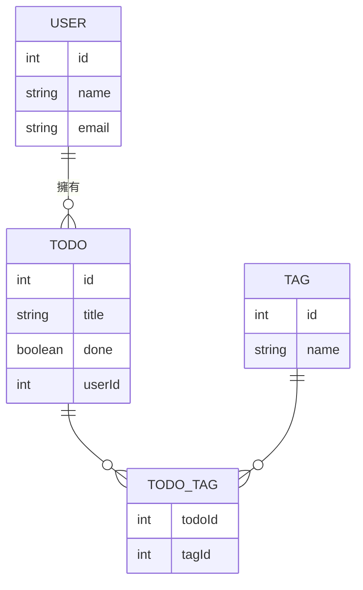
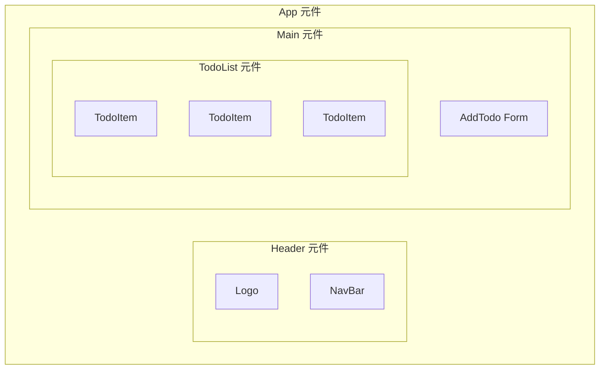
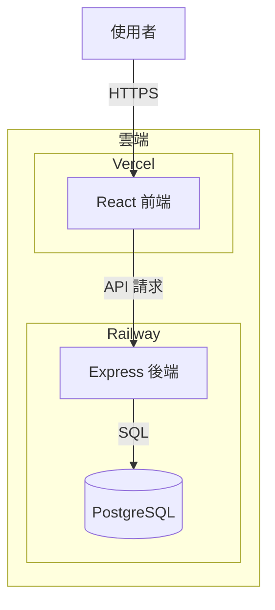

# 全端工程師養成課程大綱

> **核心理念**：這門課的目標不是「學會一門程式語言」，而是建立**程式思維與架構觀**。
> 我們用大量視覺化圖表、流程圖、pseudo code 來解釋抽象概念，讓你在寫第一行程式碼之前就先看懂全局。

---

## 學習路徑總覽



## 漸進式 POC 總覽

> 每完成一個關鍵 Part，就對同一個專案做一次升級。最終 V7 就是你的第一個完整全端作品。



---

## 導讀 — 從小餐車到企業連鎖餐廳

> **在學任何工具之前，先看懂整個世界。**
> 這章沒有程式碼，只有一個故事——一間餐廳從路邊小攤成長為全球連鎖的旅程，對應整個網路工程的演進。

- ⭐ `導讀` 從小餐車到企業連鎖餐廳：靜態網站 → 前後端分離 → 資料庫 → 快取 → 後台系統 → 負載平衡 → CDN → 微服務 → Docker/K8s

> 檔案位置：`lessons/basic/intro/world-view.md`

---

## Part 0 — 環境準備

> **目標**：用最快的速度讓你動起來——裝好工具，執行第一行程式碼，再逐步補齊其他工具。

### 章節列表
- `0-1` 開發環境全景圖：安裝 VS Code + Node.js，執行第一行程式碼
- `0-2` VS Code 設定：讓編輯器變成你的好隊友
- `0-3` Node.js & npm 安裝：JavaScript 的執行環境
- `0-4` Git 是什麼？為什麼每個工程師都需要它
- `0-5` Git 基本操作：`init` / `add` / `commit` / `push`
- `0-6` GitHub 入門：把程式碼放到雲端

### 課外讀物連結
- 想知道 Terminal 是什麼、怎麼用 → **[課外讀物 E-1] Mac Terminal 操作入門**
- 想知道 Homebrew 是什麼 → **[課外讀物 E-1-4] Homebrew：Mac 的套件管理員**
- 想深入了解 Git 的原理與進階操作 → **[課外讀物 E-8] Git 版本控制深入指南**

---

## Part 1 — 程式思維基礎

> **目標**：建立「電腦怎麼思考」的心智模型，理解程式設計的本質。

### 章節列表
- `1-1` 電腦只懂兩件事：**資料** 與 **指令**
- `1-2` 什麼是演算法？用生活例子理解
- `1-3` 程式的三種基本結構：循序、判斷、迴圈
- `1-4` 什麼是「抽象化」？為什麼工程師一直在做這件事
- `1-5` 從需求到程式碼的旅程（需求 → 設計 → 實作）

### 核心視覺化
```
需求（人的語言）
      ↓
流程圖 / Pseudo Code（中間語言）
      ↓
程式碼（電腦語言）
```

---

## Part 2 — TypeScript 核心

> **目標**：用 TypeScript 建立「型別思維」，學會用型別描述現實世界的資料。
> **重點**：不是背語法，而是理解「為什麼需要型別」。

### 章節列表
- `2-1` JavaScript vs TypeScript：為什麼型別很重要
- `2-2` 基本型別：`string` / `number` / `boolean` / `null` / `undefined`
- `2-3` 複合型別：`object` / `array` / `tuple`
- `2-4` 介面（Interface）與型別別名（Type Alias）：描述資料的形狀
- `2-5` 函式：輸入 → 處理 → 輸出 的思維
- `2-6` 泛型（Generics）：讓程式碼可以「留空」
- `2-7` 模組化：為什麼要拆檔案？`import` / `export`
- `2-8` 進階型別工具：`Partial` / `Pick` / `Omit` / `Record` / `ReturnType`
- `2-9` 實戰：CLI 任務清單工具

### 課外讀物連結
- 好奇 npm 生態系怎麼運作 → **[課外讀物 E-2] npm 與套件管理**

---

## Part 3 — 前端原生開發

> **目標**：理解瀏覽器如何運作，學會用 TypeScript 操控畫面，不依賴任何框架。
> **重點**：框架解決了什麼問題？先理解痛點，再學解法。

### 章節列表
- `3-1` 瀏覽器是怎麼運作的？（URL 輸入到畫面出現的旅程）
- `3-2` HTML 的本質：一棵樹（DOM Tree 視覺化）
- `3-3` CSS 最低限度：讓東西看起來不那麼醜
- `3-4` DOM 操作：用 TypeScript 改變畫面
- `3-5` 事件驅動程式設計：「有事發生 → 執行動作」
- `3-6` 非同步思維：`setTimeout` / `Promise` / `async-await`

### 課外讀物連結
- 好奇瀏覽器輸入網址後發生了什麼（DNS / TCP / HTTP）→ **[課外讀物 E-3] 網路通訊基礎**
- 想更深入理解 HTTP 協定 → **[課外讀物 E-3-3] HTTP 協定詳解**

### POC V1 — 靜態互動頁面

> 完成 Part 3 後的第一個里程碑：一個不需要後端的前端小應用。

**專案內容**：用原生 TypeScript + HTML 做一個 Todo App（資料存在 localStorage）
**學到的技術**：DOM 操作、事件處理、TypeScript 型別

```
V1 架構：
┌─────────────────┐
│   瀏覽器         │
│  index.html     │
│  main.ts        │
│  localStorage   │
└─────────────────┘
（還沒有後端）
```

---

## Part 4 — 前後端串接（漸進式 POC）

> **目標**：理解「網路請求」是什麼，從最簡單的 3 個檔案開始，逐步建構完整的前後端架構。
> **重點**：每個子階段都是可以跑起來的完整系統。

### 核心概念：什麼是前後端分離？



### 課外讀物連結
- 想搞清楚 HTTP 方法、狀態碼的完整含義 → **[課外讀物 E-3-3] HTTP 協定詳解**
- 想了解 CORS 為什麼存在 → **[課外讀物 E-3-4] 瀏覽器安全策略與 CORS**

---

### 階段 A — 最簡單的 POC（3 個檔案）

- `4-A-1` HTTP 是什麼？Request / Response 圖解
- `4-A-2` 建立第一個 Express 伺服器（10 行程式碼）
- `4-A-3` 用 `fetch` 從前端呼叫後端

#### POC V2 — 前後端通了！

**專案內容**：同一個 Todo App，但資料改成存在後端記憶體（用一個陣列模擬）
**新增技術**：Express、fetch、JSON

```
V2 架構（3 個核心檔案）：
┌──────────────┐    HTTP     ┌──────────────┐
│  前端         │ ─────────> │  後端         │
│  index.html  │ <───────── │  server.ts   │
│  main.ts     │   JSON      │  (資料在記憶體)│
└──────────────┘             └──────────────┘
```

---

### 階段 B — REST API 設計思維

- `4-B-1` 什麼是 REST？用資源（Resource）思考 API
- `4-B-2` HTTP 動詞：GET / POST / PUT / DELETE 對應 CRUD
- `4-B-3` 狀態碼：200 / 201 / 400 / 404 / 500 的意義
- `4-B-4` 錯誤處理：前後端如何溝通「出錯了」

#### POC V3 — 完整 REST CRUD

**新增技術**：完整的 REST API 設計、錯誤處理、狀態碼

---

### 階段 C — 引入工具鏈

- `4-C-1` 為什麼需要打包工具？（瀏覽器不直接懂 TypeScript）
- `4-C-2` Vite 設定：開發環境 vs 生產環境
- `4-C-3` 環境變數：如何安全地管理設定
- `4-C-4` CORS 是什麼？為什麼前後端分開跑會報錯

#### POC V4 — 工具鏈升級

**新增技術**：Vite、前後端型別共享、環境變數

```
V4 架構：
┌──────────────────┐         ┌──────────────────┐
│  前端 (Vite)      │  HTTP   │  後端 (Express)   │
│  src/            │ ──────> │  src/            │
│  components/     │ <────── │  routes/         │
│  types/ (共用)   │         │  types/ (共用)   │
└──────────────────┘         └──────────────────┘
         共用同一份 TypeScript 型別定義
```

---

### 階段 D — 後端架構 + 認證

> **目標**：學會真實後端的分層設計，並加入每個 app 都需要的登入功能。

- `4-D-1` 後端分層架構：Controller / Service / Repository 各自的職責
- `4-D-2` 認證（Authentication）vs 授權（Authorization）：你是誰？你能做什麼？
- `4-D-3` JWT 原理：token 是什麼，如何證明你是你
- `4-D-4` 完整登入流程：前端表單 → 後端驗證 → 簽發 token
- `4-D-5` Middleware 認證：用一行程式碼保護所有需要登入的 API
- `4-D-6` Refresh Token：為什麼 access token 要短命
- `4-D-7` 角色與權限（RBAC）：後台系統與一般前台如何共用同一組 API

### 課外讀物連結
- 想深入了解 OAuth / 第三方登入（Google、GitHub）→ **[課外讀物 E-10-4] OAuth 2.0 與第三方登入**
- 想了解更多 Web 安全威脅 → **[課外讀物 E-10] Web Security 基礎**



#### POC V5 — 完整架構 + 登入功能

**新增技術**：分層架構、JWT 認證、受保護的 API endpoint
**改變**：後端從單一檔案重構為 Controller/Service/Repository，Todo 需要登入才能操作

```
V5 架構：
┌──────────┐    ┌─────────────────────────┐    ┌───────────┐
│  前端     │    │  後端                    │    │  SQLite   │
│  (Vite)  │ -> │  routes/                │ -> │  users    │
│          │ <- │  controllers/           │ <- │  todos    │
│  JWT     │    │  services/              │    └───────────┘
│  stored  │    │  repositories/          │
│  in      │    │  middleware/auth.ts     │
│  memory  │    └─────────────────────────┘
└──────────┘
```

---

## Part 5 — 資料庫

> **目標**：理解「資料持久化」的本質，從 SQLite 零安裝開始，建立資料庫設計思維。

### 章節列表
- `5-1` 為什麼不能把資料存在變數裡？（記憶體 vs 硬碟）
- `5-2` 什麼是關聯式資料庫？用試算表類比
- `5-3` SQL 基礎思維：`SELECT` / `INSERT` / `UPDATE` / `DELETE`
- `5-4` SQLite 入門：零安裝，直接開始
- `5-5` 資料關聯：一對多 / 多對多（圖解）
- `5-6` ORM 是什麼？為什麼不直接寫 SQL
- `5-7` Prisma 入門：用 TypeScript 操作資料庫
- `5-8` Migration：資料庫版本控制
- `5-9` 進階：切換到 PostgreSQL，理解差異
- `5-10` Zod：API 資料驗證的第一道防線

### 課外讀物連結
- 想知道資料庫索引怎麼運作 → **[課外讀物 E-4] 資料庫進階概念**
- 想了解 SQL vs NoSQL 的差異 → **[課外讀物 E-4-2] SQL vs NoSQL**
- 想了解輸入驗證與 XSS、Injection 攻擊的關係 → **[課外讀物 E-10-2] 常見 Web 攻擊手法**

### 核心視覺化



#### POC V5 — 接上資料庫

**新增技術**：SQLite、Prisma ORM、Migration
**改變**：資料從記憶體陣列改成真實資料庫，重啟程式資料也不會消失

```
V5 架構：
┌──────────┐    ┌──────────┐    ┌──────────────┐
│  前端     │ -> │  後端     │ -> │  SQLite DB   │
│  (Vite)  │ <- │ (Express)│ <- │  todos.db    │
└──────────┘    └──────────┘    └──────────────┘
                      │
                  Prisma ORM
```

---

## Part 6 — 前端框架（React）

> **目標**：理解「為什麼需要框架」，用 React 解決 Part 3 原生開發的痛點。
> **重點**：元件化思維 + 狀態管理的本質。

### 章節列表
- `6-1` 回顧痛點：原生 DOM 操作在複雜專案的問題
- `6-2` React 的核心思想：`UI = f(state)`
- `6-3` 元件（Component）：可重用的 UI 積木
- `6-4` Props vs State：資料從哪來？誰管它？
- `6-5` useEffect：跟外部世界溝通
- `6-6` 路由（React Router）：多頁面應用
- `6-7` 與後端 API 整合：從 fetch 到更好的方式
- `6-8` 表單處理：React Hook Form + Zod 的組合
- `6-9` 狀態管理：什麼時候 useState 不夠用？Context vs Zustand

### 核心視覺化



#### POC V6 — React 前端

**新增技術**：React、元件化、hooks
**改變**：把 Part 3-4 的原生 TypeScript 前端，重寫成 React 元件

---

## Part 7 — 部署與工程實務

> **目標**：讓你的作品可以讓全世界看到，理解從本機到雲端的完整流程。

### 章節列表
- `7-1` 從本機到雲端：一個請求的完整旅程
- `7-2` 環境的概念：開發 / 測試 / 生產
- `7-3` Docker 基礎：把應用程式打包成貨櫃
- `7-4` 快速部署：Vercel（前端）+ Railway（後端 + DB）
- `7-5` CI/CD 概念：程式碼推上去就自動部署
- `7-6` 環境變數與 Secrets 管理
- `7-7` 結構化日誌：用 log 讀懂線上發生了什麼事
- `7-8` 錯誤追蹤：用 Sentry 接住你沒想到的 bug
- `7-9` 基本效能監控：你的服務還活著嗎、夠不夠快？

### 課外讀物連結
- 想深入了解 DNS 與網域設定 → **[課外讀物 E-3-2] DNS：網址背後的電話簿**
- 想了解 HTTPS / TLS 怎麼運作 → **[課外讀物 E-3-5] HTTPS 與憑證**
- 想了解前端效能優化技巧 → **[課外讀物 E-11-1] 前端效能優化**
- 想了解後端快取與 Redis → **[課外讀物 E-11-3] Redis 與快取策略**
- 想了解快取的多個層次如何協作 → **[課外讀物 E-11-8] 多層次快取全景：瀏覽器到資料庫**

#### POC V7 — 上線！（最終版）

**新增技術**：Docker、Vercel、Railway、PostgreSQL
**改變**：從本機跑的專案，變成可以分享 URL 給任何人的真實網站



---

## 課外讀物

> 主線課程中標記 **[課外讀物 E-X]** 的地方，表示這裡有延伸知識可以探索。
> 不看不影響繼續學習，但看了會讓你對「為什麼」有更深的理解。

---

### E-1 — Mac Terminal 操作

- `E-1-1` Terminal 是什麼？為什麼工程師都用它
- `E-1-2` 基本導航指令：`ls` / `cd` / `pwd` / `mkdir` / `rm`
- `E-1-3` 檔案操作：`cp` / `mv` / `cat` / `grep`
- `E-1-4` Homebrew：Mac 的套件管理員
- `E-1-5` 環境變數：`PATH` 是什麼，為什麼指令「找不到」
- `E-1-6` 行程管理：`ps` / `kill` / 什麼是 port
- `E-1-7` SSH 基礎：用指令連進遠端伺服器
- `E-1-8` 趣味：Terminal 的歷史——從打孔卡到現代 shell

---

### E-2 — npm 與套件生態系

- `E-2-1` npm 是什麼？`package.json` 解析
- `E-2-2` `dependencies` vs `devDependencies` 的差異
- `E-2-3` `node_modules` 為什麼那麼大？
- `E-2-4` 版本號的意義：`^1.2.3` 代表什麼
- `E-2-5` 趣味：左墊事件（left-pad incident）——一個 11 行的套件如何癱瘓半個網路

---

### E-3 — 網路通訊基礎

- `E-3-1` 網際網路是怎麼運作的？（從電纜到封包）
- `E-3-2` DNS：網址背後的電話簿
- `E-3-3` HTTP 協定詳解：方法、標頭、狀態碼、Body
- `E-3-4` 瀏覽器安全策略與 CORS：為什麼跨來源請求會被擋
- `E-3-5` HTTPS 與 TLS：加密握手的過程
- `E-3-6` WebSocket：當 HTTP 的一問一答不夠用的時候
- `E-3-7` 趣味：HTTP 狀態碼 418 — 我是茶壺

---

### E-4 — 資料庫進階概念

- `E-4-1` 索引（Index）是什麼？為什麼查詢可以變快
- `E-4-2` SQL vs NoSQL：各自適合什麼場景
- `E-4-3` 交易（Transaction）：ACID 是什麼
- `E-4-4` N+1 查詢問題：ORM 的常見效能陷阱

---

### E-5 — 趣味小知識集錦

- `E-5-1` 為什麼陣列從 0 開始？
- `E-5-2` Y2K 問題：一個日期格式如何差點讓世界崩潰
- `E-5-3` Bug 的由來：第一隻真實的蟲子
- `E-5-4` Hello World 的歷史
- `E-5-5` 為什麼工程師喜歡用 `foo` 和 `bar` 當變數名稱

---

### E-6 — Best Practices & Clean Code

> 好程式碼不只是「能跑」，而是讓未來的自己和別人都能輕鬆讀懂、修改、擴充。
> 這裡也會介紹**反模式（Anti-patterns）**——常見的壞習慣以及為什麼它們會造成問題。

- `E-6-1` Clean Code 是什麼？為什麼程式碼需要「乾淨」
- `E-6-2` 命名的藝術：讓名字說話
- `E-6-3` 函式設計：Single Responsibility 與純函式
- `E-6-4` TypeScript 最佳實踐：`strict`、避免 `any`、型別推斷
- `E-6-5` 注解的正確使用：解釋「為什麼」而非「做什麼」
- `E-6-6` 常見反模式大全：Magic Number、巢狀地獄、上帝物件...
- `E-6-7` 前端 Clean Code：元件設計原則
- `E-6-8` 後端 Clean Code：API 設計與錯誤處理原則
- `E-6-9` Code Review 思維：如何給出有建設性的回饋
- `E-6-10` 趣味：The Broken Windows Theory — 為什麼一個壞變數名稱會帶壞整個專案

---

### E-7 — SOLID 原則

> SOLID 是五個物件導向設計原則的縮寫，由 Robert C. Martin（Uncle Bob）整理。
> 這五個原則是業界公認的「寫出可維護程式碼」的核心思維，不只適用於 OOP，在函式設計與模組化中同樣適用。

- `E-7-1` SOLID 總覽：五個原則一次看懂，以及為什麼它們重要
- `E-7-2` **S** — Single Responsibility Principle：一個模組只做一件事
- `E-7-3` **O** — Open/Closed Principle：對擴充開放，對修改關閉
- `E-7-4` **L** — Liskov Substitution Principle：子類別要能無縫替換父類別
- `E-7-5` **I** — Interface Segregation Principle：介面要小而專，不要大而全
- `E-7-6` **D** — Dependency Inversion Principle：依賴抽象，不依賴實作
- `E-7-7` SOLID 在 TypeScript 中的實踐：用型別系統強化設計原則
- `E-7-8` SOLID 反例大賞：違反原則的程式碼長什麼樣子
- `E-7-9` 趣味：Uncle Bob 與 Agile Manifesto 的故事

---

### E-8 — Git 版本控制深入指南

> Git 是工程師的時光機——它讓你可以放心實驗、追蹤歷史、與他人協作。
> Part 0 只教了基礎操作，這裡深入原理與進階使用。

- `E-8-1` Git 的內部運作：blob、tree、commit 物件是什麼
- `E-8-2` Branch 與 Merge：平行宇宙的概念
- `E-8-3` Rebase vs Merge：歷史要整齊還是要真實？
- `E-8-4` 解決 Merge Conflict：不要怕，冷靜處理
- `E-8-5` Commit 訊息規範：Conventional Commits
- `E-8-6` `.gitignore`：哪些東西不應該進版本控制
- `E-8-7` Git Flow 與 GitHub Flow：團隊協作的分支策略
- `E-8-8` Pull Request 文化：Code Review 的流程
- `E-8-9` 趣味：Linus Torvalds 在 2 週內寫出 Git 的故事

---

### E-9 — 測試（Testing）

> 沒有測試的 Clean Code 是不完整的。測試不是「有空再寫」，而是讓你敢於修改程式碼的安全網。

- `E-9-1` 為什麼要寫測試？沒有測試的程式碼像什麼
- `E-9-2` 測試的種類：單元測試 / 整合測試 / E2E 測試
- `E-9-3` 單元測試入門：用 Vitest 測試 TypeScript 函式
- `E-9-4` 什麼是好的測試？AAA 原則（Arrange、Act、Assert）
- `E-9-5` TDD（Test-Driven Development）：先寫測試，再寫程式碼
- `E-9-6` 測試替身：Mock、Stub、Spy 的差別
- `E-9-7` 前端測試：測試 React 元件的思維
- `E-9-8` 後端 API 測試：用 Supertest 測試 Express
- `E-9-9` 趣味：NASA 的軟體測試文化——為什麼太空船不能有 Bug

---

### E-10 — Web Security 基礎

> 每個工程師都要知道自己的程式碼有哪些安全漏洞，以及如何防禦。
> 不懂安全的工程師就像不鎖門的保全。

- `E-10-1` Web 安全總覽：OWASP Top 10 是什麼
- `E-10-2` XSS（跨站腳本攻擊）：為什麼不能直接把使用者輸入放進 HTML
- `E-10-3` CSRF（跨站請求偽造）：為什麼要有 CSRF token
- `E-10-4` SQL Injection：一個引號如何摧毀整個資料庫
- `E-10-5` OAuth 2.0 與第三方登入：Google / GitHub 登入怎麼運作
- `E-10-6` 密碼儲存：為什麼不能存明文，bcrypt 是什麼
- `E-10-7` HTTPS 不是萬能的：中間人攻擊與憑證釘扎
- `E-10-8` Rate Limiting：防止暴力破解與 DDoS
- `E-10-9` 趣味：史上最貴的安全漏洞——Heartbleed

---

### E-11 — 效能與快取

> 功能做完只是第一步，讓使用者感覺「快」才是真本事。

- `E-11-1` 前端效能優化：Lazy Loading、Code Splitting、Memoization
- `E-11-2` 瀏覽器快取：Cache-Control 標頭怎麼設
- `E-11-3` Redis 與快取策略：什麼資料值得快取？
- `E-11-4` 資料庫效能：N+1 問題、索引、分頁設計
- `E-11-5` CDN 是什麼？靜態資源如何加速
- `E-11-6` 後端效能分析：找出你的 API 慢在哪裡
- `E-11-7` 趣味：Amazon 的研究——每 100ms 延遲損失 1% 銷售額
- `E-11-8` 多層次快取全景：瀏覽器 → CDN → Redis → 資料庫，每一層的定位與取捨

---

### E-12 — 軟體設計模式

> 設計模式是前人遇到問題後留下的解法食譜。不用背，但碰到問題時要知道有這道菜。

- `E-12-1` 什麼是設計模式？為什麼它們重要
- `E-12-2` MVC 模式：Model / View / Controller 的分工
- `E-12-3` Repository 模式：把資料庫操作藏起來
- `E-12-4` Factory 模式：把建立物件的邏輯封裝起來
- `E-12-5` Observer 模式：事件驅動的設計思維
- `E-12-6` Singleton 模式：全域唯一的實例
- `E-12-7` Strategy 模式：讓演算法可以互換
- `E-12-8` 趣味：為什麼設計模式書用「四人幫」命名

---

### E-13 — 規模化與進階架構（彩蛋）

> 恭喜你完成了整個課程。你已經是一個全端工程師了。
> 這個系列是給想繼續往深走的人——當你的服務開始有真實使用者、需要支撐更大的流量，你會需要這些知識。

- `E-13-1` 從一台伺服器到多台：垂直擴展 vs 水平擴展
- `E-13-2` 為什麼 Docker 不夠用？容器編排的問題
- `E-13-3` Kubernetes 概念入門：Pod / Node / Deployment / Service
- `E-13-4` Monolith vs Microservices：大泥球與拆分的取捨
- `E-13-5` 訊息佇列（Message Queue）：用非同步解耦服務
- `E-13-6` CAP 定理：分散式系統不可能三角
- `E-13-7` Load Balancer：流量如何分配到多台伺服器
- `E-13-8` 從全端工程師到哪裡？職涯路線圖（Backend / Frontend / DevOps / SRE / Architect）
- `E-13-9` 趣味：Netflix 如何從一台 DVD 伺服器變成全球最大串流平台

> E-13 建立了概念框架，想把這些概念落地到 AWS 的真實服務 → **[課外讀物 E-14] AWS 雲端基礎建設**

---

### E-14 — AWS 雲端基礎建設

> 你在公司聽到 VPC、EKS、T3 這些詞，這個系列就是為此而生的。
> 從「雲端是什麼」開始，一路走到你能看懂公司的 VPC 架構圖、理解 EKS 叢集的運作方式、讀懂 T3 執行個體規格單、知道為什麼帳單突然暴增。
> 建議在 E-13 之後閱讀——E-13 建立了規模化的概念，E-14 把概念全部落地到 AWS 的真實服務。

#### 階段一：雲端基礎

- `E-14-1` 雲端計算的誕生：為什麼公司不再自己買伺服器了
- `E-14-2` AWS 全球架構圖解：Region / Availability Zone / Edge Location
- `E-14-3` 如何計費？On-demand / Reserved / Spot / Savings Plans 的取捨

#### 階段二：身份與存取 IAM

- `E-14-4` IAM 是什麼？User / Group / Role / Policy 圖解
- `E-14-5` 最小權限原則：為什麼每個服務都要有自己的 Role
- `E-14-6` 實戰：IAM Policy 怎麼讀？JSON 政策文件逐行解析

#### 階段三：計算資源 EC2

- `E-14-7` EC2 是什麼？在雲端租一台電腦的完整流程
- `E-14-8` 執行個體家族解析：**T3 / M7g / C7g / R7g** — Burstable Credit 機制是什麼
- `E-14-9` AMI 與 Auto Scaling：複製一台機器 vs 根據流量自動調整台數

#### 階段四：網路 VPC

這是理解「公司雲端架構」最核心的章節。

- `E-14-10` VPC 是什麼？為什麼需要在 AWS 裡建立自己的私有網路
- `E-14-11` CIDR 是什麼？`10.0.0.0/16` 這串數字代表多少 IP 位址
- `E-14-12` 公開子網路 vs 私有子網路：什麼資源該「躲起來」
- `E-14-13` Internet Gateway vs NAT Gateway：誰能主動出門？誰能被外部拜訪？
- `E-14-14` Security Group vs NACL：Instance 層 vs Subnet 層的防火牆差在哪
- `E-14-15` Route Table：封包怎麼決定要走哪條路（圖解每一跳）
- `E-14-16` Multi-AZ 架構：為什麼要把資源分散到不同機房
- `E-14-17` 看懂 VPC 架構圖：從一張圖讀懂公司的雲端網路全貌

#### 階段五：儲存

- `E-14-18` S3 物件儲存：概念、Bucket Policy、使用場景
- `E-14-19` EBS vs EFS：Block Storage（本機硬碟）vs Shared File System 的差別
- `E-14-20` S3 進階：Versioning / Lifecycle Policy / Presigned URL

#### 階段六：受管服務

- `E-14-21` RDS：托管關聯式資料庫 — Multi-AZ vs Read Replica 差在哪
- `E-14-22` ElastiCache：AWS 上的受管 Redis，跟自己架有什麼不同
- `E-14-23` Application Load Balancer（ALB）：流量怎麼分配、健康檢查怎麼運作
- `E-14-24` CloudFront CDN：前端靜態資源部署加速的標準做法（前端工程師必看）
- `E-14-25` Route 53 + ACM：設定自訂網域與 HTTPS 憑證的完整流程

#### 階段七：容器平台 ECS / EKS

- `E-14-26` ECR：Docker Image 的倉庫（AWS 版的 Docker Hub）
- `E-14-27` ECS vs EKS：AWS 提供的兩條容器路線，各自適合什麼
- `E-14-28` **EKS 架構圖解**：Control Plane / Node Group / Fargate / kubelet 各司其職
- `E-14-29` **EKS 網路深入**：Pod IP 從哪來？Service / Ingress / CoreDNS 怎麼串起來
- `E-14-30` HPA 與 Cluster Autoscaler：流量衝高時 Kubernetes 如何自動橫向擴容
- `E-14-31` Helm Chart：Kubernetes 的套件管理員，讀懂 `values.yaml`
- `E-14-32` 看懂公司的 EKS 架構：真實場景全景拆解（結合 VPC + ALB + RDS）

#### 階段八：Serverless

- `E-14-33` Lambda 是什麼？函數即服務（FaaS）的概念與冷啟動問題
- `E-14-34` API Gateway + Lambda：不需要 Express 也能有 HTTP API
- `E-14-35` 選型指南：Lambda vs ECS vs EKS vs EC2 — 什麼場景用什麼

#### 階段九：CI/CD 與基礎設施即代碼 IaC

- `E-14-36` GitHub Actions + AWS：程式碼推上去自動部署到 ECS / EKS
- `E-14-37` 為什麼不能一直點 Console？Infrastructure as Code 的必要性
- `E-14-38` Terraform 入門：把 VPC 和 EKS 叢集寫成可版本控制的程式碼
- `E-14-39` Terraform State：多人協作時誰的狀態才是對的？
- `E-14-40` CloudFormation 與 CDK：AWS 原生的 IaC 選項，跟 Terraform 有什麼不同

#### 階段十：觀測、除錯與成本

- `E-14-41` CloudWatch：Log / Metrics / Alarm — 線上出問題時怎麼找線索
- `E-14-42` AWS X-Ray：分散式追蹤，找出哪個服務拖慢了整體回應
- `E-14-43` Cost Explorer 與 Budgets：看懂帳單、設定花費上限、避免意外爆帳
- `E-14-44` 趣味：AWS 大當機事件 — 一個打錯的 CLI 指令讓半個網路斷線兩小時

---

### 課外讀物連結（主線對照）

| 課外讀物 | 主線對應 | 建議閱讀時機 |
|---------|---------|------------|
| E-6-2 命名的藝術 | Part 2 TypeScript 核心 | 開始寫第一個變數前 |
| E-6-4 TypeScript 最佳實踐 | Part 2-1 | 學完基本型別後 |
| E-6-6 常見反模式 | Part 3 前端開發 | 寫完第一個頁面後 |
| E-6-7 前端 Clean Code | Part 6 React | 開始學元件前 |
| E-6-8 後端 Clean Code | Part 4-B REST API | 設計第一個 API 後 |
| E-7-1 SOLID 總覽 | Part 2-5 函式設計 | 學完函式後 |
| E-7-2 SRP | Part 2-5 / Part 6-3 | 函式設計 & React 元件 |
| E-7-5 ISP | Part 2-4 介面 | 學完 TypeScript 介面後 |
| E-7-6 DIP | Part 4-D 完整架構 | 理解模組化後端後 |
| E-8-5 Commit 訊息規範 | Part 0-5 Git 基本操作 | 開始用 Git 後 |
| E-8-7 Git Flow | Part 4-D 完整架構 | 開始多人協作前 |
| E-9-3 單元測試入門 | Part 2-9 CLI 小專案 | 寫完第一個完整函式後 |
| E-9-8 後端 API 測試 | Part 4-B REST API | 設計完 CRUD API 後 |
| E-10-2 XSS / Injection | Part 5-10 Zod 驗證 | 學完資料驗證後 |
| E-10-5 OAuth | Part 4-D 認證 | 學完 JWT 後 |
| E-10-6 密碼儲存 | Part 4-D-4 登入流程 | 實作登入前 |
| E-11-1 前端效能 | Part 6 React | 完成 React 前端後 |
| E-11-3 Redis | Part 7 部署 | 部署完成後 |
| E-11-8 多層次快取全景 | 導讀 / Part 7 部署 | 完成 Part 7 後 |
| E-12-2 MVC | Part 4-D-1 分層架構 | 學後端分層時 |
| E-12-3 Repository 模式 | Part 4-D-1 分層架構 | 學後端分層時 |
| E-14-2 AWS 全球架構 | 導讀 / Part 7 部署 | 學完部署概念後 |
| E-14-7 EC2 / T3 執行個體 | Part 7 部署 | 理解部署環境選型時 |
| E-14-10 ~ E-14-17 VPC 網路 | E-13 規模化架構 | 學完規模化概念，想落地到 AWS |
| E-14-24 CloudFront CDN | Part 7 部署 / E-11-5 CDN | 部署前端靜態資源時 |
| E-14-28 EKS 架構 | E-13-3 Kubernetes 入門 | 理解 K8s 概念後，在 AWS 對號入座 |
| E-14-36 GitHub Actions + AWS | Part 7-5 CI/CD | 建立自動部署流程時 |
| E-14-38 Terraform | Part 7 部署 | 想讓基礎設施可版本控制時 |

---

## 課程統計

| Part | 主題 | 章節數 |
|------|------|--------|
| 0 | 環境準備 | 6 |
| 1 | 程式思維基礎 | 5 |
| 2 | TypeScript 核心 | 9 |
| 3 | 前端原生開發 | 6 |
| 4 | 前後端串接（A/B/C/D） | 20 |
| 5 | 資料庫 | 10 |
| 6 | React | 9 |
| 7 | 部署與工程實務 | 9 |
| **課外讀物** | E-1 ~ E-13（程式設計、架構、工具） | 100 |
| **課外讀物** | E-14（AWS 雲端基礎建設） | 44 |
| **合計** | | **218** |

---

## POC 版本對照表

| 版本 | 解鎖時機 | 技術 | 特色 |
|------|---------|------|------|
| V1 | Part 3 完成後 | HTML + TypeScript | 純前端，資料存 localStorage |
| V2 | Part 4-A 完成後 | Express + fetch | 前後端通了，資料在記憶體 |
| V3 | Part 4-B 完成後 | REST API + CRUD | 完整 API 設計 |
| V4 | Part 4-C 完成後 | Vite + 共用型別 | 工具鏈完整，前後端型別安全 |
| V5 | Part 4-D 完成後 | 分層架構 + JWT 認證 | 後端有結構，Todo 需要登入才能操作 |
| V6 | Part 5 完成後 | SQLite + Prisma + Zod | 真實資料庫，API 有驗證 |
| V7 | Part 6 完成後 | React + 登入頁 + 狀態管理 | 完整前端，有登入流程 |
| V8 | Part 7 完成後 | Docker + Vercel + Railway + PostgreSQL | 部署上線，全世界可以看到 |
